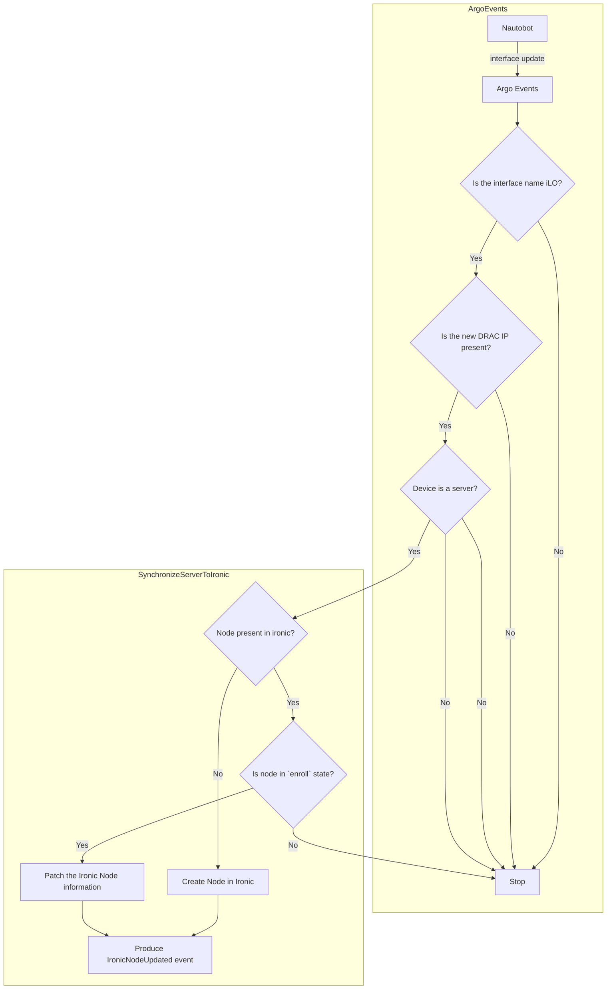

# Overview

The purpose of the workflow templates in this folder is to synchronize
information entered to Nautobot into Ironic. The most common example of this is
when the new Device is created and it is assigned the DRAC IP.

We initially wanted to listen on the `dcim.Device` record creation events, but
it is more efficient to listen for the updates on the `dcim.Interface` and
perform additional checks to see:

- if the updated Interface is an OBM interface
- if the updated Interface's device is a Server (currently we determine this by an interface name, since the Network devices don't have DRAC/iLo cards)

## Caveats
- TODO: The feature currently only supports a single Ironic instance. This may become problematic if the Device changes regions and need to talk to other Ironic instance.
- TODO: The Ironic node status is not synced back to the Nautobot at the moment. This will probably be implemented in a separate feature.
- TODO: handle tenant changes.

## InterfaceUpdate Event diagram

Possible edge cases:
- what happens when Nautobot side removes the IP address. Is leaving the old IP
  address (essentially ignoring the update) in Ironic ok?
- which Ironic states should allow the DRAC IP (and possibly other information) to be updated? Only `enroll` ?
