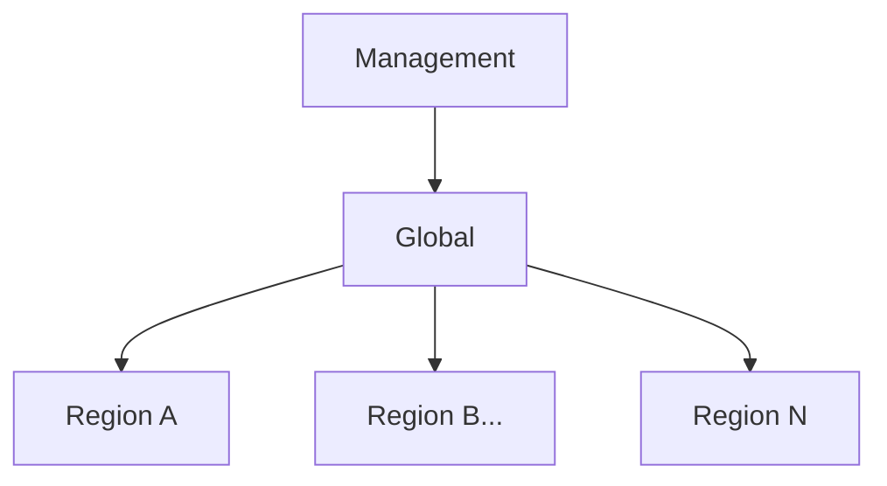
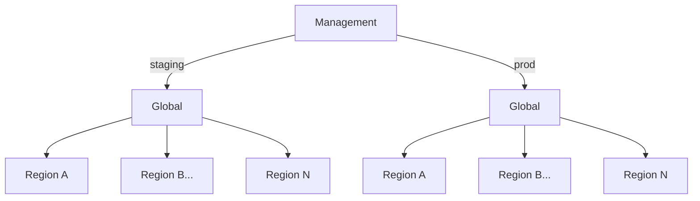

# What is Understack?

Understack is a collection of open-source tools and technologies that provides
flexible, scalable, and cost-effective infrastructure management solution. The
focus is on deploying bare metal in data centers with functional DCIM and IPAM.

## About the Guide

While the deployment of UnderStack leans heavily into [GitOps][gitops],
it is not meant to be a definitive guide to [GitOps][gitops]. It is also
not the only way GitOps can be used with UnderStack but instead focuses on
one example deployment installation.
It will make a few assumptions and some opinionated choices that may
not align with a production best practices installation. Improvements are
always welcome.

## System Division

A fully deployed UnderStack is divided into 3 distinct parts or environments
that are referred to in the documentation as:

- Management
- Global
- Region(s)

A fully functioning system only needs one Management environment, one Global
environment and one or more Regions. In this configuration the Management
environment is responsible for utilizing the [GitOps][gitops] tool to deploy
the expected state to all other environments. The Global environment is
responsible for hosting any services that are expected to exist only once
for a whole system deployment such as the DCIM/IPAM tool. While the Region
environments will run the tools and services that need to live close to the
actual hardware.

In fact one Management environment can control multiple systems if you have
a staging environment and a production environment for example.

[gitops]: <https://about.gitlab.com/topics/gitops/>
