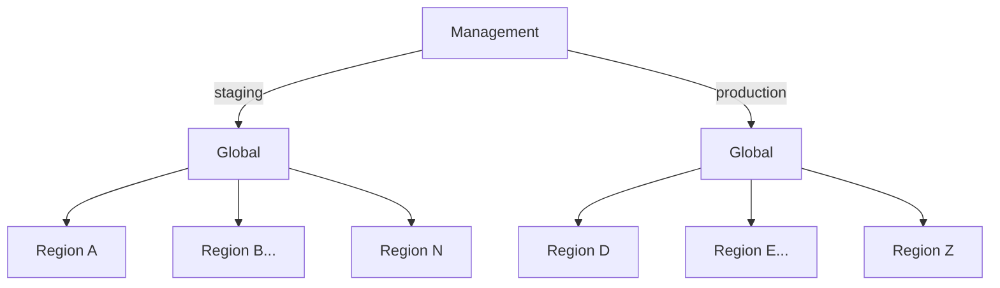

# What is UnderStack?

UnderStack is a collection of open-source tools and technologies that provides
flexible, scalable, and cost-effective infrastructure management solution. The
focus is on deploying bare metal in data centers with functional DCIM and IPAM.

## About the Guide

While the deployment of UnderStack leans heavily into [GitOps][gitops], it is not meant to
be a definitive guide to [GitOps][gitops]. It is also not the only way GitOps can be used
with UnderStack but instead focuses on one example deployment installation.
It will make a few assumptions and some opinionated choices that may not align
with a production best practices installation. Improvements are always welcome.

## System Division

A fully deployed UnderStack is divided into three distinct parts, or environments,
that are referred to in the documentation as:

- Management
- Global
- Region(s)

A fully functioning system only needs one _Management_ environment, one _Global_
environment and one or more _Region_ environment(s). In this configuration,
the _Management_ environment is responsible for utilizing our [GitOps][gitops]
tool, [ArgoCD][argocd] to deploy the expected state to all other environments.
While the _Global_ environment is
responsible for hosting any services that are expected to exist only once
for a whole system deployment such as the DCIM/IPAM tool. While the _Region_
environments will run the tools and services that need to live close to the
actual hardware.

In fact, one _Management_ environment can control multiple _Global_ environments
and their associated _Region_ environments. We call the grouping of the _Global_
environment and it's associated _Region_ environments a _partition_. An example
would be a staging partition and a production partition.

[argocd]: <https://argo-cd.readthedocs.io/en/stable/>
[gitops]: <https://about.gitlab.com/topics/gitops/>
