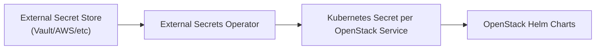

# External Secrets Operator Setup for OpenStack Service Accounts

The [External Secrets Operator (ESO)](https://external-secrets.io/) integration allows UnderStack to securely manage OpenStack service account credentials from external secret stores. This enables scenarios where Keystone runs in one cluster while other OpenStack services run in separate clusters, with credentials synchronized via ESO.

## Overview

The ESO setup provides:

- **Centralized credential management** - Store OpenStack service credentials in external systems (Vault, AWS Secrets Manager, etc.)
- **Multi-cluster support** - Share credentials between clusters running different OpenStack services
- **Automatic synchronization** - ESO keeps credentials in sync across environments
- **Security isolation** - Avoid hardcoded credentials in Helm charts

## Architecture



### Generated Resources

For each OpenStack service, the ESO integration creates:

1. **Service Account Secrets** - Individual secrets for each service account usage (admin, user, neutron, etc.)
2. **Configuration Secrets** - [oslo.config](https://docs.openstack.org/oslo.config/latest/) compatible config file snippets for the services
3. **ClusterSecretStore** or  **SecretStore**- Connection configuration to the external secret store where the credentials are sourced from

## Configuration

### 1. Enable ESO Integration

In your `$DEPLOY_NAME/openstack/values.yaml`:

```yaml title="$DEPLOY_NAME/openstack/values.yaml"
keystoneServiceUsers:
  enabled: true
  secretStore:
    kind: "ClusterSecretStore"  # or "SecretStore" for namespaced
    name: "openstack"
  keystoneInterface: "internal"

  # Optional: Add ArgoCD external links to secrets in your secret store UI
  externalLinkAnnotationTemplate: "https://vault.example.com/ui/vault/secrets/secret/show&#123;&#123; .remoteRef &#125;&#125;"
```

### 2. Configure Service Accounts

Define the service accounts for each OpenStack component:

```yaml title="$DEPLOY_NAME/openstack/values.yaml"
keystoneServiceUsers:
  services:
    nova:
      - usage: admin
        remoteRef: "/openstack/admin-keystone-password"
      - usage: user
        remoteRef: "/openstack/nova-keystone-password"
      - usage: neutron
        remoteRef: "/openstack/nova-keystone-password"
      - usage: service
        remoteRef: "/openstack/nova-keystone-password"
        section: "service_user"

    ironic:
      - usage: admin
        remoteRef: "/openstack/admin-keystone-password"
      - usage: user
        remoteRef: "/openstack/ironic-keystone-password"
      - usage: glance
        remoteRef: "/openstack/ironic-keystone-password"
      - usage: neutron
        remoteRef: "/openstack/ironic-keystone-password"
```

### 3. Service Account Usage Types

Each service requires specific usage types:

- **`admin`** - Administrative user for OpenStack Helm's `$SERVICE-ks-user` Jobs (creates/manages service users)
- **`user`** - Primary service user for the `keystone_authtoken` section
- **Custom sections** - Additional service-to-service authentication (neutron, glance, etc.)

### 4. External Secret Store Setup

UnderStack's ['openstack' component][openstack-component] a `ClusterSecretStore` will be created
that uses Kubernetes authentication:

```yaml title="$DEPLOY_NAME/openstack/values.yaml"
# Generated automatically by the openstack component
apiVersion: external-secrets.io/v1
kind: ClusterSecretStore
metadata:
  name: openstack
spec:
  provider:
    kubernetes:
      remoteNamespace: openstack
      server:
        caProvider:
          type: ConfigMap
          name: kube-root-ca.crt
          key: ca.crt
          namespace: openstack
      auth:
        serviceAccount:
          name: eso-openstack
          namespace: openstack
```

## Secrets Organization

### Remote References

Store secrets in your external secret store with these expected fields:

```json
{
  "username": "service-username",
  "password": "service-password"
}
```

### Generated Kubernetes Secrets

For each service, ESO creates:

**Individual service account secrets:**

- `nova-keystone-admin` - Admin credentials for nova
- `nova-keystone-user` - Primary nova service credentials
- `nova-keystone-neutron` - Nova-to-neutron credentials

**Configuration file secrets:**

- `nova-ks-etc` - Contains `nova_auth.conf` with OSLO config sections

### Example Generated Configuration

For the nova service example above, the `nova-ks-etc` secret contains:

```ini title="nova_auth.conf"
[keystone_authtoken]
username=nova-service-user
password=secret-password
region_name=RegionOne

[neutron]
username=nova-service-user
password=secret-password
region_name=RegionOne

[service_user]
username=nova-service-user
password=secret-password
region_name=RegionOne
```

## Migration from Static Secrets

### Current State Assessment

Check your existing secret management:

```bash title="List existing OpenStack service secrets"
kubectl get secrets -n openstack | grep keystone-password
```

```bash title="Check if ESO is enabled in your configuration"
grep -A 10 "keystoneServiceUsers:" $DEPLOY_NAME/openstack/values.yaml
```

### Migration Steps

1. **Populate External Secret Store**

   Store your existing credentials in the external secret store with the remoteRef paths configured in your `keystoneServiceUsers.services`.

2. **Enable ESO Integration**

   Update your `openstack.yaml` configuration to enable ESO and configure the service accounts.

3. **Deploy and Verify**

   ```bash title="Check that ExternalSecrets are created"
   kubectl get externalsecrets -n openstack
   ```

   ```bash title="Verify secrets are populated"
   kubectl get secrets -n openstack | grep keystone
   ```

   ```bash title="Check secret contents for nova-keystone-user for example"
   kubectl get secret nova-keystone-user -n openstack -o yaml
   ```

4. **Clean Up Legacy Secrets**

   Once verified, remove the old static secret generation from your deployment automation.

## Troubleshooting

### External Secret Sync Issues

```bash title="Check ExternalSecret status"
kubectl describe externalsecret nova-keystone-user -n openstack
```

```bash title="Check SecretStore connectivity"
kubectl describe clustersecretstore openstack
```

```bash title="Verify ESO operator logs"
kubectl logs -n external-secrets-system deployment/external-secrets
```

### Missing Service Account Permissions

The ESO service account needs access to read secrets from the source namespace:

```bash title="Check if a Service Account can list secrets"
kubectl auth can-i get secrets --as=system:serviceaccount:<namespace>:<serviceaccountname> [-n <namespace>]
```

```bash title="Check if eso-openstack Service Account can read the admin-keystone-password Secret"
kubectl auth can-i get secrets/admin-keystone-password --as=system:serviceaccount:openstack:eso-openstack -n openstack
```

```bash title="Show permissions for the eso-openstack role"
kubectl describe role eso-openstack -n openstack
```

```bash title="Verify role binding"
kubectl describe rolebinding eso-openstack-rolebinding -n openstack
```

### Configuration Validation

```bash title="Validate generated config file"
kubectl get secret nova-ks-etc -n openstack -o jsonpath='{.data.nova_auth\.conf}' | base64 -d
```

## Security Considerations

### Access Control

- ESO service account has minimal required permissions
- Secrets are scoped to the `openstack` namespace
- External secret store access follows principle of least privilege

### Secret Rotation

- ESO automatically syncs updated credentials from the external store
- Refresh interval is configurable (default: 1 hour)
- Rolling updates of OpenStack services pick up new credentials

### Audit Trail

- ESO provides audit logs for secret synchronization
- External secret stores maintain access logs
- ArgoCD external link annotations help track secret sources

## Related Documentation

- [Configuring OpenStack](./config-openstack.md) - Main OpenStack component configuration and basic ESO setup
- [Component Configuration](./component-config.md) - General component patterns
- [External Secrets Operator Documentation](https://external-secrets.io/) - Official ESO documentation

[openstack-component]: <https://github.com/rackerlabs/understack/blob/89429881be13dbf1bc5bb05c8f68b56e4e790fdb/components/openstack/templates/secretstore-openstack.yaml.tpl#L49-L67>
