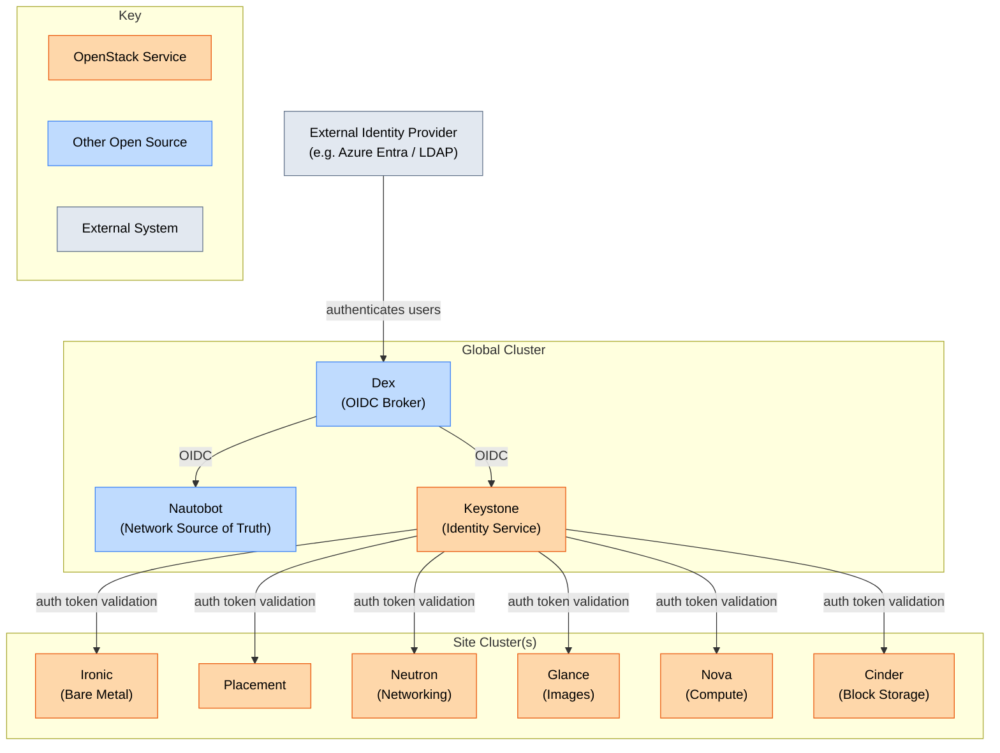

# Architecture Overview

UnderStack is split across two cluster types: a **global cluster** hosting shared
services, and one or more **site clusters** hosting the OpenStack compute plane.

## Service Layout

## Authentication Flow

All user authentication is brokered through **Dex**, which acts as an OIDC
federation layer in front of your external Identity Provider (IdP). This means
you only need to configure your IdP connection once in Dex, and all services
inherit that integration.

- **Nautobot** uses Dex for SSO, allowing operators to log in with their
  corporate credentials.
- **Keystone** is configured with Dex as its OIDC provider, so all OpenStack
  API access and dashboard logins flow through Dex to the external IdP.

Once a user is authenticated via Keystone, the resulting token is trusted by
all site cluster OpenStack services (Ironic, Placement, Neutron, Glance, Nova,
Cinder). Those services validate tokens against Keystone but do not interact
with Dex or the external IdP directly.
