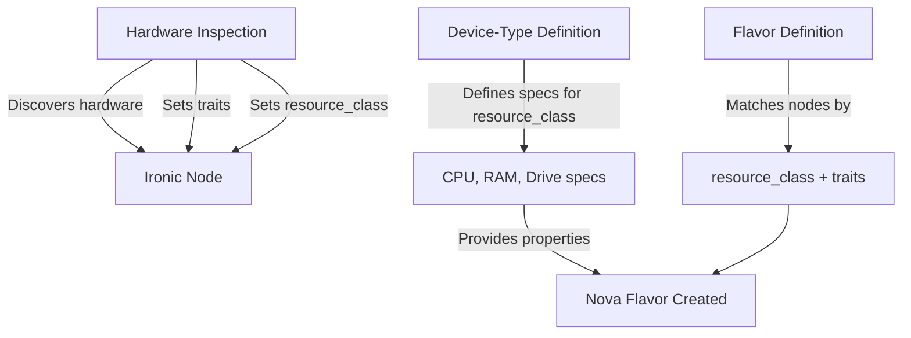

# Hardware Flavor Definitions

## Purpose

Hardware flavor definitions are YAML specifications that define how to create Nova flavors for bare metal nodes. Each hardware flavor definition results in a corresponding Nova flavor that users see when running `openstack flavor list`. These definitions specify matching criteria based on resource classes and traits, determining which Ironic bare metal nodes are eligible for each Nova flavor.

The Nova flavor properties (vCPUs, RAM, disk) are automatically derived from the matched device-type resource class, and scheduling is performed using resource class and trait matching.

Flavors enable operators to:

* Create generic hardware categories (e.g., `m1.small`) that match any server in a resource class
* Define specialized flavors with trait requirements (e.g., `m1.small.nicX`) for specific hardware features
* Exclude specific hardware from flavor matching using trait absence requirements
* Provide users with both flexible and specialized compute options from the same hardware pool

## Architecture

### Workflow

1. **Inspection Phase**: Custom inspection code adds traits to Ironic nodes based on discovered hardware capabilities (NICs, GPUs, storage controllers, etc.)
2. **Device-Type Matching**: Hardware inspection data is matched against device-type definitions, setting the node's `resource_class` property
3. **Flavor Matching**: Flavor definitions match nodes by `resource_class` first, then filter by trait requirements
4. **Nova Flavor Creation**: Matched flavors use the CPU, memory, and drive specifications from the device-type resource class to create Nova flavors

### Data Flow



## Schema Structure

Flavor definitions are YAML files validated against `schema/flavor.schema.json`.

### Required Fields

* **name**: Unique identifier for the flavor (e.g., `m1.small`, `m1.small.nicX`)
* **resource_class**: Ironic resource class to match (must correspond to a device-type resource class)

### Optional Fields

* **traits**: Array of trait requirements for hardware matching
    * **trait**: Trait name without `CUSTOM_` prefix (e.g., `NICX`, `GPU`, `NVME`)
        * Pattern: `^[A-Z][A-Z0-9_]*$` (uppercase alphanumeric and underscores)
        * `CUSTOM_` prefix is automatically added when interacting with Ironic
    * **state**: Either `required` (node must have trait) or `absent` (node must not have trait)

### Example: Generic Flavor

```yaml
---
# yaml-language-server: $schema=https://rackerlabs.github.io/understack/flavor.schema.json
name: m1.small
resource_class: m1.small
```

This matches all Ironic nodes with `resource_class=m1.small`, regardless of traits. Nova flavor properties (vCPUs, RAM, disk) come from the device-type's `m1.small` resource class definition.

### Example: Trait-Specific Flavor

```yaml
---
# yaml-language-server: $schema=https://rackerlabs.github.io/understack/flavor.schema.json
name: m1.small.nicX
resource_class: m1.small
traits:
  - trait: NICX
    state: required
```

This matches only nodes with `resource_class=m1.small` AND the `CUSTOM_NICX` trait. Nova flavor properties still come from the device-type's `m1.small` resource class.

### Example: Exclusion Flavor

```yaml
---
# yaml-language-server: $schema=https://rackerlabs.github.io/understack/flavor.schema.json
name: m1.small.no-gpu
resource_class: m1.small
traits:
  - trait: GPU
    state: absent
```

This matches nodes with `resource_class=m1.small` that do NOT have the `CUSTOM_GPU` trait.

## Integration Points

### GitOps Deployment

Flavor definitions are stored in the deployment repository:

```text
$UC_DEPLOY/
└── hardware/
    ├── flavors/
    │   ├── m1.small.yaml
    │   ├── m1.small.nicX.yaml
    │   └── m1.medium.yaml
    └── base/
        └── kustomization.yaml
```

The `kustomization.yaml` generates a ConfigMap containing all flavor definitions:

```yaml
configMapGenerator:
  - name: flavors
    options:
      disableNameSuffixHash: true
    files:
      - m1.small.yaml=../flavors/m1.small.yaml
      - m1.small.nicX.yaml=../flavors/m1.small.nicX.yaml
```

ArgoCD detects changes and updates the ConfigMap in the cluster.

### Trait System

**Trait Discovery**: Custom inspection code examines hardware and adds traits to Ironic nodes:

* NIC models/capabilities (e.g., `CUSTOM_NICX`, `CUSTOM_MELLANOX`)
* GPU presence/models (e.g., `CUSTOM_GPU`, `CUSTOM_NVIDIA_A100`)
* Storage controllers (e.g., `CUSTOM_NVME`, `CUSTOM_RAID`)
* CPU features (e.g., `CUSTOM_AVX512`, `CUSTOM_SGX`)

**Trait Naming Convention**:

* Users write trait names without the `CUSTOM_` prefix in flavor definitions
* The system automatically adds `CUSTOM_` when interacting with Ironic APIs
* Trait names must be uppercase with alphanumeric characters and underscores

### Flavor Matcher

The flavor-matcher service (or workflow component) consumes both flavor and device-type definitions:

1. Queries Ironic for nodes with matching `resource_class`
2. Filters nodes based on trait requirements:
    * `required`: Node must have the trait
    * `absent`: Node must NOT have the trait
3. Looks up the device-type resource class to get CPU, memory, and drive specifications
4. Creates or updates Nova flavors with properties from the device-type resource class

### Nova Flavor Property Derivation

Nova flavor properties (vcpus, ram, disk) are derived from the device-type resource class for convenience. For bare metal flavors, these properties are informational only - the actual scheduling is done through the `extra_specs` properties where resource consumption is set to 0. See [OpenStack Ironic flavor configuration documentation](https://docs.openstack.org/ironic/latest/install/configure-nova-flavors.html) for details on how Nova flavors work with Ironic.

Derived properties:

* **vcpus**: CPU cores from resource class `cpu.cores`
* **ram**: Memory size from resource class `memory.size` (converted to MB)
* **disk**: Primary drive size from resource class `drives[0].size` (or 0 for diskless)

The extra_specs properties are set for scheduling:

* **resources:VCPU='0'**: Bare metal doesn't consume virtual CPU resources
* **resources:MEMORY_MB='0'**: Bare metal doesn't consume virtual memory resources
* **resources:DISK_GB='0'**: Bare metal doesn't consume virtual disk resources
* **resources:CUSTOM_BAREMETAL_{RESOURCE_CLASS}='1'**: Requires one bare metal node of the specified resource class

Example device-type resource class:

```yaml
resource_class:
  - name: m1.small
    cpu:
      cores: 16
      model: AMD EPYC 9124
    memory:
      size: 128
    drives:
      - size: 480
      - size: 480
    nic_count: 2
```

This produces a Nova flavor with properties:

* vcpus: 16
* ram: 131072 MB (128 GB * 1024)
* disk: 480 GB

And extra_specs for scheduling:

* resources:CUSTOM_BAREMETAL_M1_SMALL='1'
* resources:VCPU='0'
* resources:MEMORY_MB='0'
* resources:DISK_GB='0'

## Use Cases

### Generic Hardware Pools

Create flavors that match any hardware in a resource class:

```yaml
---
name: compute.standard
resource_class: m1.medium
```

Users get any available `m1.medium` server, providing flexibility and maximizing hardware utilization.

### Specialized Workloads

Create flavors for specific hardware capabilities:

```yaml
---
name: compute.gpu
resource_class: m1.large
traits:
  - trait: GPU
    state: required
```

Guarantees instances get hardware with GPU capabilities while using the `m1.large` resource class specifications for vCPUs/RAM/disk.

### Hardware Requirement with Exclusion

Require specific hardware while excluding others:

```yaml
---
name: m1.small.mellanox-cx5
resource_class: m1.small
traits:
  - trait: NIC_MELLANOX_CX5
    state: required
```

Guarantees instances get nodes with Mellanox ConnectX-5 network cards.

### Multiple Flavors per Resource Class

Define multiple flavors for the same resource class with different trait requirements:

```yaml
---
# Generic flavor
name: m1.small
resource_class: m1.small
---
# Specialized variant
name: m1.small.nvme
resource_class: m1.small
traits:
  - trait: NVME
    state: required
```

Users can choose between generic availability or guaranteed NVMe storage. Both flavors have identical Nova properties (derived from device-type `m1.small`), but different hardware selection criteria.

## Best Practices

### Naming Conventions

* **Base flavor**: Use simple names matching resource class (e.g., `m1.small`)
* **Specialized flavors**: Append trait indicators (e.g., `m1.small.mellanox-cx5`, `m1.large.gpu`)
* **Exclusion flavors**: Use descriptive suffixes (e.g., `m1.small.no-gpu`)

### Trait Design

* Define traits at appropriate granularity - both specific (model-level) and general (category-level) traits are useful
* Specific traits enable precise hardware selection and maximize flexibility for users with specialized needs
* General traits provide broader hardware pools for users with less specific requirements
* Document trait meanings and discovery logic in a central registry (see [hardware-traits.md](hardware-traits.md) for standard traits)
* Use consistent trait naming across the organization:
    * Reference the standard traits documented in hardware-traits.md
    * For custom traits, establish naming conventions in your deployment repository's trait registry
    * Follow the pattern: `CATEGORY_VENDOR_MODEL` (e.g., `NIC_MELLANOX_CX5`, `GPU_NVIDIA_A100`)
    * Coordinate with other teams when defining new traits to avoid duplicates or conflicts

### Resource Class Alignment

* Ensure `resource_class` references exist in device-type definitions
* Nova properties are automatically derived from device-type resource class specifications
* Multiple flavors can reference the same resource class with different trait filters
* Resource class defines "what resources the hardware has"; flavor defines "which hardware qualifies"

### Version Control

* Treat flavor definitions as infrastructure-as-code
* Use descriptive commit messages when adding/modifying flavors
* Test flavor matching in non-production before promoting changes
* Document rationale for trait requirements in commit messages

## Management Workflow

Flavor definitions are managed using the `understackctl flavor` CLI:

```bash
# Validate a flavor definition
understackctl flavor validate /tmp/m1.small.yaml

# Add to deployment repository
understackctl flavor add /tmp/m1.small.yaml

# List all flavors
understackctl flavor list

# Show flavor details
understackctl flavor show m1.small

# Delete a flavor
understackctl flavor delete m1.small
```

See the [operator guide](../operator-guide/flavors.md) for detailed usage instructions.

## Validation

Flavor definitions undergo JSON schema validation checking:

* Required field presence (name, resource_class)
* Type correctness (strings for name/resource_class/traits)
* Trait name patterns (uppercase alphanumeric with underscores)
* Trait state enum values (`required` or `absent`)

Validation happens at:

* **Editor time**: YAML language server validates against schema URL
* **CLI time**: `understackctl flavor add` and `validate` commands perform full schema validation
* **Runtime**: Flavor-matcher validates ConfigMap contents before processing

## Relationship to Device-Types

Flavors and device-types have a tightly coupled relationship:

* **Device-types** define physical hardware models and resource classes with CPU/memory/drive specifications
* **Flavors** reference these resource classes and add trait filtering for node selection
* **Device-types** describe "what the hardware is" and "what resources it has"
* **Flavors** describe "which hardware qualifies for this Nova flavor"

### Resource Class Linkage

Each flavor's `resource_class` must match a resource class defined in a device-type:

**Device-Type Definition** (`dell-poweredge-r7615.yaml`):

```yaml
---
class: server
manufacturer: Dell
model: PowerEdge R7615
resource_class:
  - name: m1.small
    cpu:
      cores: 16
      model: AMD EPYC 9124
    memory:
      size: 128
    drives:
      - size: 480
      - size: 480
    nic_count: 2
```

**Flavor Definition** (`m1.small.yaml`):

```yaml
---
name: m1.small
resource_class: m1.small  # Links to device-type resource class
```

The flavor-matcher looks up `m1.small` in device-type definitions to find the CPU (16 cores), memory (128 GB), and drives (480 GB) when creating the Nova flavor.

**Important**: Resource class names must be unique across all device types. Each resource class name should only be defined in one device type to avoid conflicts and ensure predictable Nova flavor creation. Validation checks enforce this constraint.

### Multiple Flavors, Single Resource Class

A single device-type resource class supports multiple flavors with different trait filters:

```yaml
---
# Generic: matches all m1.small nodes
name: m1.small
resource_class: m1.small
---
# Specialized: only nodes with NICX trait
name: m1.small.nicX
resource_class: m1.small
traits:
  - trait: NICX
    state: required
---
# Exclusion: nodes without GPU
name: m1.small.no-gpu
resource_class: m1.small
traits:
  - trait: GPU
    state: absent
```

All three Nova flavors have identical vCPUs/RAM/disk (from device-type `m1.small`), but select different subsets of hardware based on traits.

This separation allows flexible hardware matching strategies without duplicating resource specifications across multiple files.
