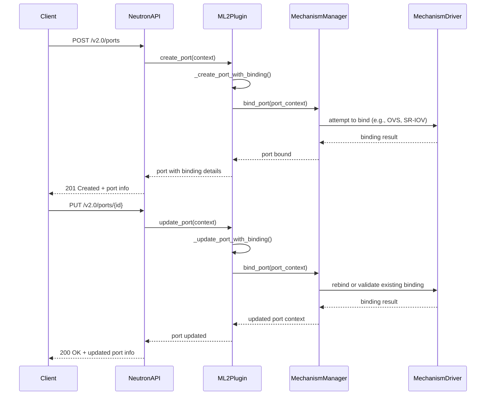

# Neutron Networking

The focus of UnderStack is on on delivering bare metal systems while wanting
to provide a cloud like experience there are a number of SDN functions that
must be implemented. By utilizing OpenStack Neutron as the user facing API
many of these features can be achieved.

To enable this we are using the following plugins/features of Neutron:

- [OVN driver][ovn-driver] for general [OVN][ovn] support
- [networking-baremetal][networking-baremetal] to have Neutron aware of the physical
  networks of Ironic baremetal ports.
- our custom mechanism driver called `understack`
- [ovn-router][ovn-admin] as the L3 router plugin
- [trunk plugin][neutron-trunk] service plugin
- [network segment range][neutron-network-segment-range] service plugin

The physical network design for each site is a leaf/spine configuration
so to best support this we use the VXLAN type driver with VLANs on all the
leaves bound to the VXLAN VNI. In this configuration there is only one subnet
across the network, in Neutron this is called [L2 Adjacency][neutron-l2-adjacency].
This model has been used by networking vendors such as Arista, Juniper, and Cisco
in their own ML2 mechanism driver. However full support for this has been lacking
upstream so we have developed our own mechanism driver as we explore the best
approach. Traditionally Ironic (baremetal) based Neutron deployment have utilized
the [networking-generic-switch][networking-generic-switch] mechanism however as it
stands today it only supports VLAN and it's templating capabilities are not sufficient
for our needs. We hope to eventually create a generic mechanism which can be contributed
back. Another limitation that we are aware of is in the VXLAN type driver itself,
the Neutron team designed this type as an overlay style VXLAN system while we are
focused on an underlay or EVPN-VXLAN style system. We are actively working with
upstream on how to best include this use case.

## Mapping Leaf/Spine to Neutron Networks

In a Leaf/Spine fabric, VXLAN VNIs are used to create virtual network segments
that run over the IP underlay. On the leaf switches, traditional VLANs connected
to physical assets are typically mapped to specific VNIs to provide connectivity
across the fabric.

### VNIs

An available pool of VNIs is defined by creating a VXLAN [network segment range][neutron-network-segment-range]
with the same name as the fabric on which the VNIs will reside.

<!-- markdownlint-capture -->
<!-- markdownlint-disable MD046 -->
!!! Note

    This is one of the places that the underlay vs overlay VXLAN disconnect
    rears its head. Neutron assumes that all VXLAN participants will be able
    to reach each other via the tunnel configuration. However it is possible
    to have multiple physically separate fabrics but Neutron does not allow
    the VXLAN type to have a `physical_network` value like VLAN networks.
<!-- markdownlint-restore -->

Provider networks and self-serviced tenant networks are allocated VNIs from this range.

### VLANs

For each leaf pair on the fabric a VLAN [network segment range][neutron-network-segment-range]
is created with the `physical_network` value set to their pair name. For example,
the name of the rack they serve could be used.

### Connecting a Server to a Network

When a server needs to establish a connection to a network, Ironic takes all
the baremetal ports assigned to that server and compares each
baremetal port's `local_link_connection` and `physical_network` attributes to
the desired network to determine the correct port to use.
This process is documented is documented in Ironic's
Networking Guide as [VIF Attachment][ironic-vif-attachment]. Changes to this
process are coming in a forthcoming Ironic spec for [dynamic port attachment][ironic-spec-dpa].

If the VNI that is associated with the VXLAN network is not already mapped to
a VLAN on the leaf pair where the server is being connected
then there will not be a `physical_network` match to a segment in the network and
one of the baremetal port's of the server. In this case
we will not have a VLAN segment, so we will allocate a new VLAN
in the correct leaf pair by utilizing the `physical_network` of one of the
baremetal ports to create a VLAN segment and attach it to the VXLAN network. The
mechanism is then responsible for then ensuring the switch configuration is applied.
The code then re-attempts this operation and this time finds a match and is able to
use it.

For more technical details on this operation see the Bind Port section.

### Routing Network Traffic

Networks by default are isolated from each other and do not support any data ingress
or egress by default. To route traffic between networks and to provide ingress and
egress, Neutron provides router support. Neutron router support is implemented by a
plugin. In the case of UnderStack, since OVN is being utilized the [OVN L3 plugin][ovn-routers]
is used. This plugin provides for the ability to define different
[router flavors][ovn-router-flavors] so that more than just OVN can be used to route
traffic. Router flavor plugins can be crafted to encompass physical devices or
virtual devices upon which other features can be provided.

Routers operate the same as baremetal servers. A VLAN must exist on the leaf pair
where the virtual or physical router is being served from so that traffic can be
handled.

## A View from the Neutron API/CLI

First we'll create a self-serviced tenant network with the following:

```bash
openstack network create milantest
# Fictional output because this network was already created and also
# had a subnet created for it. We've also got additional permissions
# to view the provider information to help with the explanation.
+---------------------------+--------------------------------------+
| Field                     | Value                                |
+---------------------------+--------------------------------------+
| admin_state_up            | UP                                   |
| availability_zone_hints   |                                      |
| availability_zones        |                                      |
| created_at                | 2025-02-12T18:32:40Z                 |
| description               |                                      |
| dns_domain                | None                                 |
| id                        | 783b4239-7220-4a74-8253-415539469860 |
| ipv4_address_scope        | None                                 |
| ipv6_address_scope        | None                                 |
| is_default                | None                                 |
| is_vlan_qinq              | None                                 |
| is_vlan_transparent       | None                                 |
| l2_adjacency              | True                                 |
| mtu                       | 9000                                 |
| name                      | milantest                            |
| port_security_enabled     | False                                |
| project_id                | d3c2c86bdbf24ff5843f323524b63768     |
| provider:network_type     | vxlan                                |
| provider:physical_network | None                                 |
| provider:segmentation_id  | 200004                               |
| qos_policy_id             | None                                 |
| revision_number           | 2                                    |
| router:external           | Internal                             |
| segments                  | None                                 |
| shared                    | False                                |
| status                    | ACTIVE                               |
| subnets                   | 6f8e3a32-c7a7-4354-808f-75800b21efcf |
| tags                      |                                      |
| updated_at                | 2025-04-25T12:40:34Z                 |
+---------------------------+--------------------------------------+
```

From the northbound side of OVN we see the following about this network:

```bash
ovn-nbctl show
# snip extra output
switch 9077901b-2a7b-46ed-a012-59bcce9a4da3 (neutron-783b4239-7220-4a74-8253-415539469860) (aka milantest)
# snip extra output
```

You will see that a virtual switch is created with the same name and its ID matches the network ID.

### Attaching servers to networks

Now there's a network that can be used to attach a server to. We'll go
ahead and assume a server was built and attached to the network.

We can see how this server got connected to the network by looking at the segments.

```bash
openstack network segment list --network milantest
+--------------------------------------+------------------+--------------------------------------+--------------+---------+
| ID                                   | Name             | Network                              | Network Type | Segment |
+--------------------------------------+------------------+--------------------------------------+--------------+---------+
| 5ab3339d-ae44-4f45-9293-7b41a83bf473 | None             | 783b4239-7220-4a74-8253-415539469860 | vlan         |    1800 |
| 78be9792-cf21-4c5e-8432-bd83f0830763 | None             | 783b4239-7220-4a74-8253-415539469860 | vxlan        |  200004 |
+--------------------------------------+------------------+--------------------------------------+--------------+---------+

openstack network segment show 5ab3339d-ae44-4f45-9293-7b41a83bf473
+------------------+--------------------------------------+
| Field            | Value                                |
+------------------+--------------------------------------+
| created_at       | 2025-04-29T13:21:31Z                 |
| description      | None                                 |
| id               | 5ab3339d-ae44-4f45-9293-7b41a83bf473 |
| name             | None                                 |
| network_id       | 783b4239-7220-4a74-8253-415539469860 |
| network_type     | vlan                                 |
| physical_network | f20-2-network                        |
| revision_number  | 0                                    |
| segmentation_id  | 1800                                 |
| updated_at       | 2025-04-29T13:21:31Z                 |
+------------------+--------------------------------------+
```

Now we can check the ports to confirm that this segment exists to provide
connectivity to this server.

```bash
openstack port list --network milantest
+--------------------------------------+-----------------+-------------------+--------------------------------------------------------------------------------+--------+
| ID                                   | Name            | MAC Address       | Fixed IP Addresses                                                             | Status |
+--------------------------------------+-----------------+-------------------+--------------------------------------------------------------------------------+--------+
| 47bb4c37-f60d-474f-8ce5-c7c1d9982585 | trunk_parent11  | 14:23:f3:f5:22:b0 | ip_address='192.168.100.170', subnet_id='6f8e3a32-c7a7-4354-808f-75800b21efcf' | ACTIVE |
+--------------------------------------+-----------------+-------------------+--------------------------------------------------------------------------------+--------+

openstack baremetal port list --address '14:23:f3:f5:22:b0' --fields physical_network internal_info
+------------------+----------------------------------------------------------------+
| Physical Network | Internal Info                                                  |
+------------------+----------------------------------------------------------------+
| f20-2-network    | {'tenant_vif_port_id': '47bb4c37-f60d-474f-8ce5-c7c1d9982585'} |
+------------------+----------------------------------------------------------------+
```

You will see in the last output that the `tenant_vif_port_id` matches the ID of the Neutron
port when we shows the ports on the network.

This process will be repeated for every server that is connected to the network. If a
server is connected to a leaf with an existing segment then an additional VLAN will not
be consumed.

Similarly on the northbound of OVN we will see the port appear on the virtual switch.

```bash
ovn-nbctl show
# snip extra output
switch 9077901b-2a7b-46ed-a012-59bcce9a4da3 (neutron-783b4239-7220-4a74-8253-415539469860) (aka milantest)
    port 47bb4c37-f60d-474f-8ce5-c7c1d9982585 (aka trunk_parent11)
        type: external
        addresses: ["14:23:f3:f5:22:b0 192.168.100.170"]
# snip extra output
```

Once again the naming and the IDs match up with the port as it exists in Neutron to aid debugging.

### Attaching routers to networks

Attaching a router to a network operates similarly to attaching servers except that
the router port will be trunked to our Neutron Network node.

Firstly we'll create a router.

```bash
openstack router create puc-908
+---------------------------+--------------------------------------+
| Field                     | Value                                |
+---------------------------+--------------------------------------+
| admin_state_up            | UP                                   |
| availability_zone_hints   |                                      |
| availability_zones        |                                      |
| created_at                | 2025-05-01T15:13:06Z                 |
| description               |                                      |
| enable_default_route_bfd  | False                                |
| enable_default_route_ecmp | False                                |
| enable_ndp_proxy          | None                                 |
| external_gateway_info     | null                                 |
| external_gateways         | []                                   |
| flavor_id                 | None                                 |
| ha                        | False                                |
| id                        | 85533c29-d1f1-42f8-a133-d15099318f3a |
| interfaces_info           | []                                   |
| name                      | puc-908                              |
| project_id                | d3c2c85bdbf24ff5843f323524b63768     |
| revision_number           | 1                                    |
| routes                    |                                      |
| status                    | ACTIVE                               |
| tags                      |                                      |
| tenant_id                 | d3c2c85bdbf24ff5843f323524b63768     |
| updated_at                | 2025-05-01T21:09:19Z                 |
+---------------------------+--------------------------------------+
```

We'll see this object get created in OVN as well.

```bash
ovn-nbctl show
# snip extra output
router 81a34be1-bbb3-4ae4-8d3e-d9b7bf3992b4 (neutron-85533c29-d1f1-42f8-a133-d15099318f3a) (aka puc-908)
# snip extra output
```

The name and the ID continue to match up with data inside of Neutron. Now we can attach our
network's subnet to the router.

```bash
openstack router add subnet puc-908 6f8e3a32-c7a7-4354-808f-75800b21efcf
+---------------------------+-------------------------------------------------------------------------------------------------------------------------------------------+
| Field                     | Value                                                                                                                                     |
+---------------------------+-------------------------------------------------------------------------------------------------------------------------------------------+
| admin_state_up            | UP                                                                                                                                        |
| availability_zone_hints   |                                                                                                                                           |
| availability_zones        |                                                                                                                                           |
| created_at                | 2025-05-01T15:13:06Z                                                                                                                      |
| description               |                                                                                                                                           |
| enable_default_route_bfd  | False                                                                                                                                     |
| enable_default_route_ecmp | False                                                                                                                                     |
| enable_ndp_proxy          | None                                                                                                                                      |
| external_gateway_info     | null                                                                                                                                      |
| external_gateways         | []                                                                                                                                        |
| flavor_id                 | None                                                                                                                                      |
| ha                        | True                                                                                                                                      |
| id                        | 85533c29-d1f1-42f8-a133-d15099318f3a                                                                                                      |
| interfaces_info           | [{"port_id": "10099d3c-0ade-41b9-8a1c-1d50ace4bf22", "ip_address": "192.168.100.1", "subnet_id": "6f8e3a32-c7a7-4354-808f-75800b21efcf"}] |
| name                      | puc-908                                                                                                                                   |
| project_id                | d3c2c85bdbf24ff5843f323524b63768                                                                                                          |
| revision_number           | 4                                                                                                                                         |
| routes                    |                                                                                                                                           |
| status                    | ACTIVE                                                                                                                                    |
| tags                      |                                                                                                                                           |
| tenant_id                 | d3c2c85bdbf24ff5843f323524b63768                                                                                                          |
| updated_at                | 2025-05-01T21:10:39Z                                                                                                                      |
+---------------------------+-------------------------------------------------------------------------------------------------------------------------------------------+
```

We'll look at the segments and how they're attached.

```bash
openstack network segment list --network milantest
+--------------------------------------+------------------+--------------------------------------+--------------+---------+
| ID                                   | Name             | Network                              | Network Type | Segment |
+--------------------------------------+------------------+--------------------------------------+--------------+---------+
| 059fd287-4fd1-446f-a506-e0ed9276f67d | None             | 783b4239-7220-4a74-8253-415539469860 | vlan         |    1801 |
| 5ab3339d-ae44-4f45-9293-7b41a83bf473 | None             | 783b4239-7220-4a74-8253-415539469860 | vlan         |    1800 |
| 78be9792-cf21-4c5e-8432-bd83f0830763 | None             | 783b4239-7220-4a74-8253-415539469860 | vxlan        |  200004 |
+--------------------------------------+------------------+--------------------------------------+--------------+---------+

openstack network segment show 059fd287-4fd1-446f-a506-e0ed9276f67d
+------------------+--------------------------------------+
| Field            | Value                                |
+------------------+--------------------------------------+
| created_at       | 2025-05-01T20:45:16Z                 |
| description      |                                      |
| id               | 059fd287-4fd1-446f-a506-e0ed9276f67d |
| name             | None                                 |
| network_id       | 783b4239-7220-4a74-8253-415539469860 |
| network_type     | vlan                                 |
| physical_network | f20-1-network                        |
| revision_number  | 2                                    |
| segmentation_id  | 1801                                 |
| updated_at       | 2025-05-01T20:55:24Z                 |
+------------------+--------------------------------------+
```

This time we can see a different VLAN is selected on a different leaf. We can confirm this via
our ports.

```bash
openstack port list --network milantest
+--------------------------------------+-----------------+-------------------+--------------------------------------------------------------------------------+--------+
| ID                                   | Name            | MAC Address       | Fixed IP Addresses                                                             | Status |
+--------------------------------------+-----------------+-------------------+--------------------------------------------------------------------------------+--------+
| 10099d3c-0ade-41b9-8a1c-1d50ace4bf22 |                 | fa:16:3e:10:8f:f1 | ip_address='192.168.100.1', subnet_id='6f8e3a32-c7a7-4354-808f-75800b21efcf'   | ACTIVE |
| 47bb4c37-f60d-474f-8ce5-c7c1d9982585 | trunk_parent11  | 14:23:f3:f5:22:b0 | ip_address='192.168.100.170', subnet_id='6f8e3a32-c7a7-4354-808f-75800b21efcf' | ACTIVE |
+--------------------------------------+-----------------+-------------------+--------------------------------------------------------------------------------+--------+
```

Inside of OVN we see the following data:

```bash
ovn-nbctl show
# snip extra output
switch 9077901b-2a7b-46ed-a012-59bcce9a4da3 (neutron-783b4239-7220-4a74-8253-415539469860) (aka milantest)
    port 47bb4c37-f60d-474f-8ce5-c7c1d9982585 (aka trunk_parent11)
        type: external
        addresses: ["14:23:f3:f5:22:b0 192.168.100.170"]
    port 10099d3c-0ade-41b9-8a1c-1d50ace4bf22
        type: router
        router-port: lrp-10099d3c-0ade-41b9-8a1c-1d50ace4bf22
    port provnet-059fd287-4fd1-446f-a506-e0ed9276f67d
        type: localnet
        tag: 1801
        addresses: ["unknown"]
router 81a34be1-bbb3-4ae4-8d3e-d9b7bf3992b4 (neutron-85533c29-d1f1-42f8-a133-d15099318f3a) (aka puc-908)
    port lrp-10099d3c-0ade-41b9-8a1c-1d50ace4bf22
        mac: "fa:16:3e:10:8f:f1"
        networks: ["192.168.100.1/24"]
# snip extra output
```

The names and the IDs all match, along with the VLAN ID of the segment where the node running OVN resides.

## ML2 Mechanism Operations

Our ML2 mechanism is responsible for the following:

- creating dynamic VLAN segments on VXLAN networks via port binding operations via `bind_port()`
- deleting dynamic VLAN segments on VXLAN networks when ports are removed via `delete_port_postcommit()`
- triggering the actual operation to update the leaf/spine devices to provide the connectivity via `update_port_postcommit()`



### Bind Port

While `bind_port()` is a distinct method inside of an ML2 mechanism, there is
no direct call for this via the Neutron API. This method is triggered by
Neutron based on certain data provided to port creation and update API calls.

`bind_port()` will be triggered in the following situations:

- the port has a binding host
- the port is either unbound or has previously failed to bind

[networking-baremetal]: <https://docs.openstack.org/networking-baremetal/latest/>
[ovn]: <https://docs.ovn.org/en/latest/>
[ovn-driver]: <https://docs.openstack.org/neutron/latest/ovn/index.html>
[ovn-admin]: <https://docs.openstack.org/neutron/latest/admin/ovn/index.html>
[ovn-routers]: <https://docs.openstack.org/neutron/latest/admin/ovn/refarch/routers.html>
[ovn-router-flavors]: <https://specs.openstack.org/openstack/neutron-specs/specs/2023.2/ml2ovn-router-flavors.html>
[neutron-trunk]: <https://docs.openstack.org/neutron/latest/admin/config-trunking.html>
[neutron-network-segment-range]: <https://docs.openstack.org/neutron/latest/admin/config-network-segment-ranges.html>
[neutron-l2-adjacency]: <https://specs.openstack.org/openstack/neutron-specs/specs/newton/routed-networks.html>
[networking-generic-switch]: <https://docs.openstack.org/networking-generic-switch/latest/>
[ironic-vif-attachment]: <https://docs.openstack.org/ironic/latest/admin/networking.html#vif-attachment-flow>
[ironic-spec-dpa]: <https://review.opendev.org/c/openstack/ironic-specs/+/945642>
