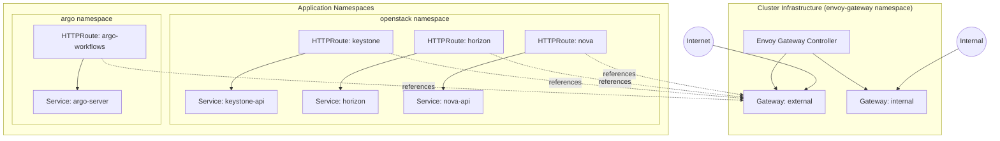

# Gateway API Migration Guide

## Overview & Rationale

UnderStack has migrated from the legacy Ingress API with ingress-nginx controller to the new Kubernetes Gateway API with Envoy Gateway. This migration was driven by the [ingress-nginx project retirement announcement](https://www.kubernetes.dev/blog/2025/11/12/ingress-nginx-retirement/) with a deadline of March 2026. The Kubernetes community recommends migrating to the Gateway API as the modern, standardized approach for managing ingress traffic.

### Benefits of Gateway API

- **Role-oriented design**: Separates concerns between cluster operators (Gateway) and application developers (Routes)
- **Expressive routing**: More powerful matching and filtering capabilities
- **Protocol support**: Native support for HTTP, HTTPS, TLS passthrough, TCP, and UDP
- **Extensibility**: Vendor-specific features through policy attachments
- **Type safety**: Strongly typed API with better validation

## Architecture Overview

UnderStack uses a centralized Gateway architecture where cluster operators manage shared Gateway resources, and application teams create Route resources in their own namespaces.



## Concept Mapping

Understanding how Ingress concepts map to Gateway API helps with migration and troubleshooting:

| Ingress Concept | Gateway API Concept | Location | Description |
|----------------|---------------------|----------|-------------|
| IngressController (ingress-nginx) | Gateway Controller (Envoy Gateway) | `envoy-gateway` namespace | The controller implementation that manages traffic |
| IngressClass | GatewayClass | Cluster-scoped | Defines which controller handles the Gateway |
| Ingress | Gateway | `envoy-gateway` namespace | Defines listeners (ports, protocols, TLS) - shared cluster resource |
| Ingress rules | HTTPRoute / TLSRoute | Application namespace | Defines routing rules (hostnames, paths, backends) |
| `nginx.ingress.kubernetes.io/backend-protocol` annotation | Backend resource | Application namespace | For TLS backends, uses Envoy Gateway's Backend CRD |
| `cert-manager.io/cluster-issuer` annotation | Gateway annotation | On Gateway resource | Certificate management moved to Gateway level |

### Key Architectural Differences

**Ingress (Old)**:

- Each application creates its own Ingress resource
- Ingress includes both infrastructure concerns (TLS, listeners) and routing rules
- Annotations used heavily for controller-specific features
- Each Ingress can specify its own TLS configuration

**Gateway API (New)**:

- Cluster operators create shared Gateway resources (external, internal)
- Applications create lightweight Route resources that reference Gateways
- Clear separation: Gateway = infrastructure, Route = application routing
- TLS certificates managed at Gateway level for all routes
- Routes can be in different namespaces than the Gateway

## UnderStack Implementation

### Gateway Resources

UnderStack deploys two shared Gateways in the `envoy-gateway` namespace:

**External Gateway** (`gw-external`):

- Handles public-facing traffic
- HTTPS (port 443) with TLS termination
- Dynamically creates listeners based on configured routes
- Integrates with cert-manager for automatic certificate provisioning
- Each hostname gets its own listener with dedicated TLS certificate

**Internal Gateway** (`gw-internal`):

- Handles cluster-internal traffic
- HTTP (port 80) without TLS
- Single listener accepting all namespaces

### Route Configuration

Routes are managed through the `envoy-configs` Helm chart, which generates HTTPRoute and TLSRoute resources based on declarative configuration.

#### HTTP Routes

HTTP routes terminate TLS at the Gateway and forward HTTP traffic to backend services:

```yaml
routes:
  http:
    - name: keystone
      fqdn: keystone.example.com
      namespace: openstack
      service:
        name: keystone-api
        port: 5000
```

This generates:

1. A listener on the external Gateway for `keystone.example.com:443`
2. An HTTPRoute in the `openstack` namespace
3. A cert-manager Certificate resource named `keystone-tls`

#### TLS Routes (Passthrough)

TLS routes pass encrypted traffic directly to the backend without termination:

```yaml
routes:
  tls:
    - name: argo-workflows
      fqdn: workflows.example.com
      namespace: argo
      service:
        name: argo-server
        port: 2746
```

Used when the backend service handles TLS itself (like Argo Workflows with HTTPS).

#### HTTPS Backends

For backends that expect HTTPS but you want TLS termination at the Gateway:

```yaml
routes:
  http:
    - name: argo-workflows
      fqdn: workflows.example.com
      namespace: argo
      service:
        name: argo-server
        port: 2746
        backendType: tls  # Tells Envoy to use HTTPS to backend
```

This uses Envoy Gateway's Backend CRD to establish TLS connections to the backend service.

## Migration Guide

### Prerequisites

Ensure your UnderStack deployment is using a recent version that includes:

- Envoy Gateway component (automatically deployed via ArgoCD)
- cert-manager with Gateway API support enabled
- Updated bootstrap script with Gateway API configuration

### Migration Steps for Existing Deployments

The migration requires changes in your deployment repository (`deploy/<site>/`). Here's the complete process:

#### 1. Disable ingress-nginx Controller

In your `apps.yaml`, add ingress-nginx to the skip list:

```yaml
- component: ingress-nginx
  skip: true
```

#### 2. Create GatewayClass Resource

Create `manifests/envoy-gateway/gateway-class.yaml`:

```yaml
---
apiVersion: gateway.networking.k8s.io/v1
kind: GatewayClass
metadata:
  name: eg
spec:
  controllerName: gateway.envoyproxy.io/gatewayclass-controller
```

And `manifests/envoy-gateway/kustomization.yaml`:

```yaml
apiVersion: kustomize.config.k8s.io/v1beta1
kind: Kustomization
resources:
  - gateway-class.yaml
```

#### 3. Configure Gateway and Routes

Create `helm-configs/envoy-configs.yaml` with your Gateway and route definitions:

```yaml
# yaml-language-server: $schema=https://rackerlabs.github.io/understack/schema/component-envoy-configs.schema.json
gateways:
  external:
    name: external-gateway
    namespace: envoy-gateway
    className: eg
    serviceAnnotations:
      # If using Cilium L2 announcements
      lbipam.cilium.io/ips: "10.4.35.199"
      lbipam.cilium.io/sharing-cross-namespace: "openstack"
      lbipam.cilium.io/sharing-key: "provisioning-service"
  internal:
    name: internal-gateway
    namespace: envoy-gateway
    className: eg
    serviceAnnotations:
      lbipam.cilium.io/ips: "10.4.35.199"
      lbipam.cilium.io/sharing-cross-namespace: "openstack"
      lbipam.cilium.io/sharing-key: "provisioning-service"

routes:
  http:
    # OpenStack services
    - fqdn: keystone.example.com
      service:
        name: keystone-api
        port: 5000
    - fqdn: nova.example.com
      service:
        name: nova-api
        port: 8774
    - fqdn: neutron.example.com
      service:
        name: neutron-server
        port: 9696
    # Add all your other services...

    # Services with HTTPS backends
    - fqdn: nautobot.example.com
      namespace: nautobot
      service:
        name: nautobot-default
        port: 443
        backendType: tls
    - fqdn: workflows.example.com
      namespace: argo
      service:
        name: argo-server
        port: 2746
        backendType: tls
```

Create empty `manifests/envoy-configs/kustomization.yaml`:

```yaml
apiVersion: kustomize.config.k8s.io/v1beta1
kind: Kustomization
resources: []
```

#### 4. Remove Old Ingress Resources

Delete any standalone Ingress manifests:

```bash
# Example
rm manifests/argo-workflows/ingress.yaml
```

Update kustomization files to remove ingress references:

```yaml
# manifests/argo-workflows/kustomization.yaml
resources:
  - https://github.com/rackerlabs/understack.git//components/argo-workflows/?ref=v0.0.43
  # Remove: - ingress.yaml
```

#### 5. Disable Ingress in Helm Charts

For components that generate their own Ingress resources (like monitoring stack), disable them in helm-configs:

```yaml
# helm-configs/monitoring.yaml
grafana:
  ingress:
    enabled: false

prometheus:
  ingress:
    enabled: false

alertmanager:
  ingress:
    enabled: false
```

#### 6. Update Cilium L2 Policies

If using Cilium L2 announcements, update the service selector to match Envoy Gateway:

```yaml
# manifests/cilium/c-l2policies.yaml
spec:
  serviceSelector:
    matchLabels:
      app.kubernetes.io/name: envoy  # Changed from: app.kubernetes.io/instance: ingress-nginx
```

#### 7. Update Load Balancer IP Sharing

Update any services that share IPs with the ingress controller:

```yaml
# manifests/ironic/services-ironic.yaml
metadata:
  annotations:
    lbipam.cilium.io/sharing-cross-namespace: envoy-gateway  # Changed from: ingress-nginx
```

#### 8. Update cert-manager Configuration

If not already done, ensure cert-manager has Gateway API support enabled in `helm-configs/cert-manager.yaml`:

```yaml
config:
  enableGatewayApi: true
  apiVersion: "controller.config.cert-manager.io/v1alpha1"
  kind: "ControllerConfiguration"
```

#### 9. Apply Changes

Commit and push your changes. ArgoCD will automatically:

1. Deploy Envoy Gateway controller
2. Create the GatewayClass
3. Create Gateway resources with listeners
4. Create HTTPRoute/TLSRoute resources
5. Provision TLS certificates via cert-manager
6. Remove the old ingress-nginx controller

### Adding New Applications

When adding a new application that needs external access:

1. **Add route configuration** to your site's `helm-configs/envoy-configs.yaml`:

   ```yaml
   routes:
     http:
       - name: myapp
         fqdn: myapp.example.com
         namespace: myapp-namespace
         service:
           name: myapp-service
           port: 8080
   ```

2. **For HTTPS backends**, add `backendType: tls`:

   ```yaml
   routes:
     http:
       - name: myapp
         fqdn: myapp.example.com
         namespace: myapp-namespace
         service:
           name: myapp-service
           port: 8443
           backendType: tls
   ```

3. **For TLS passthrough** (no termination at Gateway):

   ```yaml
   routes:
     tls:
       - name: myapp
         fqdn: myapp.example.com
         namespace: myapp-namespace
         service:
           name: myapp-service
           port: 8443
   ```

4. **Do not create Ingress resources** - all routing is managed centrally through `envoy-configs.yaml`

5. **For OpenStack Helm charts**, ensure these settings are configured:

   ```yaml
   network:
     use_external_ingress_controller: true

   manifests:
     ingress_api: false
     service_ingress_api: false

   endpoints:
     identity:
       scheme:
         public: https
       port:
         api:
           public: 443
   ```

### Troubleshooting

**Check Gateway status**:

```bash
kubectl get gateway -n envoy-gateway
kubectl describe gateway gw-external -n envoy-gateway
```

**Check Route status**:

```bash
kubectl get httproute -A
kubectl describe httproute <name> -n <namespace>
```

**View Envoy Gateway logs**:

```bash
kubectl logs -n envoy-gateway -l control-plane=envoy-gateway
```

**Check generated Envoy configuration**:

```bash
# Find the Envoy proxy pod
kubectl get pods -n envoy-gateway -l gateway.envoyproxy.io/owning-gateway-name=gw-external

# View configuration
kubectl exec -n envoy-gateway <pod-name> -- curl localhost:19000/config_dump
```

**Common issues**:

- **Route not working**: Check that the HTTPRoute's `parentRefs` correctly references the Gateway name and namespace
- **Certificate issues**: Verify the Gateway annotation `cert-manager.io/cluster-issuer` is set and the ClusterIssuer exists
- **Backend connection failures**: For HTTPS backends, ensure `backendType: tls` is set and the Backend resource is created
- **No traffic reaching HTTPRoutes**: Check if the Envoy Gateway Service has an external IP assigned:

  ```bash
  kubectl get svc -n envoy-gateway
  ```

  If the Service is stuck without an external IP, the old ingress-nginx Service may still exist and be holding the port. The `skip: true` setting only prevents new resources from being created but does not prune existing ones. Manually remove the old ingress-nginx resources:

  ```bash
  # Check for old ingress-nginx resources
  kubectl get svc -n ingress-nginx
  kubectl get deploy -n ingress-nginx

  # Remove the old controller
  kubectl delete namespace ingress-nginx
  ```

## Configuration Reference

### envoy-configs Helm Chart

The `envoy-configs` chart is deployed via ArgoCD and generates Gateway and Route resources.

**Location**: `components/envoy-configs/`

**Deployment**: `apps/site/envoy-configs.yaml`

**Site-specific values**: `deploy/<site>/helm-configs/envoy-configs.yaml`

### Route Schema

```yaml
routes:
  http:
    - name: string              # Route name (optional, defaults to first part of fqdn)
      fqdn: string              # Fully qualified domain name
      namespace: string         # Namespace for the HTTPRoute resource
      path: string              # Path prefix (default: "/")
      pathType: string          # PathPrefix or Exact (default: "PathPrefix")
      service:
        name: string            # Backend service name
        port: integer           # Backend service port
        backendType: string     # Optional: "tls" for HTTPS backends
      filters: []               # Optional: Gateway API filters
      from: string              # Optional: "All" or "Selector" for namespace selection
      selector: {}              # Optional: Label selector for allowed namespaces

  tls:
    - name: string              # Route name (optional)
      fqdn: string              # Fully qualified domain name
      namespace: string         # Namespace for the TLSRoute resource
      service:
        name: string            # Backend service name
        port: integer           # Backend service port
```

## Additional Resources

- [Kubernetes Gateway API Documentation](https://gateway-api.sigs.k8s.io/)
- [Envoy Gateway Documentation](https://gateway.envoyproxy.io/)
- [Gateway API Migration Guide](https://gateway-api.sigs.k8s.io/guides/migrating-from-ingress/)
- [cert-manager Gateway API Support](https://cert-manager.io/docs/usage/gateway/)
