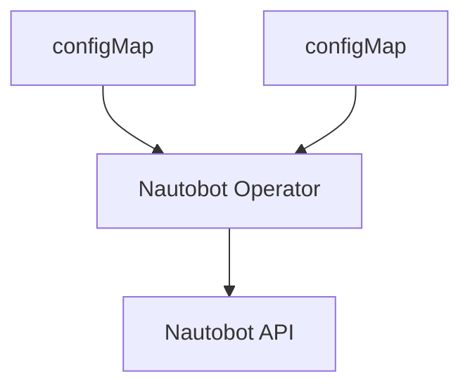

# Nautobot Operator

NautobotOP ( short for Nautobot Operator ) is a Kubernetes operator that synchronizes network device type,  manufacturers and other configurations from Kubernetes ConfigMaps to Nautobot instances.

## What It Does

The Nautobot operator automates the management of device types in Nautobot by:

- Watching Kubernetes ConfigMaps containing device type definitions
- Syncing device types, manufacturers, and templates to Nautobot via API
- Detecting changes and performing incremental updates
- Providing status reporting and reconciliation tracking



## Quick Start

### Prerequisites

- Kubernetes v1.11.3+
- Access to a Nautobot instance

### Installation

#### Option 1: Using Helm (Recommended)

```bash
# Install the operator
helm install nautobotop oci://ghcr.io/rackerlabs/charts/nautobotop:0.0.1 -n nautobotop --create-namespace
```

### Basic Configuration

1. **Create Nautobot credentials secret:**

```yaml
apiVersion: v1
kind: Secret
metadata:
  name: nautobot-credentials
  namespace: nautobotop
type: Opaque
stringData:
  username: admin
  token: your-nautobot-api-token
```

1. **Create device type ConfigMap:**

```yaml
apiVersion: v1
kind: ConfigMap
metadata:
  name: device-types
  namespace: nautobotop
data:
  server.yaml: |
    manufacturer: Dell
    part_number: R740
    model: PowerEdge R740
    u_height: 2
    is_full_depth: true
    comments: "Dell 2U rack server"
    console-ports:
      - name: Console
        type: rj-45
    power-ports:
      - name: PSU1
        type: iec-60320-c14
        maximum_draw: 750
        allocated_draw: 600
    interfaces:
      - name: eth0
        type: 1000base-t
        mgmt_only: false
      - name: mgmt
        type: 1000base-t
        mgmt_only: true
```

1. **Create Nautobot resource:**

```yaml
apiVersion: sync.rax.io/v1alpha1
kind: Nautobot
metadata:
  name: nautobot-sync
spec:
  syncIntervalSeconds: 86400  # 24 hours
  requeueAfter: 600          # 10 minutes

  nautobotSecretRef: # Ref where nautobot secret
    name: nautobot-credentials
    namespace: nautobotop
    usernameKey: username
    tokenKey: token

  nautobotServiceRef: # Ref where nautobot service name
    name: nautobot
    namespace: nautobot # Make sure this points namespace where actual instance of nautobotot is

  deviceTypeRef: # Data for device types
    - name: servers
      configMapSelector:
        name: device-types
        namespace: nautobotop
        key: server.yaml
```

## Configuration Reference

### Nautobot Custom Resource

| Field | Type | Default | Description |
|-------|------|---------|-------------|
| `syncIntervalSeconds` | int | 172800 (48h) | Minimum time between syncs |
| `requeueAfter` | int | 600 (10m) | Time between reconciliation attempts |
| `nautobotSecretRef` | SecretKeySelector | - | Reference to Nautobot credentials |
| `nautobotServiceRef` | ServiceSelector | - | Reference to Nautobot service |
| `deviceTypeRef` | []ConfigMapRef | - | Array of ConfigMap references |

### Device Type Format

Device types are defined in YAML format within ConfigMaps:

```yaml
manufacturer: "Manufacturer Name"
part_number: "Model-123"
model: "Device Model"
u_height: 2
is_full_depth: true
comments: "Optional description"

console-ports:
  - name: "Console"
    type: "rj-45"

power-ports:
  - name: "PSU1"
    type: "iec-60320-c14"
    maximum_draw: 500
    allocated_draw: 400

interfaces:
  - name: "eth0"
    type: "1000base-t"
    mgmt_only: false

module-bays:
  - name: "Slot 1"
    position: "1"
    label: "Module Bay 1"
```

## How It Works

1. **Change Detection**: Uses SHA-256 hashing to detect ConfigMap changes
2. **Sync Logic**:
   - Syncs immediately when data changes
   - Syncs periodically based on `syncIntervalSeconds`
   - Skips sync if no changes and interval not elapsed
3. **Nautobot Operations**:
   - Creates/updates manufacturers
   - Creates/updates device types
   - Syncs console ports, power ports, interfaces, module bays
   - Removes obsolete items not in desired state.

## Understack Integration

### Component Configuration

The nautobotop component is defined in the UnderStack repository at `apps/global/nautobotop.yaml`.

**Key integration points:**

- **Component Definition**: [apps/global/nautobotop.yaml](https://github.com/rackerlabs/understack/blob/main/apps/global/nautobotop.yaml) - Defines how the operator is deployed via ArgoCD
- **AppProject Configuration**: [apps/appsets/project-understack.yaml](https://github.com/rackerlabs/understack/blob/main/apps/appsets/project-understack.yaml) - Manages RBAC and deployment permissions for the component

### Deployment Customization

UnderStack allows environment-specific customization through:

- **Helm Values Override**: Create `$DEPLOY_NAME/helm-configs/nautobotop.yaml` in deployment repository
- **Manifest Overlays**: Add Kustomize overlays in `$DEPLOY_NAME/manifests/nautobotop/`
- **Component Control**: Disable or modify sources in your `$DEPLOY_NAME/apps.yaml`

## Local Development

### Running Locally

1. **Configure kubectl context**:

   ```bash
   kubectl config current-context
   kubectl config use-context <your-target-cluster>
   ```

1. **Run the operator**:

   ```bash
   cd cmd/
   go run main.go
   ```

### Debugging

Use your preferred IDE for debugging:

- **VS Code**: Set breakpoints and use the Go debugger extension
- **GoLand**: Configure run/debug configurations for the main.go file
- **Command line**: Use `dlv` (Delve) for debugging from terminal
