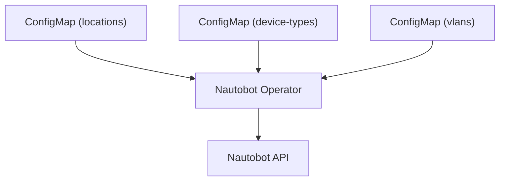
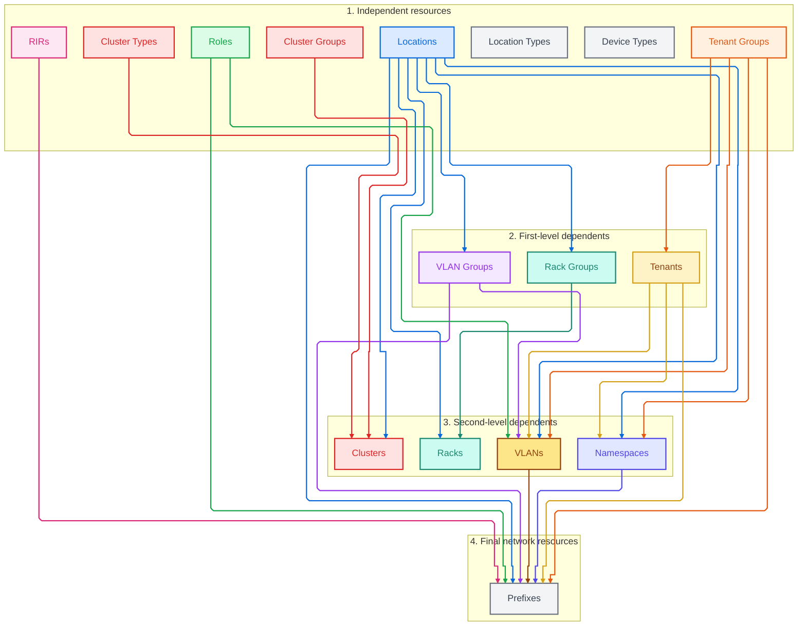

# Nautobot Operator

NautobotOP (short for Nautobot Operator) is a Kubernetes operator that synchronizes infrastructure configuration from Kubernetes ConfigMaps into a Nautobot instance. It supports the following resource types:

- Location Types
- Locations
- Rack Groups
- Racks
- Device Types
- VLAN Groups
- VLANs
- Prefixes
- Cluster Types
- Cluster Groups
- Clusters
- Namespaces
- RIRs
- Roles
- Tenant Groups
- Tenants

## What It Does

The operator watches ConfigMaps that contain your infrastructure definitions as YAML and pushes them into Nautobot through its API. When you update a ConfigMap, the operator detects the change and syncs only what changed.


```mermaid
flowchart
    n1["ConfigMap (locations)"]
    n2["ConfigMap (device-types)"]
    n3["ConfigMap (vlans)"]
    n6["Nautobot Operator"]
    n7["Nautobot API"]
    n1 --> n6
    n2 --> n6
    n3 --> n6
    n6 --> n7
```

## Quick Start

### Prerequisites

- Kubernetes v1.11.3+
- Access to a Nautobot instance

### Installation

```bash
helm install nautobotop oci://ghcr.io/rackerlabs/charts/nautobotop:0.0.1 -n nautobotop --create-namespace
```

### Basic Configuration

Create a Secret with your Nautobot credentials:

```yaml
apiVersion: v1
kind: Secret
metadata:
  name: nautobot-token
  namespace: nautobotop
type: Opaque
stringData:
  username: admin
  token: your-nautobot-api-token
```

Then create the Nautobot custom resource that ties everything together. See the full CRD reference below.

## Nautobot Custom Resource

The Nautobot CR is a cluster-scoped resource (`sync.rax.io/v1alpha1`) that tells the operator where Nautobot lives, how to authenticate, and which ConfigMaps to sync.

### Full CRD Example

```yaml
apiVersion: sync.rax.io/v1alpha1
kind: Nautobot
metadata:
  name: nautobot-sample
  labels:
    app.kubernetes.io/name: nautobotop
    app.kubernetes.io/managed-by: kustomize
spec:
  isEnabled: true
  requeueAfter: 600
  syncIntervalSeconds: 172800
  cacheMaxSize: 70000

  nautobotSecretRef:
    name: nautobot-token
    namespace: nautobotop
    usernameKey: username
    tokenKey: token

  nautobotServiceRef:
    name: nautobot
    namespace: nautobot

  locationTypesRef:
    - configMapSelector:
        name: location-types
        namespace: nautobot

  locationRef:
    - configMapSelector:
        name: locations
        namespace: nautobot

  rackGroupRef:
    - configMapSelector:
        name: rack-groups
        namespace: nautobot

  rackRef:
    - configMapSelector:
        name: racks
        namespace: nautobot

  deviceTypeRef:
    - configMapSelector:
        name: device-types
        namespace: nautobot

  vlanGroupRef:
    - configMapSelector:
        name: vlan-groups
        namespace: nautobot

  vlanRef:
    - configMapSelector:
        name: vlans
        namespace: nautobot

  prefixRef:
    - configMapSelector:
        name: prefixes
        namespace: nautobot

  clusterTypeRef:
    - configMapSelector:
        name: cluster-types
        namespace: nautobot

  clusterGroupRef:
    - configMapSelector:
        name: cluster-groups
        namespace: nautobot

  clusterRef:
    - configMapSelector:
        name: clusters
        namespace: nautobot

  namespaceRef:
    - configMapSelector:
        name: namespaces
        namespace: nautobot

  rirRef:
    - configMapSelector:
        name: rirs
        namespace: nautobot

  roleRef:
    - configMapSelector:
        name: roles
        namespace: nautobot

  tenantGroupRef:
    - configMapSelector:
        name: tenant-groups
        namespace: nautobot

  tenantRef:
    - configMapSelector:
        name: tenants
        namespace: nautobot
```

### Spec Fields

| Field | Type | Default | Description |
|-------|------|---------|-------------|
| `isEnabled` | bool | true | Enables or disables the operator |
| `requeueAfter` | int | 600 | Seconds between reconciliation attempts |
| `syncIntervalSeconds` | int | 172800 | Minimum seconds between full syncs |
| `cacheMaxSize` | int | 70000 | Maximum number of entries in the Nautobot object cache |
| `nautobotSecretRef` | SecretKeySelector | | Reference to the Secret holding the Nautobot API token |
| `nautobotServiceRef` | ServiceSelector | | Reference to the Nautobot Kubernetes Service |
| `locationTypesRef` | []ConfigMapRef | | ConfigMaps containing location type definitions |
| `locationRef` | []ConfigMapRef | | ConfigMaps containing location definitions |
| `rackGroupRef` | []ConfigMapRef | | ConfigMaps containing rack group definitions |
| `rackRef` | []ConfigMapRef | | ConfigMaps containing rack definitions |
| `deviceTypeRef` | []ConfigMapRef | | ConfigMaps containing device type definitions |
| `vlanGroupRef` | []ConfigMapRef | | ConfigMaps containing VLAN group definitions |
| `vlanRef` | []ConfigMapRef | | ConfigMaps containing VLAN definitions |
| `prefixRef` | []ConfigMapRef | | ConfigMaps containing prefix definitions |
| `clusterTypeRef` | []ConfigMapRef | | ConfigMaps containing cluster type definitions |
| `clusterGroupRef` | []ConfigMapRef | | ConfigMaps containing cluster group definitions |
| `clusterRef` | []ConfigMapRef | | ConfigMaps containing cluster definitions |
| `namespaceRef` | []ConfigMapRef | | ConfigMaps containing namespace definitions |
| `rirRef` | []ConfigMapRef | | ConfigMaps containing RIR definitions |
| `roleRef` | []ConfigMapRef | | ConfigMaps containing role definitions |
| `tenantGroupRef` | []ConfigMapRef | | ConfigMaps containing tenant group definitions |
| `tenantRef` | []ConfigMapRef | | ConfigMaps containing tenant definitions |

## ConfigMap YAML Formats

Each ConfigMap referenced in the CRD above holds a YAML key whose value is a list of objects. The ConfigMap `metadata.name` and `metadata.namespace` must match what you put in the `configMapSelector`. Below are full ConfigMap examples for every supported resource type.

### Location Types

Referenced by `locationTypesRef` in the CRD.

```yaml
apiVersion: v1
kind: ConfigMap
metadata:
  name: location-types
  namespace: nautobot
data:
  location-types.yaml: |
    - name: Region
      description: Geographic region
      content_types:
        - dcim.device
        - ipam.namespace
      nestable: false
      children:
        - name: Data Center
          description: Physical data center facility
          content_types:
            - dcim.device
            - ipam.vlan
          nestable: false
```

### Locations

Referenced by `locationRef` in the CRD.

```yaml
apiVersion: v1
kind: ConfigMap
metadata:
  name: locations
  namespace: nautobot
data:
  locations.yaml: |
    - name: us-east
      description: US East Region
      location_type: Region
      status: Active
      children:
        - name: iad3
          description: IAD3 Data Center
          location_type: Data Center
          status: Active
```

### Rack Groups

Referenced by `rackGroupRef` in the CRD.

```yaml
apiVersion: v1
kind: ConfigMap
metadata:
  name: rack-groups
  namespace: nautobot
data:
  rack-groups.yaml: |
    - name: iad3-floor1-hall-a
      description: IAD3 Floor 1 Hall A
      location: iad3
      children:
        - name: iad3-floor1-hall-a-row1
          description: Hall A Row 1
          location: iad3
```

### Racks

Referenced by `rackRef` in the CRD.

```yaml
apiVersion: v1
kind: ConfigMap
metadata:
  name: racks
  namespace: nautobot
data:
  racks.yaml: |
    - name: iad3-a01
      facility: IAD3-A01
      description: IAD3 Hall A Rack 01
      location: iad3
      rack_group: iad3-floor1-hall-a
      status: Active
      u_height: 42
    - name: iad3-a02
      facility: IAD3-A02
      description: IAD3 Hall A Rack 02
      location: iad3
      rack_group: iad3-floor1-hall-a
      status: Active
      u_height: 42
```

### Device Types

Referenced by `deviceTypeRef` in the CRD. Device types are a single object per key (not a list).

```yaml
apiVersion: v1
kind: ConfigMap
metadata:
  name: device-types
  namespace: nautobot
data:
  dell-r740.yaml: |
    class: server
    manufacturer: Dell
    model: PowerEdge R740
    part_number: R740
    u_height: 2
    is_full_depth: true
    comments: Dell 2U rack server
    console-ports:
      - name: Console
        type: rj-45
    power-ports:
      - name: PSU1
        type: iec-60320-c14
        maximum_draw: 750
        allocated_draw: 600
    interfaces:
      - name: eth0
        type: 1000base-t
        mgmt_only: false
      - name: mgmt
        type: 1000base-t
        mgmt_only: true
```

### VLAN Groups

Referenced by `vlanGroupRef` in the CRD.

```yaml
apiVersion: v1
kind: ConfigMap
metadata:
  name: vlan-groups
  namespace: nautobot
data:
  vlan-groups.yaml: |
    - name: management-vlans
      location: iad3
      range: "100-199"
    - name: guest-vlans
      location: dfw1
      range: "200-299"
```

### VLANs

Referenced by `vlanRef` in the CRD.

```yaml
apiVersion: v1
kind: ConfigMap
metadata:
  name: vlans
  namespace: nautobot
data:
  vlans.yaml: |
    - name: mgmt-vlan-100
      vid: 100
      status: Active
      role: Management
      description: Management VLAN
      locations:
        - iad3
      vlan_group: management-vlans
      tenant_group: infrastructure
      tenant: network-ops
      dynamic_groups: []
      tags:
        - production
    - name: guest-vlan-200
      vid: 200
      status: Active
      role: Guest
      description: Guest network VLAN
      locations:
        - dfw1
      vlan_group: guest-vlans
      tenant_group: infrastructure
      tenant: network-ops
      dynamic_groups: []
      tags:
        - guest
```

### Prefixes

Referenced by `prefixRef` in the CRD.

```yaml
apiVersion: v1
kind: ConfigMap
metadata:
  name: prefixes
  namespace: nautobot
data:
  prefixes.yaml: |
    - prefix: "10.0.0.0/8"
      namespace: Global
      type: container
      status: Active
      role: Infrastructure
      rir: "RFC 1918"
      date_allocated: "2024-01-15 10:30:00"
      description: Private address space
      vrfs:
        - management-vrf
      locations:
        - iad3
      vlan_group: management-vlans
      vlan: mgmt-vlan-100
      tenant_group: infrastructure
      tenant: network-ops
      tags:
        - production
    - prefix: "192.168.1.0/24"
      namespace: Global
      type: pool
      status: Reserved
      role: Guest
      rir: ""
      date_allocated: ""
      description: Guest network pool
      vrfs: []
      locations:
        - dfw1
      vlan_group: guest-vlans
      vlan: guest-vlan-200
      tenant_group: infrastructure
      tenant: network-ops
      tags:
        - guest
```

### Namespaces

Referenced by `namespaceRef` in the CRD.

```yaml
apiVersion: v1
kind: ConfigMap
metadata:
  name: namespaces
  namespace: nautobot
data:
  namespaces.yaml: |
    - name: Global
      description: Global default namespace
      location: Global
    - name: management
      description: Management network namespace
      location: iad3
```

### RIRs

Referenced by `rirRef` in the CRD.

```yaml
apiVersion: v1
kind: ConfigMap
metadata:
  name: rirs
  namespace: nautobot
data:
  rirs.yaml: |
    - name: "RFC 1918"
      is_private: true
      description: Private IPv4 address space
    - name: ARIN
      is_private: false
      description: American Registry for Internet Numbers
```

### Roles

Referenced by `roleRef` in the CRD.

```yaml
apiVersion: v1
kind: ConfigMap
metadata:
  name: roles
  namespace: nautobot
data:
  roles.yaml: |
    - name: Management
      color: "0000ff"
      description: Management network role
      weight: 1000
      content_types:
        - ipam.vlan
        - ipam.prefix
    - name: Infrastructure
      color: "9e9e9e"
      description: Infrastructure role
      weight: 500
      content_types:
        - ipam.prefix
        - dcim.device
```

### Cluster Types

Referenced by `clusterTypeRef` in the CRD.

```yaml
apiVersion: v1
kind: ConfigMap
metadata:
  name: cluster-types
  namespace: nautobot
data:
  cluster-types.yaml: |
    - name: VMware vSphere
      description: VMware vSphere hypervisor cluster
    - name: Kubernetes
      description: Kubernetes container orchestration cluster
```

### Cluster Groups

Referenced by `clusterGroupRef` in the CRD.

```yaml
apiVersion: v1
kind: ConfigMap
metadata:
  name: cluster-groups
  namespace: nautobot
data:
  cluster-groups.yaml: |
    - name: production-clusters
      description: Production environment clusters
    - name: staging-clusters
      description: Staging environment clusters
```

### Clusters

Referenced by `clusterRef` in the CRD.

```yaml
apiVersion: v1
kind: ConfigMap
metadata:
  name: clusters
  namespace: nautobot
data:
  clusters.yaml: |
    - name: iad3-vsphere-prod
      comments: Production vSphere cluster in IAD3
      cluster_type: VMware vSphere
      cluster_group: production-clusters
      location: iad3
      devices:
        - esxi-iad3-01
        - esxi-iad3-02
    - name: dfw1-k8s-prod
      comments: Production Kubernetes cluster in DFW1
      cluster_type: Kubernetes
      cluster_group: production-clusters
      location: dfw1
      devices:
        - k8s-ctrl-dfw1-01
        - k8s-ctrl-dfw1-02
```

### Tenant Groups

Referenced by `tenantGroupRef` in the CRD.

```yaml
apiVersion: v1
kind: ConfigMap
metadata:
  name: tenant-groups
  namespace: nautobot
data:
  tenant-groups.yaml: |
    - name: infrastructure
      description: Infrastructure services
      parent: ""
    - name: customers
      description: Customer tenants
      parent: ""
```

### Tenants

Referenced by `tenantRef` in the CRD.

```yaml
apiVersion: v1
kind: ConfigMap
metadata:
  name: tenants
  namespace: nautobot
data:
  tenants.yaml: |
    - name: network-ops
      description: Network Operations team
      comments: Manages all network infrastructure
      tenant_group: infrastructure
      tags:
        - production
    - name: acme-corp
      description: ACME Corporation
      comments: Enterprise customer
      tenant_group: customers
      tags:
        - customer
```

## Resource Dependency Graph

Resources are synced in a specific order because some depend on others already existing in Nautobot. The graph below shows which resources are independent and which ones require other resources to be synced first.


```mermaid
%%{init: {"flowchart": {"defaultRenderer": "elk", "rankSpacing": 200, "nodeSpacing": 50, "curve": "linear"}} }%%
flowchart TD
    subgraph S1["1. Independent resources"]
        direction LR
        LOC["Locations"]:::blue
        TGR["Tenant Groups"]:::orange
        RIR["RIRs"]:::pink
        ROLE["Roles"]:::green
        CT["Cluster Types"]:::red
        CG["Cluster Groups"]:::red
        LT["Location Types"]:::grey
        DT["Device Types"]:::grey
    end

    subgraph S2["2. First-level dependents"]
        direction LR
        RG["Rack Groups"]:::teal
        VG["VLAN Groups"]:::purple
        TEN["Tenants"]:::amber
    end

    subgraph S3["3. Second-level dependents"]
        direction LR
        RACK["Racks"]:::teal
        NS["Namespaces"]:::indigo
        VLAN["VLANs"]:::brown
        CLUSTER["Clusters"]:::red
    end

    subgraph S4["4. Final network resources"]
        direction LR
        PREFIX["Prefixes"]:::grey
    end

    %% Location edges (blue)
    LOC --> RG
    LOC --> VG
    LOC --> RACK
    LOC --> NS
    LOC --> VLAN
    LOC --> CLUSTER
    LOC --> PREFIX

    %% Tenant Group edges (orange)
    TGR --> TEN
    TGR --> NS
    TGR --> VLAN
    TGR --> PREFIX

    %% Tenant edges (amber)
    TEN --> NS
    TEN --> VLAN
    TEN --> PREFIX

    %% Rack Group edges (teal)
    RG --> RACK

    %% VLAN Group edges (purple)
    VG --> VLAN
    VG --> PREFIX

    %% Role edges (green)
    ROLE --> VLAN
    ROLE --> PREFIX

    %% Cluster type/group edges (red)
    CT --> CLUSTER
    CG --> CLUSTER

    %% RIR edges (pink)
    RIR --> PREFIX

    %% Namespace edges (indigo)
    NS --> PREFIX

    %% VLAN edges (brown)
    VLAN --> PREFIX

    classDef blue fill:#DBEAFE,stroke:#0969DA,color:#0969DA,stroke-width:2px
    classDef orange fill:#FFF0E0,stroke:#E5570F,color:#E5570F,stroke-width:2px
    classDef amber fill:#FEF3C7,stroke:#D4A017,color:#92400E,stroke-width:2px
    classDef teal fill:#CCFBF1,stroke:#1A8870,color:#1A8870,stroke-width:2px
    classDef purple fill:#F3E8FF,stroke:#9333EA,color:#9333EA,stroke-width:2px
    classDef green fill:#DCFCE7,stroke:#16A34A,color:#16A34A,stroke-width:2px
    classDef red fill:#FEE2E2,stroke:#DC2626,color:#DC2626,stroke-width:2px
    classDef pink fill:#FCE7F3,stroke:#DB2777,color:#DB2777,stroke-width:2px
    classDef indigo fill:#E0E7FF,stroke:#4F46E5,color:#4F46E5,stroke-width:2px
    classDef brown fill:#FDE68A,stroke:#92400E,color:#92400E,stroke-width:2px
    classDef grey fill:#F3F4F6,stroke:#6B7280,color:#374151,stroke-width:2px

    linkStyle 0,1,2,3,4,5,6 stroke:#0969DA,stroke-width:2px
    linkStyle 7,8,9,10 stroke:#E5570F,stroke-width:2px
    linkStyle 11,12,13 stroke:#D4A017,stroke-width:2px
    linkStyle 14 stroke:#1A8870,stroke-width:2px
    linkStyle 15,16 stroke:#9333EA,stroke-width:2px
    linkStyle 17,18 stroke:#16A34A,stroke-width:2px
    linkStyle 19,20 stroke:#DC2626,stroke-width:2px
    linkStyle 21 stroke:#DB2777,stroke-width:2px
    linkStyle 22 stroke:#4F46E5,stroke-width:2px
    linkStyle 23 stroke:#92400E,stroke-width:2px
```

The operator syncs independent resources first, then works through the dependent ones in order. If a dependency is missing, the sync for that resource will fail and report the error.

## How It Works

The operator uses SHA-256 hashing to detect ConfigMap changes. When a change is detected, it syncs immediately. Otherwise it syncs periodically based on `syncIntervalSeconds`. If nothing changed and the interval hasn't elapsed, it skips the sync.

During a sync the operator will create or update objects in Nautobot and remove anything that is no longer in the desired state.

## UnderStack Integration

The nautobotop component is defined at `apps/global/nautobotop.yaml` and deployed through ArgoCD.

You can customize the deployment per environment:

- Helm values override at `$DEPLOY_NAME/nautobotop/values.yaml`
- Kustomize overlays in `$DEPLOY_NAME/nautobotop/`
- Component control through `$DEPLOY_NAME/apps.yaml`

## Local Development

```bash
# Make sure your kubectl context points to the right cluster
kubectl config current-context

# Run the operator locally
cd go/nautobotop/cmd/
go run main.go
```

For debugging, use your IDE's Go debugger or `dlv` from the command line.
