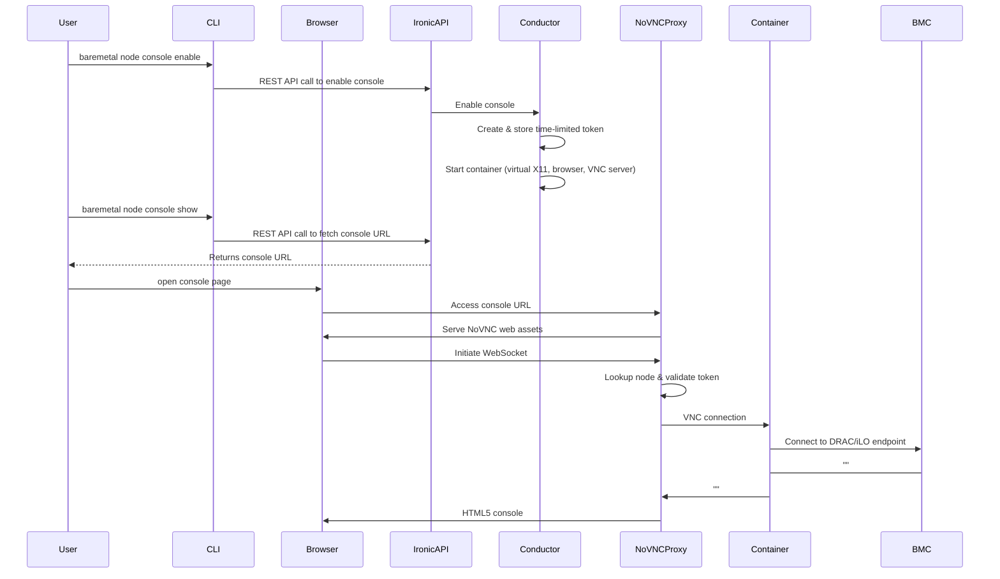
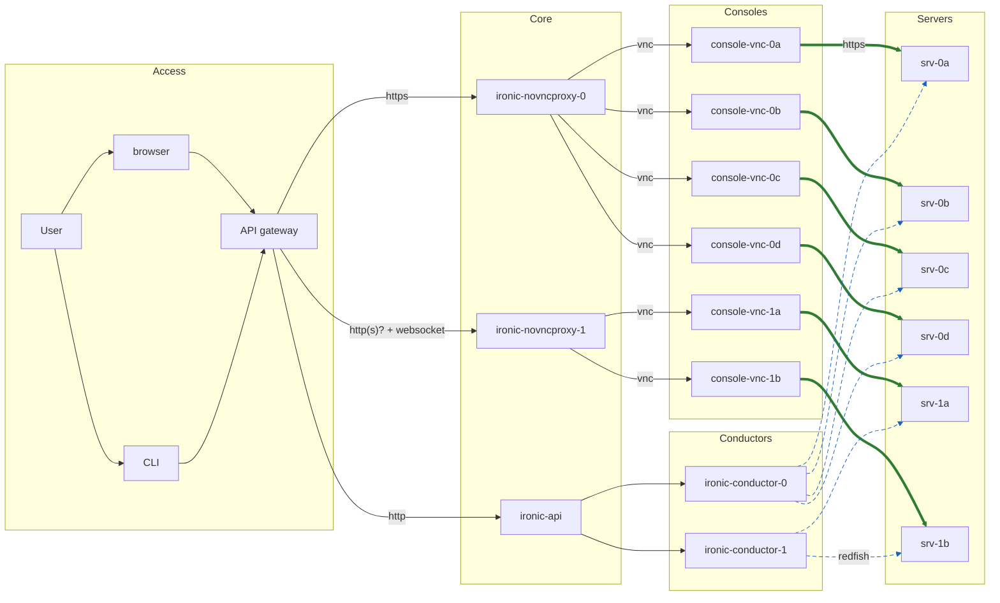

# Ironic Graphical Console guide

This guide explains how the Graphical Console feature is implemented for
baremetal nodes.

## Overview

The overall goal of this is to provide the Undercloud users
with an out-of-band, graphical console access to their provisioned nodes. At
the same time, we do not want to give them full access to DRAC / iLo
interfaces, nor do we want to share the access credentials.

Graphical console access feature is realised using several different components
stitched together.

You can see how they all fit together on a diagram in [components](#components) section.
Here is brief explanation of what each component is responsible for:

- **User** is typically interacting with Ironic **API** through the Openstack
  **CLI** and uses web **browser** to access the console
- Ironic **Conductor** is responsible for starting the **console containers**
  upon user request
- Ironic **Conductor** is also responsible for creating a Kubernetes secret
  with the credentials to access the console
- **Console VNC Containers** are like a mini jump host desktops that can run
  only one application - a browser with a HTML5 console exposed by the
  baremetal nodes BMC. These containers are accessible (internally) through
  VNC.
- **ironic-novncproxy** is launched alongside the **Ironic Conductor** and as
  the name implies, it proxies users HTTPS traffic. It does that by serving
  [noVNC](https://github.com/novnc/noVNC) web application to the user's
  browser. The browser then opens websocket connection to the
  **ironic-novncproxy** which in turn opens VNC connection to the relevant
  **container**.

## Sequence diagram

Below diagram shows the sequence of events that occur during typical session
when the user or operator opens the console.

## Components

A typical deployment will have several components running to provide console functionality.

Please note:

- Each baremetal node console session gets it's own VNC container
- There is a 1:1 coupling between the Ironic conductor and the Ironic NOVNCProxy

## Environment requirements and configuration

Following per-environment configurations must be made to enable graphical
console feature:

1. The baremetal nodes' console_interface must be set to a graphical driver
   such as `redfish-graphical`.
2. Ironic must have the relevant drivers enabled in `enabled_console_interfaces`
3. `ironic-novncproxy` must be launched for each of the ironic conductors. At
   the time of writing, this is achieved through `extraContainers` because
   OpenStack Helm does not have direct support for launching that component. We
   plan to contribute that feature to [OSH][3] soon.
4. Each instance of the `ironic-novncproxy` must be exposed to the external
   world. This means, we have to create relevant Kubernetes `Service` and
   `HTTPRoute` definitions. The `cert-manager` will take care of TLS certificates
   and `external-dns` will register the DNS domain.
5. *(Optional)* The RBAC policy may need to be adjusted as the baremetal console,
   by default is only accessible to admins.

## Docs

- [ironic VNC config][1] documentation
- [ironic - Graphical Console support][2]

[1]: https://docs.openstack.org/ironic/latest/configuration/config.html#vnc
[2]: https://docs.openstack.org/ironic/latest/install/graphical-console.html
[3]: https://github.com/RSS-Engineering/undercloud-deploy/commit/d7201742ae5e10b9428be17b7418ac1066899214
