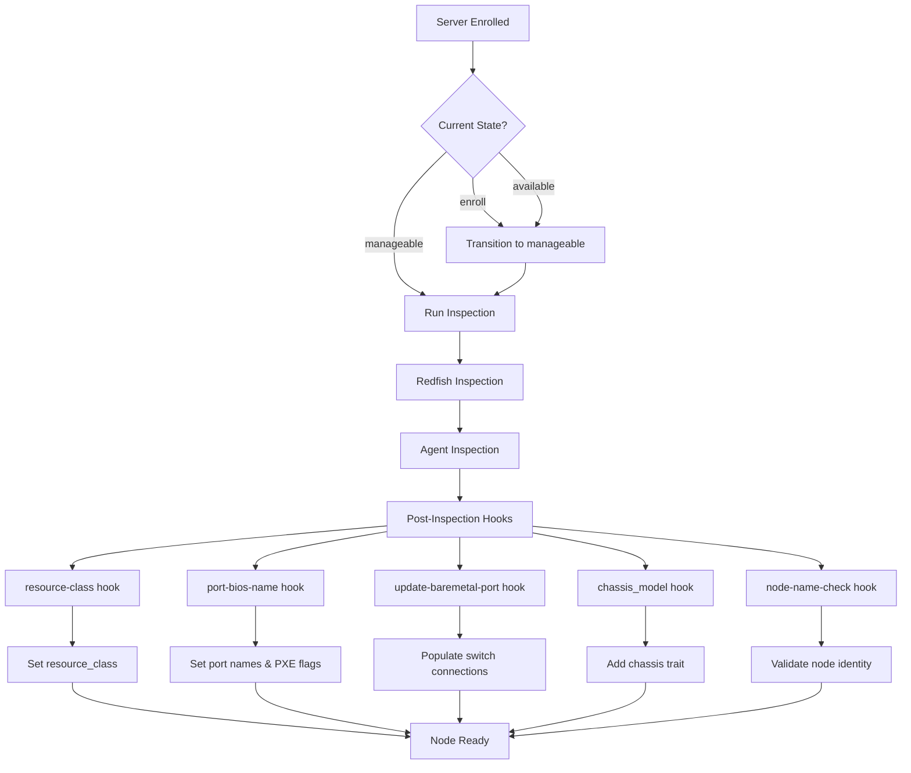
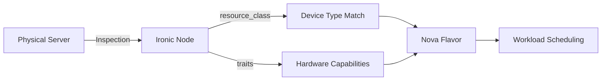

# Ironic Inspection Guide

This guide explains how to inspect baremetal nodes in OpenStack Ironic, covering both out-of-band (Redfish) and in-band (Agent) inspection methods.

## Purpose

Hardware inspection is the process of discovering and validating the physical characteristics of bare metal servers. In UnderStack, inspection serves two primary functions:

* **Enrolling new nodes**: When servers are added to the infrastructure, inspection discovers hardware specifications (CPU, memory, drives, network interfaces) and automatically assigns the appropriate resource class based on [device type](../design-guide/device-types.md) definitions
* **Validating existing nodes**: For servers already in the system, inspection confirms the hardware matches expected specifications and detects any changes (such as hardware replacements or upgrades)

Inspection integrates with [OpenStack Ironic](https://docs.openstack.org/ironic/latest/admin/inspection.html), extending its capabilities with custom inspection hooks that handle UnderStack-specific requirements like device type matching and LLDP-based network topology discovery.

---

## Overview

UnderStack uses **Redfish inspection as the primary method** for discovering hardware specifications. Redfish provides out-of-band access to detailed hardware inventory through the BMC without requiring the server to boot, making it faster and less disruptive than in-band alternatives.

The two-phase inspection process:

1. **Redfish Inspection (Out-of-Band)**: Queries the BMC directly via Redfish API to gather hardware inventory without booting the server
2. **Agent Inspection (In-Band)**: Boots the Ironic Python Agent (IPA) to collect detailed hardware information including LLDP data from network switches

The inspection workflow prioritizes Redfish data collection, then supplements with agent inspection specifically for LLDP-based network topology discovery. This approach minimizes server downtime while ensuring complete hardware and network information.



The Argo workflow [inspect-server](https://github.com/rackerlabs/understack/blob/main/workflows/argo-events/workflowtemplates/inspect-server.yaml) automates this process, running both inspection phases sequentially.

---

## Inspection Interfaces

### Redfish / iDRAC-Redfish (Out-of-Band)

Out-of-band inspection queries the BMC directly without booting the server. Use `redfish` for generic Redfish-compliant hardware or `idrac-redfish` for Dell servers.

* **Preferred method** for hardware discovery
* Provides CPU, memory, drive, and network interface details
* Fast execution with no impact on server workloads
* UnderStack extends Ironic's Redfish inspection with custom interfaces (`redfish-understack` and `idrac-redfish-understack`) that integrate device type matching

```bash
# Set the inspect interface
openstack baremetal node set <NODE_UUID_OR_NAME> --inspect-interface idrac-redfish

# Run inspection
openstack baremetal node inspect <NODE_UUID_OR_NAME> --wait
```

**Redfish Inspection Hooks** (configured in `values.yaml`):

```yaml
redfish:
  inspection_hooks: "validate-interfaces,ports,port-bios-name,architecture,pci-devices,resource-class"
```

| Hook | Description |
|------|-------------|
| `validate-interfaces` | Validates discovered network interfaces |
| `ports` | Creates Ironic port objects from Redfish ethernet interfaces |
| `port-bios-name` | Sets port name and `extra.bios_name` from Redfish interface identity (e.g., "NIC.Integrated.1-1") |
| `architecture` | Detects CPU architecture (x86_64, aarch64) |
| `pci-devices` | Discovers PCI devices (GPUs, NICs, storage controllers) |
| `resource-class` | Matches hardware specs against device-types to set the node's resource class |

### Agent (In-Band)

In-band inspection boots the Ironic Python Agent (IPA) ramdisk to collect detailed hardware information, including LLDP data from connected switches.

* Primary purpose: LLDP discovery for network topology mapping
* Collects switch connection data that Redfish cannot provide
* Required for populating `local_link_connection` on ports

```bash
# Set the inspect interface
openstack baremetal node set <NODE_UUID_OR_NAME> --inspect-interface agent

# Run inspection
openstack baremetal node inspect <NODE_UUID_OR_NAME> --wait
```

**Agent Inspection Hooks** (configured in `values.yaml`):

```yaml
inspector:
  extra_kernel_params: ipa-collect-lldp=1
  hooks: "ramdisk-error,validate-interfaces,architecture,pci-devices,validate-interfaces,parse-lldp,resource-class,update-baremetal-port"
```

| Hook | Description |
|------|-------------|
| `ramdisk-error` | Reports errors from the IPA ramdisk |
| `validate-interfaces` | Validates discovered network interfaces |
| `architecture` | Detects CPU architecture |
| `pci-devices` | Discovers PCI devices |
| `parse-lldp` | Parses LLDP TLVs to extract switch connection info (switch name, port, chassis ID) |
| `resource-class` | Matches hardware specs against device-types to set the node's resource class |
| `update-baremetal-port` | Updates port `local_link_connection` and `physical_network` from LLDP data |

---

## UnderStack Inspection Hooks

UnderStack extends Ironic's inspection with custom hooks that process discovered hardware data. These hooks are implemented in `python/ironic-understack` and registered as Ironic inspection hook entry points.

### Resource Class Hook

The `resource-class` hook is responsible for matching discovered hardware against [device type](../design-guide/device-types.md) definitions and setting the node's `resource_class` property.

**What it does:**

1. Extracts hardware specifications from the inspection inventory:
   * CPU model and core count
   * Memory size (in MB)
   * Drive sizes
   * Manufacturer and model name

2. Normalizes manufacturer names:
   * Removes "Inc." suffix
   * Converts "HP" to "HPE"
   * Cleans model names (removes SKU information)

3. Loads device type definitions from the ConfigMap

4. Matches the discovered hardware against device type resource classes by comparing:
   * Manufacturer and model (exact match)
   * CPU model (exact match)
   * Memory size (exact match)
   * Minimum disk space (machine must meet minimum)

5. Sets the matched resource class name on the Ironic node

**Integration**: This hook connects hardware inspection to the [device type](../design-guide/device-types.md) system. The assigned `resource_class` is then used by [flavor definitions](../design-guide/flavors.md) to create Nova flavors for workload scheduling.

### Port BIOS Name Hook

The `port-bios-name` hook sets port naming and PXE boot configuration based on Redfish-discovered interface data.

**What it does:**

1. Sets `extra.bios_name` on each port from Redfish interface data
2. Sets the port `name` as `{node_name}:{bios_name}`
3. Determines PXE boot eligibility using naming heuristics (matches common PXE interface naming patterns)
4. Sets `pxe_enabled` flag on the appropriate port
5. For PXE ports, sets placeholder values for `physical_network` and `local_link_connection` if not already populated

### Update Baremetal Port Hook

The `update-baremetal-port` hook populates port attributes from LLDP data discovered during agent inspection, enabling accurate network topology mapping.

**What it does:**

1. Parses LLDP data from each inspected interface to extract:
   * Switch system name (hostname)
   * Switch port ID
   * Switch chassis ID

2. Sets `local_link_connection` on each Ironic port:

   ```json
   {
     "port_id": "<switch-port>",
     "switch_id": "<switch-chassis-id>",
     "switch_info": "<switch-hostname>"
   }
   ```

3. Determines `physical_network` based on switch naming conventions and VLAN group mapping

4. Sets port `category` for specialized networks (e.g., "storage" for storage network connections)

5. Adds node traits based on VLAN group connections (e.g., `CUSTOM_STORAGE_SWITCH` when connected to storage switches)

#### VLAN Group Configuration

Switch suffixes are mapped to VLAN groups based on naming conventions:

| Switch Suffix | VLAN Group |
|---------------|------------|
| `-1`, `-2` | network |
| `-1f`, `-2f` | storage |
| `-3f`, `-4f` | storage-appliance |
| `-1d` | bmc |

### Chassis Model Hook

The `chassis_model` hook adds a custom trait identifying the specific hardware chassis model.

**What it does:**

1. Extracts chassis model from `system_vendor.product_name`
2. Normalizes manufacturer name (handles "DELL", "HP" variants)
3. Creates a trait in the format: `CUSTOM_{MANUFACTURER}#{CHASSIS_MODEL}`

**Example**: A Dell PowerEdge R7615 receives the trait `CUSTOM_DELL#POWEREDGE_R7615`

This trait enables [flavor definitions](../design-guide/flavors.md) to target specific hardware models. See [hardware traits](../design-guide/hardware-traits.md) for more on how traits work.

### Node Name Check Hook

The `node-name-check` hook validates that the node identity matches the expected hardware.

**What it does:**

1. Expects node names to follow the format: `{Manufacturer}_{SerialNumber}`
2. Extracts the serial number from inspection data (`system_vendor.sku` or `serial_number`)
3. Compares against the expected serial number from the node name
4. Raises an error if there's a mismatch, requiring operator intervention

**Use case**: This hook detects hardware replacements. If a server's motherboard is replaced (changing the serial number), the hook will fail inspection, alerting operators that the node identity has changed and requires review.

### Hook Execution Order

Inspection hooks execute in a defined order based on their dependencies:

1. **port-bios-name**: Sets initial port attributes from Redfish data
2. **update-baremetal-port**: Enriches ports with LLDP-based switch connection data
3. **resource-class**: Matches device type and sets resource class
4. **chassis_model**: Adds chassis model trait
5. **node-name-check**: Validates node identity

Some hooks have explicit dependencies:

* `update-baremetal-port` requires `validate-interfaces` and `parse-lldp` to run first
* `port-bios-name` requires the `ports` hook to run first

---

## Integration with Device Types and Flavors

Hardware inspection is the bridge between physical hardware and OpenStack scheduling:



1. **Inspection** discovers hardware specifications and populates the Ironic node
2. **Device type matching** assigns the appropriate `resource_class` based on CPU/memory/drives
3. **Trait discovery** adds hardware capability traits (NVMe, GPU, NIC models, chassis)
4. **Flavor matching** uses `resource_class` and traits to determine eligible Nova flavors
5. **Scheduling** places workloads on appropriate hardware

See also:

* [Device Types](../design-guide/device-types.md) - Defining hardware models and resource classes
* [Hardware Traits](../design-guide/hardware-traits.md) - Trait discovery and usage
* [Flavors](../design-guide/flavors.md) - Creating Nova flavors from resource classes and traits

---

## Configuration

Inspection hooks are configured in the Ironic configuration. Key settings in `ironic_understack` section:

| Setting | Default | Description |
|---------|---------|-------------|
| `device_types_dir` | `/var/lib/understack/device-types` | Directory containing device type YAML definitions |
| `switch_name_vlan_group_mapping` | See VLAN table above | Maps switch suffixes to VLAN group names |

---

## Automated Inspection Workflow

The `inspect-server` Argo workflow handles the complete inspection process:

1. Reads the node's current driver and provision state
2. Moves the node to `manageable` state if needed
3. Runs Redfish inspection (sets `--inspect-interface redfish` or `idrac-redfish`)
4. Runs Agent inspection (sets `--inspect-interface agent`)
5. Returns the node to its original state

To trigger the workflow manually:

```bash
argo submit -n argo-events --from workflowtemplate/inspect-server -p node=<NODE_UUID_OR_NAME>
```

---

## Viewing Inspection Data

### Node Inventory

After inspection completes, retrieve the full hardware inventory:

```bash
openstack baremetal node inventory save <NODE_UUID_OR_NAME> --file inspection-data.json
```

Sample inventory data:

```json
{
    "inventory": {
        "memory": {
            "physical_mb": 98304
        },
        "cpu": {
            "count": 32,
            "model_name": "AMD EPYC 9124 16-Core Processor",
            "frequency": 4400,
            "architecture": "x86_64"
        },
        "disks": [
            {
                "name": "Solid State Disk 0:1:0",
                "size": 479559942144
            }
        ],
        "interfaces": [
            {
                "mac_address": "D4:CB:E1:BF:8E:21",
                "name": "NIC.Integrated.1-1"
            }
        ],
        "system_vendor": {
            "product_name": "PowerEdge R7615",
            "serial_number": "MXVX4003C100KL",
            "manufacturer": "Dell Inc."
        },
        "boot": {
            "current_boot_mode": "uefi"
        }
    },
    "plugin_data": {
        "parsed_lldp": {
            "eno1": {
                "switch_system_name": "a1-1-1.ord1.rackspace.net",
                "switch_chassis_id": "aa:bb:cc:dd:ee:ff",
                "switch_port_id": "Ethernet1/1"
            }
        }
    }
}
```

### Node Properties and Ports

```bash
# View node details including resource_class and properties
openstack baremetal node show <NODE_UUID_OR_NAME> -f json

# List ports with local_link_connection info
openstack baremetal port list --node <NODE_UUID_OR_NAME> --long
```

### Check Node History

The node history shows recent errors and state transitions:

```bash
openstack baremetal node history list <NODE_UUID_OR_NAME>
```

For detailed error information:

```bash
openstack baremetal node history get <NODE_UUID_OR_NAME> <EVENT_UUID>
```

---

## Troubleshooting

### Resource Class Not Set

If a node's `resource_class` is not set after inspection:

1. **Check device type definitions**: Ensure a device type exists for the hardware manufacturer and model
2. **Verify hardware specs match**: The CPU model, memory, and drive sizes must match a resource class definition
3. **Check inspection logs**: Look for matching errors in the Ironic conductor logs

### Port Local Link Connection Missing

If ports don't have `local_link_connection` data:

1. **Verify LLDP is enabled**: Switches must be configured to send LLDP frames
2. **Check IPA inspection**: Agent inspection must complete successfully for LLDP data
3. **Verify switch naming**: Switch hostnames must follow the expected naming convention for VLAN group mapping

### Node Name Check Failures

If the `node-name-check` hook fails:

1. **Hardware replacement detected**: The serial number doesn't match the node name
2. **Review the change**: Verify whether hardware was intentionally replaced
3. **Update node name**: If hardware was replaced, update the node name to match the new serial number

### Inspection Timeout

```bash
# Check the node's last error
openstack baremetal node show <NODE_UUID_OR_NAME> -c last_error

# Abort the stuck inspection
openstack baremetal node abort <NODE_UUID_OR_NAME>
```

### Conductor Logs

For deeper investigation, check the Ironic conductor logs:

```bash
kubectl logs -n openstack -l application=ironic,component=conductor --tail=500 | grep <NODE_UUID>
```

---

## Manual Inspection Commands

### Switch Between Inspection Interfaces

```bash
# Use Redfish (out-of-band) inspection
openstack baremetal node set <NODE_UUID_OR_NAME> --inspect-interface redfish

# Use iDRAC-Redfish for Dell servers
openstack baremetal node set <NODE_UUID_OR_NAME> --inspect-interface idrac-redfish

# Use Agent (in-band) inspection
openstack baremetal node set <NODE_UUID_OR_NAME> --inspect-interface agent
```

### Re-run Inspection

```bash
# Ensure node is in manageable state
openstack baremetal node manage <NODE_UUID_OR_NAME> --wait

# Run inspection
openstack baremetal node inspect <NODE_UUID_OR_NAME> --wait

# Return to available state
openstack baremetal node provide <NODE_UUID_OR_NAME> --wait
```

---

## External References

* [Ironic Inspection Documentation](https://docs.openstack.org/ironic/latest/admin/inspection.html)
* [Ironic Python Agent (IPA)](https://docs.openstack.org/ironic-python-agent/latest/)
* [Redfish Specification](https://www.dmtf.org/standards/redfish)
