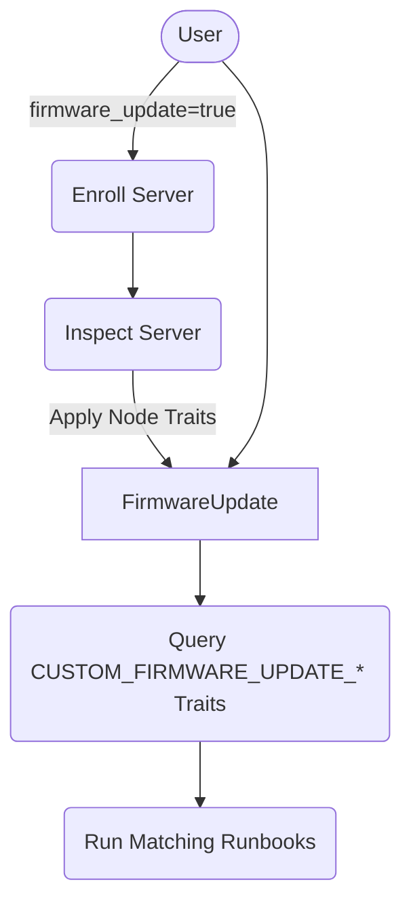
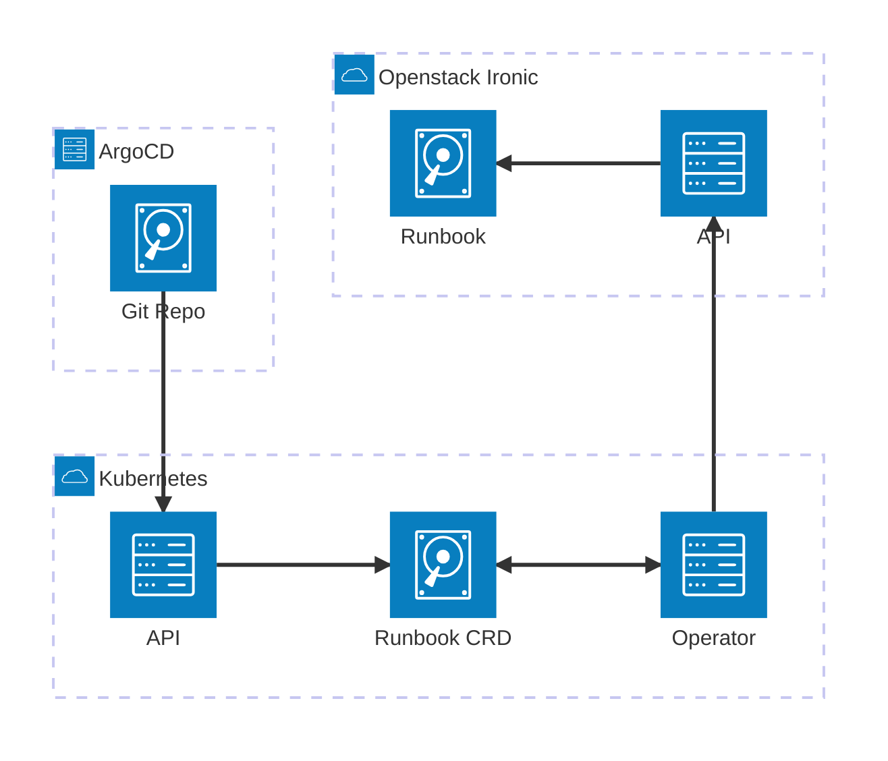

# Server Firmware Updates

Server firmware updates are done via executing Ironic Runbooks against target nodes. The node must have a trait matching the name of the runbook for the runbook to execute.

## Inspection rules

Traits are applied to a node during inspection. Ironic Inspection Rules can be used to define which traits are applied during inspection time. These Inspection Rules are currently deployed with Ironic Conductor, in a yaml file located in `/etc/ironic/inspection-rules/inspection-rules.yaml`. An example inspection-rules.yaml file:

```yaml
---
- description: Set R7615 Firmware Traits
    phase: main
    conditions:
    - op: "contains"
        args: ["{inventory[system_vendor][product_name]}", "PowerEdge R7615"]
    actions:
    - op: "add-trait"
        args: ["CUSTOM_FIRMWARE_UPDATE_R7615"]
- description: Set R7515 Firmware Traits
    phase: main
    conditions:
    - op: "contains"
        args: ["{inventory[system_vendor][product_name]}", "PowerEdge R7515"]
    actions:
    - op: "add-trait"
        args: ["CUSTOM_FIRMWARE_UPDATE_R7515"]
- description: Set R740xd Firmware Traits
    phase: main
    conditions:
    - op: "contains"
        args: ["{inventory[system_vendor][product_name]}", "PowerEdge R740xd"]
    - op: "!contains"
        args: ["{inventory[system_vendor][product_name]}", "(?i)R740xd2"]
    actions:
    - op: "add-trait"
        args: ["CUSTOM_FIRMWARE_UPDATE_R740XD"]
```

## Ironic Runbooks

Deployment of the Ironic Runbooks are done via Kubernetes manifests. A kubernetes Runbook CRD has been created to define a Runbook resource. To sync and maintain the state of these Runbook resources to the Openstack API, a Kubernetes Runbook operator was created.

## Workflows

An Argo Workflow, named `server-firmware-update`, was created to handle execution of the server firmware updates. This workflow will take a node in either `manageable` or `available` state and do the following:

- Move the node to `manageable` state (if necessary)
- Identify all traits matching `^CUSTOM_FIRMWARE_UPDATE_.*`
- Attempt to execute a Runbook for all matching traits that were found
- Sequentially install firmwares defined in all runbooks
- Return the node to original state (if necessary)

This workflow can also optionally be run from within the `enroll-server` workflow, immediately after the final inspection, by passing in `firmware_update=true`.



## Runbook Operator

The Ironic Runbook Operator was written using [shell-operator](https://github.com/flant/shell-operator). Essentially it listens for create, update or delete events on any Runbook resources, and then issues the appropriate calls to the Openstack Ironic API. These operations are defined by basic shell hooks, which can be found [here](https://github.com/rackerlabs/understack/tree/main/containers/shell-operator-ironic/hooks)


