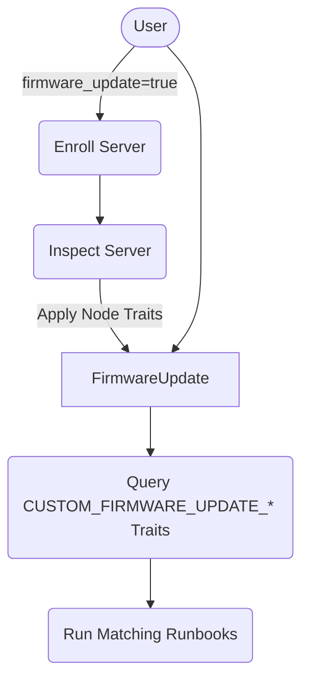
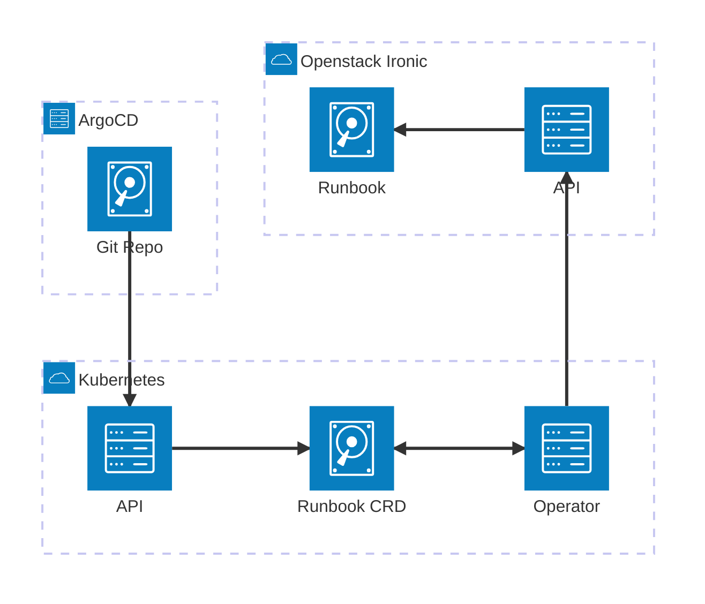

# Server Firmware Updates

Server firmware updates are done by executing Ironic runbooks against target
nodes. The firmware workflow looks for node traits matching
`CUSTOM_FIRMWARE_UPDATE_*` and runs the Ironic runbook with the same name.

## Inspection rules

Traits are applied to a node during inspection. Ironic inspection rules define
which traits are added, and Ironic Conductor loads them from
`/etc/ironic/inspection-rules/inspection-rules.yaml`.

Example inspection rules:

```yaml
---
- description: Set R7615 Firmware Traits
  phase: main
  conditions:
    - op: "contains"
      args: ["{inventory[system_vendor][product_name]}", "PowerEdge R7615"]
  actions:
    - op: "add-trait"
      args: ["CUSTOM_FIRMWARE_UPDATE_R7615"]
- description: Set R7515 Firmware Traits
  phase: main
  conditions:
    - op: "contains"
      args: ["{inventory[system_vendor][product_name]}", "PowerEdge R7515"]
  actions:
    - op: "add-trait"
      args: ["CUSTOM_FIRMWARE_UPDATE_R7515"]
- description: Set R740xd Firmware Traits
  phase: main
  conditions:
    - op: "contains"
      args: ["{inventory[system_vendor][product_name]}", "PowerEdge R740xd"]
    - op: "!contains"
      args: ["{inventory[system_vendor][product_name]}", "(?i)R740xd2"]
  actions:
    - op: "add-trait"
      args: ["CUSTOM_FIRMWARE_UPDATE_R740XD"]
```

## Ironic Runbooks

Ironic runbooks are managed as `IronicRunbook` Kubernetes CRs. The
`ironicRunbooks` openstack-sync hook reconciles those CRs into the Ironic API
and patches sync status back onto the CR. Removing a CR does **not** remove its
Ironic runbook unless the hook is configured to prune; see
[Removing a runbook](#removing-a-runbook).

For firmware updates, set `spec.runbookName` to the matching
`CUSTOM_FIRMWARE_UPDATE_*` trait name. Ironic only runs a runbook on a node that
has at least one of the runbook's `spec.traits`; a runbook with no traits
matches no nodes.

### API version needed for traits

Runbook traits need Ironic API microversion 1.112 or newer.

The sync hook looks after itself. It always asks Ironic for `1.112`, and if the
cloud cannot serve that version the hook fails its readiness check and
reconciles nothing, naming the version it needs in the error.

The client that *runs* a runbook is not protected the same way. Whatever calls
`openstack baremetal node clean --runbook` picks its own API version, and an
older `python-ironicclient` or `openstacksdk` only goes as high as the version
it knows about. If that is below 1.112, Ironic quietly falls back to the older
rule where the runbook's **name** has to be a node trait. The run is then
refused with a message saying the name does not match a trait. That message says
nothing about versions, so it reads like a broken runbook instead of an old
client, which is easy to spend a long time chasing.

Check the client version anywhere runbooks get triggered: the
`server-firmware-update` workflow image, and any host where an operator runs the
CLI by hand.

```bash
openstack --os-baremetal-api-version 1.112 baremetal runbook list
```

If the client refuses that version, it is too old to use `spec.traits`. Upgrade
the client rather than working around it by renaming runbooks back to trait
names.

## Workflows

The `server-firmware-update` Argo Workflow handles server firmware updates for
a node in either `manageable` or `available` state. It:

- moves the node to `manageable` state if needed
- identifies traits matching `^CUSTOM_FIRMWARE_UPDATE_.*`
- executes the Ironic runbook for each matching trait
- installs firmware from the selected runbooks in sequence
- returns the node to its original state if needed

The `enroll-server` workflow can run firmware updates after final inspection by
passing `firmware_update=true`.


```mermaid
flowchart TB
    A([User]) --> | firmware_update=true | B(Enroll Server)
    B --> C(Inspect Server)
    C --> | Apply Node Traits | D["`FirmwareUpdate`"]
    A --> D
    D --> E(Query CUSTOM_FIRMWARE_UPDATE_* Traits)
    E --> F(Run Matching Runbooks)
```

## Runbook Sync

`IronicRunbook` resources are owned by the `openstack-sync-operator` framework.
The hook creates and updates operator-owned Ironic runbooks through the Ironic
API. It deletes them only when pruning is enabled, which it is not by default;
see [Removing a runbook](#removing-a-runbook).


```mermaid
architecture-beta
    group argo(server)[ArgoCD]

    service repo(disk)[Git Repo] in argo

    repo:B --> T:api


    group k8s(cloud)[Kubernetes]

    service api(server)[API] in k8s
    service operator(server)[Operator] in k8s
    service crd(disk)[Runbook CRD] in k8s

    api:R --> L:crd
    crd:R <--> L:operator

    group os(cloud)[Openstack Ironic]

    service ironic(server)[API] in os
    service ir(disk)[Runbook] in os

    operator:T --> B:ironic
    ironic:L --> R:ir

```

## Removing a runbook

Deleting an `IronicRunbook` CR does not delete the runbook from Ironic. Deletion
is gated on the hook's `PRUNE` setting, which defaults to `false`:

```yaml title="components/openstack-sync-operator/values.yaml"
pluginData:
  ironicRunbooks:
    hook:
      env:
        # When true, removing an IronicRunbook CR also deletes its
        # operator-owned Ironic runbook.
        PRUNE: false
```

At that default a deleted CR leaves an **orphaned runbook**. It stays in Ironic
and any node whose traits match can still be cleaned with it, but nothing
reconciles it any more: there is no CR left to carry a `status.syncStatus`, and
no alert fires. The orphan is invisible until someone lists the cloud's
runbooks. That is a deliberate trade — a mistaken `kubectl delete` costs a stale
runbook rather than a real one — but it means removing the CR is only half of a
decommission.

To retire a runbook while `PRUNE` is `false`, do both halves:

```bash
kubectl -n openstack delete ironicrunbook <cr-name>
openstack baremetal runbook delete <runbook-name>
```

Delete the CR first. Removing the runbook while its CR still exists just has the
hook recreate it on the next reconcile, and if you then delete the CR you are
back to an orphan.

To find orphans, compare the runbooks Ironic holds against the CRs that claim
them:

```bash
openstack baremetal runbook list -f value -c Name | sort > /tmp/ironic-runbooks
kubectl -n openstack get ironicrunbooks \
  -o jsonpath='{range .items[*]}{.spec.runbookName}{"\n"}{end}' \
  | sort > /tmp/runbook-crs
comm -23 /tmp/ironic-runbooks /tmp/runbook-crs
```

Anything the last command prints exists in Ironic with no CR asking for it. That
includes hand-made runbooks, which the operator never touches.

### Enabling automatic deletion

With `PRUNE` set to `true`, each reconcile deletes every operator-owned runbook
that no CR asks for. Enable it per site in the deployment repo:

```yaml title="$CLUSTER_NAME/openstack-sync-operator/values.yaml"
pluginData:
  ironicRunbooks:
    hook:
      env:
        PRUNE: "true"
```

Three things to know first:

- **It is retroactive.** Prune is a diff against the current CRs, not a reaction
  to a delete event, so switching it on removes every accumulated orphan on the
  next reconcile — not just the next CR you delete. Run the comparison above and
  read the list before enabling.
- **Ownership is what protects a runbook, and it is claimed on first sync.** The
  hook only deletes runbooks carrying its marker in `extra`, which it writes
  when it creates a runbook or adopts an existing one of the same name. A
  runbook made by hand, or by the retired `shell-operator-ironic` controller, is
  not eligible for pruning until a CR has claimed it. With a system-scoped
  credential the hook lists runbooks in every project, so confirm nothing you
  care about has been adopted unintentionally.
- **Not during the migration onto `openstack-sync-operator`.** In the release
  that moves the `IronicRunbook` CRD between ArgoCD Applications, the CRs are
  cascade-deleted if the outgoing Application prunes the CRD before the new
  owner recreates it. They come back on a later sync, and at `PRUNE: false` the
  Ironic runbooks are never touched either way. Leave it off until the CRs are
  back and `Synced`.

A runbook Ironic reports as in use is skipped rather than deleted, and the hook
logs that it skipped it.
