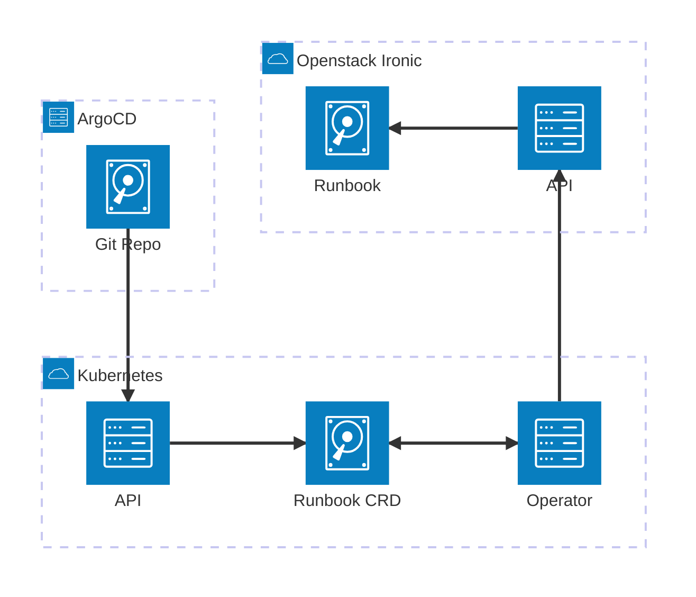

# Server Firmware Updates

Server firmware updates are done via executing Ironic Runbooks against target nodes. The node must have a trait matching the name of the runbook for the runbook to execute.

## Inspection rules

Traits are applied to a node during inspection. Ironic Inspection Rules can be used to define which traits are applied during inspection time. These Inspection Rules are currently deployed with Ironic Conductor, in a yaml file located in `/etc/ironic/inspection-rules/inspection-rules.yaml`. An example inspection-rules.yaml file:

```yaml
---
- description: Set R7615 Firmware Traits
    phase: main
    conditions:
    - op: "contains"
        args: ["{inventory[system_vendor][product_name]}", "PowerEdge R7615"]
    actions:
    - op: "add-trait"
        args: ["CUSTOM_FIRMWARE_UPDATE_R7615"]
- description: Set R7515 Firmware Traits
    phase: main
    conditions:
    - op: "contains"
        args: ["{inventory[system_vendor][product_name]}", "PowerEdge R7515"]
    actions:
    - op: "add-trait"
        args: ["CUSTOM_FIRMWARE_UPDATE_R7515"]
- description: Set R740xd Firmware Traits
    phase: main
    conditions:
    - op: "contains"
        args: ["{inventory[system_vendor][product_name]}", "PowerEdge R740xd"]
    - op: "!contains"
        args: ["{inventory[system_vendor][product_name]}", "(?i)R740xd2"]
    actions:
    - op: "add-trait"
        args: ["CUSTOM_FIRMWARE_UPDATE_R740XD"]
```

## Ironic Runbooks

Deployment of the Ironic Runbooks are done via Kubernetes manifests. An `IronicRunbook` CRD defines a runbook resource, and the `ironicRunbooks` hook in `openstack-sync-operator` reconciles those resources against the Openstack Ironic API.

Reference CRs live in [`components/openstack-sync-plugins/ironic-runbooks/examples/`](https://github.com/rackerlabs/understack/tree/main/components/openstack-sync-plugins/ironic-runbooks/examples). Nothing in that directory is applied. Copy a file to `<deploy-repo>/<site>/openstack-sync-plugins/`, add it to that directory's `kustomization.yaml`, and set `spec.cloudCredentialsRef` to the Secret holding the `clouds.yaml` to authenticate with.

The hook is enabled per site with `plugins.ironicRunbooks: true` in `<deploy-repo>/<site>/openstack-sync-operator/values.yaml`, and only after the site is pinned to an operator image containing `/hooks/ironic_runbooks.py`.

The workflow below resolves each runbook by trait name, so it can only drive a runbook whose `spec.runbookName` is itself the `CUSTOM_FIRMWARE_UPDATE_*` trait that selects the node. Runbooks named some other way are still reconciled by the hook and still usable directly with `openstack baremetal node clean --runbook`; they are just not picked up by that workflow. The runbooks deployed from `hardware/runbooks/` in the deploy repo are named by component and version, so they fall in the second group.

## Workflows

An Argo Workflow, named `server-firmware-update`, was created to handle execution of the server firmware updates. This workflow will take a node in either `manageable` or `available` state and do the following:

- Move the node to `manageable` state (if necessary)
- Identify all traits matching `^CUSTOM_FIRMWARE_UPDATE_.*`
- Attempt to execute a Runbook for all matching traits that were found
- Sequentially install firmwares defined in all runbooks
- Return the node to original state (if necessary)

This workflow can also optionally be run from within the `enroll-server` workflow, immediately after the final inspection, by passing in `firmware_update=true`.


```mermaid
flowchart TB
    A([User]) --> | firmware_update=true | B(Enroll Server)
    B --> C(Inspect Server)
    C --> | Apply Node Traits | D["`FirmwareUpdate`"]
    A --> D
    D --> E(Query CUSTOM_FIRMWARE_UPDATE_* Traits)
    E --> F(Run Matching Runbooks)
```

## Runbook Operator

Runbooks are reconciled by the `ironicRunbooks` hook in [openstack-sync-operator](../deploy-guide/components/openstack-sync-operator.md), which is built on [shell-operator](https://github.com/flant/shell-operator). It listens for create, update or delete events on any `IronicRunbook` resource, and then issues the appropriate calls to the Openstack Ironic API. A cron schedule reconciles every CR periodically as well, so drift is corrected without a CR change.

The hook entrypoint is [`ironic_runbooks.py`](https://github.com/rackerlabs/understack/blob/main/python/openstack-sync/openstack_sync/hooks/ironic_runbooks.py), and the Ironic-specific reconcile, prune and ownership logic lives under [`plugins/ironic/runbooks/`](https://github.com/rackerlabs/understack/tree/main/python/openstack-sync/openstack_sync/plugins/ironic/runbooks).

It requires Ironic API microversion 1.112, which is the first with runbook descriptions and the `/runbooks/{id}/traits` sub-resource. The hook refuses to run against an older Ironic rather than syncing partial state.

One known limitation: Ironic masks secret-looking step arguments in every runbook read, so a runbook whose step `args` carry a password (or a URL with credentials in it) always reads back as differing from its CR. The hook then rewrites `steps` on every reconcile, logging `Updating Ironic runbook <name>: /steps` on each scheduled run. The runbook stays correct; the repeated write is noise, not drift. Runbooks whose step arguments hold no credentials are unaffected.


```mermaid
architecture-beta
    group argo(server)[ArgoCD]

    service repo(disk)[Git Repo] in argo

    repo:B --> T:api


    group k8s(cloud)[Kubernetes]

    service api(server)[API] in k8s
    service operator(server)[Operator] in k8s
    service crd(disk)[Runbook CRD] in k8s

    api:R --> L:crd
    crd:R <--> L:operator

    group os(cloud)[Openstack Ironic]

    service ironic(server)[API] in os
    service ir(disk)[Runbook] in os

    operator:T --> B:ironic
    ironic:L --> R:ir

```

## Removing a runbook

Deleting an `IronicRunbook` CR does not by itself delete the runbook from Ironic. The hook only prunes when `PRUNE` is enabled for it, and the chart default is `false`, so a removed CR otherwise leaves the runbook in Ironic with nothing reconciling it.

To have the hook delete it, enable pruning for the site before removing the CR:

```yaml title="<deploy-repo>/<site>/openstack-sync-operator/values.yaml"
pluginData:
  ironicRunbooks:
    hook:
      env:
        PRUNE: "true"
```

With pruning left off, remove both: delete the CR, then delete the runbook directly.

```bash
openstack baremetal runbook delete <runbook-name>
```

Pruning only ever deletes runbooks the operator owns. A runbook the hook created or adopted carries `_understack_runbook_*` markers in its `extra`, and one without them is left in place and logged. A runbook Ironic reports as in use is also left in place.
