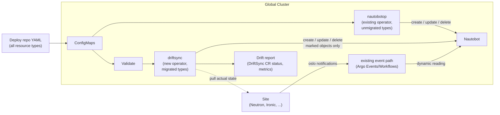

---
authors:
    - "@geetikabatra"
reviewers:
    - "@cardoe"
    - "@mfencik"
    - "@abhimanyu003"
    - "@haseebsyed12"
creation-date: 2026-07-20
last-updated: 2026-08-21
status: provisional
---

# Nautobot Resource Sync (driftsync)

## Table of Contents

- [Glossary](#glossary)
- [Summary](#summary)
- [Motivation](#motivation)
    - [Goals](#goals)
    - [Non-Goals](#non-goals)
- [Proposal](#proposal)
    - [Architecture](#architecture)
    - [Relationship to nautobotop](#relationship-to-nautobotop)
    - [Data Ownership: Static vs Dynamic](#data-ownership-static-vs-dynamic)
    - [User Stories](#user-stories)
    - [Requirements](#requirements)
    - [Implementation Details/Notes/Constraints](#implementation-detailsnotesconstraints)
- [Scope and Phased Rollout](#scope-and-phased-rollout)
- [Open Questions](#open-questions)
- [Alternatives Considered](#alternatives-considered)
- [Additional Details](#additional-details)
    - [Test Plan](#test-plan)
    - [Subtasks](#subtasks)
    - [Graduation Criteria](#graduation-criteria)
- [References](#references)
- [Implementation History](#implementation-history)

## Glossary

- **Nautobot** - our DCIM/IPAM system. For everything in scope here it is a
  projection rather than an origin: static data is rendered into it from the
  deploy repo, and dynamic data is recorded in it by the site event path. It is
  not an authoring surface — nothing is created there by hand and expected to
  survive. See [Data Ownership: Static vs Dynamic](#data-ownership-static-vs-dynamic).
- **nautobotop** - the Nautobot Operator we already run. It reads YAML out of
  Kubernetes ConfigMaps and pushes it into Nautobot through the Nautobot API,
  including deleting Nautobot objects that no longer appear in the YAML. It is a
  one-directional deploy-repo → Nautobot sync. This proposal does not modify
  nautobotop's code: it keeps running exactly as it does today for every
  resource type that hasn't been explicitly migrated to driftsync. See the
  [Nautobot Operator guide](../operator-guide/nautobotop.md) and
  [Relationship to nautobotop](#relationship-to-nautobotop).
- **driftsync** - the new, separate Kubernetes operator this proposal introduces.
  It runs on the global cluster as its own controller — its own CRD, its own
  Deployment, its own RBAC and credentials — alongside nautobotop, not merged
  into nautobotop's binary or reconcile loop. It owns full CRUD, validation,
  ownership marking, and pull-based read-back for the resource types explicitly
  migrated to it, starting with VLAN Groups. See
  [Relationship to nautobotop](#relationship-to-nautobotop).
- **`DriftSync` CR** - the custom resource driftsync reconciles against, distinct from
  nautobotop's own `Nautobot` CR. One exists per resource type per environment
  that has been migrated to driftsync's ownership. Its status is where validation
  failures, sync results, and drift reports are surfaced.
- **Global cluster** - the cluster where Nautobot, the Nautobot worker,
  nautobotop, and (once built) driftsync run. Sites can reach it.
- **Management cluster** - the ArgoCD and logging environment. Nautobot does
  *not* run here.
- **Site** - a physical undercloud location with its own hardware, its own
  Kubernetes cluster, and its own OpenStack services (Neutron, Ironic).
- **Deploy repo** - `RSS-Engineering/undercloud-deploy`, which holds the
  per-environment hardware YAML (for example
  `hardware/vlan-groups/staging/vlan-groups.yaml`) that gets rendered into
  ConfigMaps, for every resource type in scope — not just VLAN groups. Which
  operator consumes a given ConfigMap depends on whether that resource type has
  been migrated to driftsync yet.
- **Static generator** - a generator, being built separately, that produces
  per-site data (OOB IP ranges, VNI ranges, BGP ASNs, switch loopback IPs) as a
  file committed to the deploy repo.
- **Static data** - data authored up front, by design or by the static generator,
  in the deploy repo. Git is the source of truth: the deploy repo file is where
  changes are made and where people look values up.
- **Dynamic data** - values a site's own OpenStack services produce at runtime,
  inside the ranges the deploy repo authored. Nautobot's copy of them is a
  recorded reading of what a site currently has — useful for visibility and drift
  reporting, never authoritative, and never something to author against.
- **Resource type** - a category of thing synced into Nautobot: VLAN groups,
  locations, racks, device types, VLANs, and so on. Each resource type is
  classified static or dynamic (or both), and at any time is owned by exactly
  one operator — nautobotop or driftsync, never both.

## Summary

The deploy repo is the source of truth for Nautobot. Hardware YAML in
`RSS-Engineering/undercloud-deploy`, together with the static generator's
output committed alongside it, is where every in-scope resource type is
authored. Changes are made there, reviewed there, and looked up there. Nautobot
holds a copy rendered from it.

Nautobot also has to hold one more thing: what sites actually have. Certain
values — tenant VLANs, VNIs, and subnets today — come into existence when a
tenant calls a site's Neutron API, inside the ranges the deploy repo authored,
and they reach Nautobot through the existing event path. This proposal keeps
that path but fixes its standing: what it writes is a recorded reading of the
site, for visibility and drift reporting. It is not authoritative, and nothing
is ever authored from it.

This is a general proposal for how *any* resource type moves between the
deploy repo, Nautobot, and a site — not a VLAN-Group-specific design, and not a
patch to nautobotop. It does four things:

1. States the deploy repo as the single authoring surface, and requires every
   resource type brought into scope to be classified as static (rendered from
   the deploy repo) or dynamic (recorded from a site).
2. Introduces **driftsync** as a new, standalone operator deployed on the global
   cluster — its own CRD, its own controller, its own RBAC — separate from
   nautobotop rather than a set of changes merged into it. See
   [Relationship to nautobotop](#relationship-to-nautobotop) for why.
3. Makes the static/dynamic split enforceable in driftsync rather than a
   convention we rely on. Its delete pass is ownership-scoped from day one: it
   only ever removes objects it rendered itself, for the resource types it
   owns. nautobotop's own delete pass is unchanged and stays unscoped for
   whatever a resource type hasn't yet moved to driftsync.
4. Establishes the mechanism generically — full CRUD from deploy repo YAML,
   validated before it reaches Nautobot, plus pull-based read-back of actual
   state from a site — and applies it to VLAN Groups first as the concrete
   proof of the pattern. Which resource type migrates next is deliberately left
   open; see [Scope and Phased Rollout](#scope-and-phased-rollout).

At a July 27, 2026 sync-up (@abhimanyu003, @haseebsyed12), the team agreed on
the shape of the mechanism itself, independent of any one resource type:

- The deploy repo YAML stays the source of truth.
- Validation is needed, and can call the Nautobot API directly rather than
  relying on Nautobot's own server-side checks alone.
- Ansible-driven sync cannot handle deletion — nothing tracks what was
  previously applied, so removing an entry from the YAML doesn't remove it from
  Nautobot — which is why this has to be an operator, not a playbook.
- Reading actual state back from a site should be pull-based: the global
  cluster asks, the site answers.
- The right way to prove this out is full CRUD for one resource end to end
  before generalizing further — VLAN Groups was picked as that first resource
  because its deploy repo YAML already exists and its failure modes (the
  unscoped delete, the silent bad reference) are already understood.

Earlier drafts of this proposal described a generic two-way sync with a
`spec`/`status` split and writeback into Nautobot for any resource type. We've
stepped back from that: writeback treats a reading as authoritative, which tends
to invite sync loops and lets Nautobot's copy drift away from the file people are
reading. Static data flows one way, deploy repo → Nautobot. Dynamic data flows the
other, site → Nautobot, report only. The two never meet in the same field.

This work doesn't rely on Cluster API or its IPAM claim/pool contract.

## Motivation

The problems below are properties of how nautobotop syncs *any* resource type
today. VLAN groups happen to be where each one is easiest to point to concretely,
because that resource type's code already exists and its YAML is already in the
deploy repo — but none of these are VLAN-Group-specific bugs. This proposal
does not fix them by patching nautobotop's existing sync package; it builds a
new operator, driftsync, that is designed to avoid them from the start, and moves
resource types onto it one at a time. A type stops being exposed to these
problems the moment it is migrated, not before.

### Nothing distinguishes what we authored from what a site reported

nautobotop reconciles by listing everything of a given type in Nautobot and
deleting whatever is not in the YAML. For VLANs that is
[`deleteObsoleteVlans`](https://github.com/rackerlabs/understack/blob/main/go/nautobotop/internal/nautobot/sync/vlan.go),
which calls `ListAll` and removes every VLAN whose name is absent from the
ConfigMap; VLAN groups, racks, devices, prefixes and the rest follow the same
shape. Meanwhile, dynamic values created at a site already reach Nautobot
through the existing oslo notification → Argo Events → Argo Workflows →
`ironic-nautobot-client` path.

Those two facts together mean that as soon as site-reported data lands in
Nautobot for any resource type that has both a static and a dynamic side, a
nautobotop reconcile deletes it, because it was never in the deploy repo YAML.
The delete pass is right to remove anything absent from the deploy repo *among
the objects it rendered* — that is what makes git the source of truth — but it
currently cannot tell those apart from readings the event path recorded. This
is exactly the gap driftsync's ownership marker closes for the types it takes
over; it does not retrofit nautobotop's existing delete passes for types that
stay on nautobotop.

### Static data reaches Nautobot unvalidated

References in the YAML are resolved by name at reconcile time, and a name that
does not resolve is silently dropped rather than rejected. In
[`vlanGroup.go`](https://github.com/rackerlabs/understack/blob/main/go/nautobotop/internal/nautobot/sync/vlanGroup.go),
`buildLocationReference` returns an empty reference when the location lookup
fails, so a VLAN group with a mistyped `location` is created in Nautobot with no
location at all and no error surfaced. This is one instance of a general
pattern: any resource type with a reference field is exposed to the same silent
failure. A typo in the deploy repo becomes bad data in Nautobot, discovered
later by whoever depends on it. Since the deploy repo is also where people look
values up, the file and Nautobot end up disagreeing with nothing to signal it.

### There is no way to ask a site what is actually configured

Nautobot holds the authored intent and a copy of some runtime values, but nothing
reads a site back to confirm the two agree, for any resource type. Drift is
found by hand. nautobotop has never done this and this proposal does not add it
to nautobotop; it's a capability driftsync has from the start.

### Ansible-driven sync does not cover deletion

This was the specific point settled at the July 27 sync-up: the existing
Ansible-based flows can create and update, but deletion is the hard case —
nothing tracks what was previously applied, so removing an entry from the YAML
does not remove it from the target. That is a property of Ansible playbooks in
general, not of any one resource type, and it is the reason this has to be
built as a level-triggered operator rather than extended as more playbooks. An
operator also gives us per-site conditions, metrics, and observability that a
one-shot playbook does not.

### Goals

1. Establish the deploy repo as the single authoring surface for Nautobot, and
   require every resource type brought into driftsync's scope to be documented as
   static (rendered from the deploy repo) or dynamic (recorded from a site)
   before driftsync takes over syncing it.
2. Build driftsync as a new, separate operator on the global cluster — its own
   CRD, controller, Deployment, and RBAC — rather than as changes merged into
   nautobotop. See [Relationship to nautobotop](#relationship-to-nautobotop).
3. Make driftsync's delete pass ownership-scoped from day one, for every resource
   type it manages, so it never deletes objects it did not render, regardless
   of what else lives in Nautobot. nautobotop's delete pass is untouched by
   this proposal.
4. Validate deploy repo YAML — structurally and referentially — for every
   resource type driftsync manages, and fail loudly with an actionable message
   instead of writing partial data.
5. Give driftsync a pull-based way to read actual state from a site into the
   global cluster, generalized across resource types, and report disagreement
   between that and Nautobot.
6. Prove driftsync end to end on one resource type — full CRUD, validation,
   ownership marking, read-back — before migrating a second type onto it. VLAN
   Groups is that first resource type; see
   [Scope and Phased Rollout](#scope-and-phased-rollout) for how later types
   get added.

### Non-Goals

1. **No two-way sync.** No field is written from both directions, and no value a
   site reported is ever promoted into static data by a machine, for any
   resource type. Neither operator writes individual runtime allocations
   (VLANs, VNIs, tenant subnets), since those are allocated at runtime rather
   than authored.
2. **No automatic conflict resolution.** When actual state and Nautobot
   disagree, driftsync reports it. Deciding what to do is a human call for now, and
   for static data the fix is an edit to the deploy repo.
3. **Not a rewrite of nautobotop.** nautobotop's existing code, behavior, and
   delete semantics for resource types not yet migrated are out of scope for
   this proposal. Those types keep behaving exactly as they do today —
   including the unscoped delete pass — until someone explicitly migrates them
   onto driftsync.
4. **Not new-site onboarding.** Bringing a new cab or site online is covered by
   [ADR027](https://docs.undercloud.rackspace.net/architecture-decisions/adr027-automated-cab-addition/).
5. **Not a replacement for the existing dynamic path.** The oslo notification →
   Argo Events → Argo Workflows → `ironic-nautobot-client` route stays as the way
   dynamic data reaches Nautobot. driftsync makes what it writes distinguishable as a
   reading rather than authoritative data; it does not duplicate the path.
6. **No Cluster API**, no IPAM provider pattern, no claim/pool contract.
7. **Not deciding the static generator's output format.** That is being designed
   separately; this proposal only states that it's consumed as static data.
8. **Not committing to a full list of resource types up front.** This proposal
   defines the mechanism and classifies the types nautobotop syncs today (see
   the table below). Which types migrate to driftsync next — beyond VLAN Groups —
   is a follow-on decision, not part of this document.

## Proposal

### Architecture

This is deliberately a basic picture: two independent operators on the global
cluster, each owning a disjoint set of resource types, both writing into the
same Nautobot, plus one read-only path out to a site.

- **Two operators, one cluster.** nautobotop and driftsync both run on the global
  cluster, as separate Deployments with separate CRDs and separate RBAC. They
  are not two modes of the same binary. At any time, a given resource type's
  ConfigMap is reconciled by exactly one of them — see
  [Relationship to nautobotop](#relationship-to-nautobotop).
- **Static, deploy repo → Nautobot.** The only authoring surface, for both
  operators. nautobotop keeps writing the types not yet migrated, unchanged.
  driftsync validates YAML before writing, and marks every object it writes so its
  own delete pass — and only its own — is scoped to what it rendered.
- **Dynamic, site → Nautobot.** Unchanged: a site's own services allocate
  inside the authored ranges and the existing event path records it in
  Nautobot as a reading. Unmarked by either operator, so neither's delete pass
  touches it.
- **Read-back, global → site, read-only.** Only driftsync does this; nautobotop
  never talks to a site and never has site credentials. driftsync pulls actual
  state from a site, compares it with Nautobot, and reports differences. It
  writes to neither side. If the global cluster cannot reach site APIs
  directly, this becomes a per-site read-only agent that global pulls from
  (see [Open Questions](#open-questions)).

This picture is the same regardless of which resource type is flowing through
driftsync's half of it — VLAN Groups is simply the first one wired end to end.

### Relationship to nautobotop

nautobotop is not being extended, refactored, or otherwise changed by this
proposal. driftsync is a second, independent operator that takes over specific
resource types from nautobotop one at a time.

**Ownership is exclusive and explicit.** For any resource type, exactly one of
nautobotop or driftsync has write and delete authority in Nautobot at a time —
never both, and never implicitly. Before driftsync is built, every resource type
nautobotop currently syncs stays under nautobotop, unchanged. A type moves to
driftsync only when someone deliberately migrates it, which is a tracked cutover,
not a gradual handoff:

1. driftsync gains support for the resource type (schema, referential validation,
   ownership marking, read-back if applicable).
2. Existing Nautobot objects of that type — created by nautobotop, currently
   unmarked — are backfilled with driftsync's ownership marker.
3. The deploy repo config that feeds nautobotop is updated to stop including
   that resource type (or nautobotop's own config is scoped to exclude it), so
   nautobotop's reconcile no longer touches it — including no longer running
   its delete pass against it.
4. driftsync's config picks up the same (or equivalent) ConfigMap and starts
   reconciling that type going forward.

Until step 3 happens for a type, driftsync does not touch it, even if driftsync
already has code that could sync it — this is what keeps the two operators
from racing to reconcile the same objects.

**Why a separate operator instead of extending nautobotop:**

- **Blast radius.** nautobotop's sync for its other resource types is stable
  and depended on in production today. Merging new, less-proven validation and
  read-back logic into the same binary and reconcile loop risks destabilizing
  that; a separate operator means a bug in driftsync's newer code can't take down
  nautobotop's sync for everything else.
- **Credentials.** driftsync needs per-site OpenStack API access for read-back.
  nautobotop has never needed that and shouldn't acquire it just so one
  resource type can gain read-back — keeping the operators separate keeps each
  one's RBAC and credential footprint scoped to what it actually does.
- **Release cadence.** driftsync can ship, version, and roll back independently of
  nautobotop, which matters while its validation and read-back logic are new
  and iterating quickly.
- **A clean ownership boundary.** "Which operator wrote this object" is a
  question about which Deployment ran, not about a flag inside a shared
  process — that's a simpler invariant to test and to reason about during a
  migration than a shared codebase with per-type behavior switches.

**Deployment shape.** driftsync is built and deployed independently of nautobotop:
its own Go module/binary (proposed: `go/driftsync/`, alongside `go/nautobotop/` in
the same repo — see [Open Questions](#open-questions) for whether it should
instead be a separate repo), its own container image and version, its own
controller-manager Deployment on the global cluster, its own CRD (`DriftSync`),
and its own ServiceAccount and RBAC — scoped to the Nautobot API plus, for
resource types with read-back, per-site OpenStack API credentials. It is
declared in the deploy repo as `global.driftsync`, parallel to and independent of
`global.nautobotop`.

### Data Ownership: Static vs Dynamic

The deploy repo is the source of truth throughout. The classification below is
about what each row *is* in Nautobot — data rendered from the deploy repo, or a
reading recorded from a site — and therefore who may write it. The Mechanism
column also records which operator currently owns the write path: today that's
nautobotop for everything except the one row that has been migrated.

| Data | Authored in | Class | Direction | Mechanism |
|------|-------------|-------|-----------|-----------|
| VLAN groups (name, location, range) | Deploy repo YAML | static | deploy repo → Nautobot | **driftsync** (migrated — first resource type in scope) |
| Locations, location types, racks, rack groups | Deploy repo YAML | static | deploy repo → Nautobot | nautobotop (not yet migrated) |
| Device types | Deploy repo YAML | static | deploy repo → Nautobot | nautobotop (not yet migrated) |
| VLAN ID / VNI / subnet ranges a site may allocate from | Deploy repo YAML or generator | static | deploy repo → Nautobot | nautobotop (not yet migrated) |
| OOB IP ranges | Static generator, committed to deploy repo | static | generator file → Nautobot | nautobotop (not yet migrated) |
| VNI ranges per site | Static generator, committed to deploy repo | static | generator file → Nautobot | nautobotop (not yet migrated) |
| BGP ASNs | Static generator, committed to deploy repo | static | generator file → Nautobot | nautobotop (not yet migrated) |
| Switch loopback IPs | Static generator, committed to deploy repo | static | generator file → Nautobot | nautobotop (not yet migrated) |
| Tenant VLAN / VNI / subnet allocations | Not authored — allocated at runtime by a site's Neutron, inside the authored ranges | dynamic | site → Nautobot, report only | existing oslo/Argo path (unchanged by either operator) |
| Device/port actual state | Not authored — reported by site Ironic | dynamic | site → global, report only | driftsync read-back |

Four rules fall out of it, and apply to every row, present and future, and to
whichever operator currently owns it:

- Every object in Nautobot is either rendered from the deploy repo or recorded as
  a reading from a site. There is no third category, and nothing in Nautobot is
  authoritative on its own.
- The operator that owns a static row may create, update, and delete only the
  objects it rendered itself. It never touches objects the other operator
  rendered or that a site reported.
- For rows marked **dynamic**, neither operator creates, updates, or deletes —
  including via a delete-obsolete pass. Nautobot's copy of that data is a
  reflection of the site, not an instruction to it.
- A dynamic value is never promoted into static data by a machine. If a site has
  something the deploy repo does not, that is drift to report, and a human
  resolves it by editing the deploy repo.

A resource type does not move to the "driftsync" mechanism until it has gone
through the migration steps in
[Relationship to nautobotop](#relationship-to-nautobotop). Being listed in this
table is not the same as being migrated yet — see
[Scope and Phased Rollout](#scope-and-phased-rollout).

### User Stories

These stories describe the mechanism generically. VLAN Groups is used as the
worked example in each because it's the resource type the team agreed to prove
this out on first — the same story holds for any static or dynamic resource
type once it's migrated to driftsync.

#### Story 1 - A typo in the deploy repo is caught before it reaches Nautobot

Someone edits a deploy repo YAML file for a resource type driftsync already owns —
today `vlan-groups.yaml` — and misspells a referenced field, such as a
location. Today (under nautobotop, before migration) the object is created in
Nautobot with that reference left empty and no complaint. Under driftsync,
validation rejects the entry, the reconcile reports the failure on the
`DriftSync` CR status and in metrics, and Nautobot is left unchanged.

#### Story 2 - An object is removed from the deploy repo

The entry is deleted from the YAML, and the operator that owns that resource
type — driftsync, for a migrated type — deletes the corresponding object in
Nautobot, but only because that object is marked as owned by that operator.
Nothing else in Nautobot is affected. This is the case Ansible-driven sync
could not handle.

#### Story 3 - A site produces a runtime value inside an authored range

A site's own services allocate something (a VLAN, today) from the range the
deploy repo authored. It reaches Nautobot through the existing event path and
is recorded there as a reading. Neither nautobotop nor driftsync sees an object it
rendered, so neither deletes it, even though it is not in any deploy repo YAML.
If the allocation falls outside the authored range, that is drift and gets
reported.

#### Story 4 - Someone asks whether a site matches Nautobot

driftsync pulls actual state for the resource type from the site, compares it with
Nautobot, and reports the differences with enough detail to act on. It does not
change either side. nautobotop is never involved in this, whether or not it
still owns other resource types at that site.

#### Story 5 - Someone needs to change a static value

They edit the deploy repo YAML, open a review, and merge. Validation runs in CI
before the merge, and whichever operator currently owns that resource type
(driftsync, if migrated; nautobotop otherwise) renders the change into Nautobot on
its next reconcile. The file remains the thing to read to find out what the
value is. Editing the same value directly in Nautobot is not a supported
route: the next reconcile puts it back to what the file says.

### Requirements

The requirements below describe **driftsync**, the new operator. Where nautobotop
is called out explicitly (FR1), it's to state what stays unchanged.

#### Functional Requirements

- **FR1**: nautobotop's own code and behavior are unchanged by this proposal.
  It keeps syncing ConfigMap YAML into Nautobot, including its current
  unscoped delete pass, for every resource type that has not been explicitly
  migrated to driftsync.
- **FR2**: driftsync is built and deployed as its own Kubernetes operator: its own
  CRD (`DriftSync`), its own controller-manager Deployment, its own
  ServiceAccount and RBAC, and its own entry in the deploy repo
  (`global.driftsync`) — not a package merged into nautobotop's binary or
  reconcile loop.
- **FR3**: Objects driftsync creates in Nautobot are marked as driftsync-owned, using
  a marker Nautobot can filter on (see [Open Questions](#open-questions) for
  which one) and that is distinct from anything nautobotop may ever adopt, so
  the two operators' delete passes can never collide.
- **FR4**: driftsync's delete-obsolete pass is scoped to objects carrying its own
  marker. It never deletes an object it did not render, an object nautobotop
  rendered, or an object a site reported.
- **FR5**: The YAML for a resource type driftsync owns is validated before any
  write to Nautobot:
    - structurally, against a schema (required fields, value bounds, duplicate
      names);
    - referentially, against the Nautobot API directly (does this reference
      exist?) — this is the specific validation approach agreed at the July 27
      sync-up.
- **FR6**: A validation failure fails the reconcile for that resource with a
  named error, surfaces it on the `DriftSync` CR status, and does not write
  partial data. A reference that cannot be resolved is never silently dropped.
- **FR7**: driftsync can pull actual state for a resource type it owns from a site
  and compare it against Nautobot.
- **FR8**: Differences are reported on the `DriftSync` CR status, in logs, and as
  metrics. No automatic remediation, and no writing a reported value back as
  static data.
- **FR9**: driftsync is proven end to end on one resource type — create, update,
  delete, validate, read back — before a second type is migrated onto it. VLAN
  Groups is that first type; see
  [Relationship to nautobotop](#relationship-to-nautobotop) for the migration
  steps.
- **FR10**: Site interaction uses the OpenStack APIs (Neutron, Ironic) directly
  rather than shelling out to the OpenStack CLI. nautobotop never gains site
  credentials or site interaction as part of this proposal — only driftsync does.
- **FR11**: Dynamic data written by the event path is distinguishable in
  Nautobot from static data written by either operator, so "what did we
  author, and by which operator?" and "what does the site actually have?" are
  separately answerable.
- **FR12**: At any time, exactly one operator holds write and delete authority
  for a given resource type. Migrating a type from nautobotop to driftsync is an
  explicit, tracked cutover (marker backfill, then a config change that
  excludes the type from nautobotop) — never simultaneous ownership by both.

#### Non-Functional Requirements

- **NFR1**: Unit tests for driftsync's ownership-scoped delete pass, including the
  case where Nautobot contains objects of the same type that are unmarked or
  marked as nautobotop-owned.
- **NFR2**: Unit tests for schema validation and for referential validation,
  covering the unresolved-reference case that currently fails silently under
  nautobotop.
- **NFR3**: driftsync's reconciles stay idempotent — an unchanged YAML produces no
  Nautobot writes and no change-log noise.
- **NFR4**: Per-site, per-resource metrics from driftsync: reconcile outcome,
  validation failures, objects created/updated/deleted, drift count, last
  successful pull.
- **NFR5**: A site being unreachable is a reported condition on driftsync's status,
  not a failed reconcile of unrelated resources, and never affects nautobotop.
- **NFR6**: driftsync ships as an independently deployable, independently
  releasable component (own container image, own version, own rollout), so a
  bug in driftsync cannot block or destabilize nautobotop's sync for unmigrated
  types, and a nautobotop change cannot block driftsync's release.

### Implementation Details/Notes/Constraints

#### Current State

- nautobotop runs on the **global cluster** (`global.nautobotop` in the deploy
  repo) and pushes ConfigMap YAML into Nautobot. It supports location types,
  locations, rack groups, racks, device types, VLAN groups, VLANs, prefixes,
  namespaces, RIRs, roles, tenants, tenant groups, clusters, cluster types, and
  cluster groups. On day one of driftsync, all of these stay under nautobotop
  exactly as today; nothing about nautobotop changes as part of building
  driftsync.
- Its delete pass is unscoped: list everything of a type, delete what is not in
  the YAML. This does not change for types that remain on nautobotop.
- Reference resolution is by name with silent failure on miss. Also unchanged
  for types that remain on nautobotop.
- Dynamic data flows site → Nautobot today via oslo notifications, captured by
  Argo Events, handled by Argo Workflows, with `ironic-nautobot-client` making
  the Nautobot calls. A Nautobot worker driven from global runs the jobs. This
  replaced an earlier ServiceNow-based job, and is untouched by this proposal.
- Sites can reach the global cluster. Whether the global cluster can reach a
  site's OpenStack APIs is not yet confirmed — this matters for driftsync's
  read-back, not for nautobotop, which never needs it.
- There is no validation layer and no read-back of actual state today, for any
  resource type. driftsync is new code, not an extension of an existing package;
  it does not exist yet.
- Ansible-driven playbooks exist for some of this today and were evaluated at
  the July 27 sync-up; they were ruled out as the primary mechanism specifically
  because they cannot express deletion.

#### Ownership Marking and Cutover

The delete pass needs a filter it can trust, for every resource type driftsync
manages. Every object driftsync writes gets a marker — a tag, a custom field, or a
relationship — and its `deleteObsolete*` logic lists only objects carrying that
marker, rather than everything of the type. Consequences:

- Site-reported objects are structurally invisible to driftsync's delete pass.
- Objects nautobotop rendered are also invisible to driftsync's delete pass, as
  long as driftsync's marker and nautobotop's objects (unmarked, or marked
  differently if nautobotop ever adopts its own scheme) stay distinguishable.
- When a resource type migrates from nautobotop to driftsync, the objects
  nautobotop already created for it are backfilled with driftsync's marker as
  part of the cutover (step 2 in
  [Relationship to nautobotop](#relationship-to-nautobotop)) — before
  nautobotop's config is updated to stop managing that type. Until the backfill
  and the config change both happen, driftsync does not reconcile that type, so
  there's never a window where both operators are deleting against the same
  objects.
- The marker also gives us a cheap answer to "did we author this, and through
  which operator, or did a site report it?" when reporting drift.

#### Validation

Two layers, because they catch different mistakes:

1. **Schema validation** of the deploy repo YAML. Catches shape errors and can
   run in the deploy repo's own CI, before merge, where the feedback is most
   useful. Also runs inside driftsync, for the types it owns, so a hand-edited
   ConfigMap cannot bypass it.
2. **Referential validation** by calling the Nautobot API directly at reconcile
   time. Catches a well-formed file that refers to something that does not
   exist — the mistyped-reference case. This is the approach agreed at the July
   27 sync-up, and it is the only layer that can see Nautobot's actual contents.

Nautobot also has its own server-side data validation mechanism. That is worth
using as a backstop for anything that must hold regardless of which client
writes it, but it cannot replace layer 1 (too late, and the error surfaces in the
wrong place) — see [Open Questions](#open-questions).

Validation failures are reported per entry, not as a single opaque reconcile
error, so a bad line in a large file names itself.

#### Reading Actual State Back From a Site

The agreed preference, from the July 27 sync-up, is a **pull** model: the global
cluster asks, the site answers. Pull keeps credentials and scheduling on one
side, makes "when did we last look?" answerable, and avoids every site needing
write access to global state. This is driftsync's job exclusively — nautobotop
never gains site credentials or a read-back path.

Two shapes, depending on reachability:

- **driftsync → site OpenStack APIs directly.** driftsync, on the global cluster,
  holds per-site credentials and queries Neutron/Ironic. Nothing new to deploy
  per site. Requires the global cluster to reach site API endpoints.
- **Per-site agent, pulled by driftsync.** A small read-only agent at each site
  exposes the data; driftsync pulls it on a schedule. Works when site APIs are not
  directly reachable, at the cost of a component per site.

Sites can reach the global cluster, so a site-initiated push is technically
available as a fallback. It is not preferred: it inverts control of scheduling
and needs write credentials at every site.

Read-back is read-only in both shapes. It never writes to the site, and it does
not write dynamic data into Nautobot — that remains the existing event path's
job. Its output is a comparison report, and a difference it finds in a static
resource is fixed by editing the deploy repo, not by writing to either side.

#### Why an Operator, and Why a Separate One

A Kubernetes operator gives us the deletion semantics Ansible lacks — the
specific gap identified at the July 27 sync-up — plus a level-triggered
reconcile that converges after transient failures, per-site status conditions,
and metrics. That much argues for an operator in general; nautobotop already
proves the pattern works here.

It doesn't by itself argue for a *second* operator instead of extending
nautobotop, so that choice is worth stating plainly: extending nautobotop in
place was considered and rejected for this work. nautobotop's sync for its
other resource types is stable and depended on in production today, and
merging new, less-proven validation and read-back logic into the same binary
and reconcile loop risks destabilizing that for the sake of one migrating
type. A separate operator — driftsync — gets its own release cadence, its own
test suite, its own blast radius, and its own credentials: it needs per-site
OpenStack API access for read-back, which nautobotop has never needed and
shouldn't acquire just to gain read-back for one resource type. Resource types
move to driftsync's ownership one at a time, on a schedule this proposal doesn't
fix in advance (see [Scope and Phased Rollout](#scope-and-phased-rollout));
nautobotop keeps everything else running exactly as it does today.

## Scope and Phased Rollout

This proposal is a general mechanism, not a VLAN-Groups-specific one. VLAN
Groups is where it lands first because that YAML already exists in the deploy
repo and its failure modes (unscoped delete, silent bad reference) are already
understood — it's the fastest path to proving driftsync end to end, not the
boundary of what driftsync is for.

**Phase 0 — Build the operator.** Scaffold driftsync itself: the `DriftSync` CRD, the
controller-manager, RBAC, container image, and the `global.driftsync` entry in the
deploy repo, deployed to a test environment on the global cluster, independent
of nautobotop. Nothing migrates yet; this phase just proves driftsync runs.

**Phase 1 — VLAN Groups.** Full CRUD from deploy repo YAML, schema and
referential validation, ownership-scoped deletion, and pull-based read-back
against one site, with a drift report — plus the cutover itself: backfilling
driftsync's marker onto the VLAN Group objects nautobotop already created, and
updating nautobotop's config so it stops managing VLAN Groups. This is the
slice described in [First Increment](#first-increment) below and is what the
Alpha/Beta graduation criteria are scoped to.

**Phase 2 and beyond — everything else nautobotop currently syncs, plus VLANs
specifically.** VLANs are called out because that is where the static/dynamic
boundary actually bites — Nautobot holds both VLANs rendered from the deploy
repo and VLANs reported from a site's Neutron — so it's the next type that
exercises parts of the mechanism VLAN Groups alone doesn't. Beyond that,
locations, racks, device types, and the static-generator-produced types (OOB IP
ranges, VNI ranges, BGP ASNs, switch loopback IPs) are all candidates for
eventual migration to driftsync, but **which one comes after VLANs, and in what
order, is intentionally not decided in this document.** Each additional type
needs its own classification row agreed
(see [Data Ownership: Static vs Dynamic](#data-ownership-static-vs-dynamic))
and its own cutover before it moves off nautobotop, and that prioritization is
a follow-on conversation once Phase 1 has landed.

#### First Increment

VLAN Groups, end to end, as the concrete slice:

1. driftsync operator scaffolded and deployed (Phase 0), with the `DriftSync` CRD,
   controller-manager, and RBAC in place.
2. Ownership marker written on create, delete pass scoped to it, with tests.
3. Schema validation for `vlan-groups.yaml`, plus referential validation of
   `location` against Nautobot, replacing the silent empty-reference path.
4. Validation and reconcile results reported on the `DriftSync` CR status and as
   metrics.
5. Existing VLAN Group objects backfilled with driftsync's marker; nautobotop's
   config updated to stop managing VLAN Groups; verified no object is
   duplicated, deleted, or left unmanaged during the cutover.
6. Read-back of VLAN group state from one site, and a drift report.

## Open Questions

1. **Do tenant allocations need to be authored in the deploy repo at all?** This
   proposal says the deploy repo authors the *ranges*, and the individual tenant
   VLAN, VNI and subnet allocations inside those ranges are runtime values that
   Nautobot merely records. The stricter reading — every VLAN declared in git
   before a tenant can use it — would mean giving up tenant self-service network
   creation, since a tenant API call cannot wait on a merge. This needs agreement
   before VLANs (Phase 2) are implemented, because it decides whether the event
   path stays.
2. **What should happen to a hand edit made directly in Nautobot** to a static
   type? As specified it is reverted on the next reconcile, silently, by
   whichever operator owns that type. Reverting is right, but it may be worth
   reporting rather than doing quietly, so the person who made the edit finds
   out.
3. **Which Nautobot mechanism marks ownership** — tag, custom field, or
   relationship — and does driftsync's marker need to also distinguish
   "driftsync-owned" from a hypothetical future "nautobotop-owned" marker, or is
   "not driftsync-owned" a safe enough proxy for "still nautobotop's" for as long
   as the two operators never share a type?
4. **Can the global cluster reach site Neutron/Ironic APIs?** Sites reaching
   global is confirmed; this direction is not, and it decides whether driftsync
   needs a per-site agent for read-back.
5. **Where does validation live?** Deploy repo CI, driftsync itself, Nautobot's
   server-side validators, or some split across all three.
6. **What does the static generator emit, and how does it reach driftsync (or
   nautobotop, for types not yet migrated)?** A file committed to the deploy
   repo and rendered into a ConfigMap is the assumption here; it needs
   confirming against that work.
7. **How are per-environment files (`staging/`, production) rendered into
   ConfigMaps**, and does each environment get its own `DriftSync` CR per
   migrated resource type, mirroring how nautobotop's own `Nautobot` CR is
   scoped today?
8. **Which resource type comes after VLAN Groups, and in what order?** Deferred
   deliberately — see [Scope and Phased Rollout](#scope-and-phased-rollout).
   Each candidate needs its own classification review and cutover plan before
   it is migrated.
9. **Does driftsync live in the same repository as nautobotop** (for example
   `go/driftsync/` alongside `go/nautobotop/`), or as a fully separate repository?
   Same-repo keeps shared tooling and CI close by; a separate repo makes the
   "these are two independent deployables" boundary harder to accidentally
   blur later.
10. **Does driftsync get its own Nautobot API service account/token**, separate
    from nautobotop's, for least-privilege scoping and so activity from each
    operator is separately auditable in Nautobot's own logs?
11. **How is the VLAN Groups cutover sequenced in production** — is a
    maintenance window needed, or can the marker backfill and the nautobotop
    config change be made close enough together that there's no practical
    window where both operators could act on the same objects?

## Alternatives Considered

- **Generic two-way sync with a `spec`/`status` split and writeback into
  Nautobot** (the original version of this proposal). Rejected: it treats a
  reading of a site as authoritative, which risks sync loops and lets Nautobot's
  copy drift away from the deploy repo file people are reading. With the deploy
  repo as the source of truth, one-directional sync per type is sufficient and
  much less machinery.
- **Extending nautobotop in place instead of building a separate operator.**
  Rejected: it would entangle new, unproven validation, ownership-marking, and
  read-back logic with the reconcile loop and delete passes for fourteen other
  resource types already running in production, and would force nautobotop to
  acquire site-reaching credentials it doesn't need for the resource types that
  stay static-only. A separate operator keeps blast radius and credentials
  scoped to only the types actually migrated, at the cost of running two
  Deployments instead of one. See
  [Why an Operator, and Why a Separate One](#why-an-operator-and-why-a-separate-one).
- **Cluster API's IPAM provider pattern (`IPAddressClaim`/`IPAddress`)**.
  Rejected: no machine lifecycle here, and it adds a contract we would only be
  borrowing vocabulary from.
- **Convention-based static/dynamic separation** (agree not to put dynamic data
  in the same Nautobot tables, leave the delete pass as is). Rejected: the
  existing event path already writes dynamic data into Nautobot for at least one
  resource type, so the convention is already broken and the failure mode is
  silent deletion.
- **Authoring everything in the deploy repo, including individual tenant VLANs and
  subnets.** This is the cleanest form of "git is the source of truth" and is why
  the ranges are authored there. Not adopted for the individual allocations
  themselves: a tenant creating a network calls Neutron and gets an answer
  immediately, which no git-mediated flow can supply. Recorded as
  [Open Question 1](#open-questions) rather than settled here.
- **Ansible-driven sync**. Rejected as the primary mechanism at the July 27
  sync-up: no deletion semantics, no drift detection, no metrics. Still fine for
  one-shot tasks outside this scope.
- **Site-initiated push to the global cluster**. Kept as a fallback if pull turns
  out to be impractical, but not preferred — it needs write credentials per site
  and moves scheduling to the sites.
- **Wrapping the OpenStack CLI at the site**. Rejected: subprocess management and
  output parsing, where the APIs give structured responses and real errors.
- **Building full CRUD, validation, and read-back for several resource types at
  once.** Rejected for the first increment: the mechanism itself (ownership
  marking, validation, pull-based read-back, and now the operator and cutover
  machinery) is the unproven part, and proving it on one type first — as
  agreed at the July 27 sync-up — means the next types migrate onto a pattern
  that already works rather than several unproven ones at once.

## Additional Details

### Test Plan

- Unit tests: driftsync's delete pass with a mix of driftsync-marked, unmarked, and
  nautobotop-created objects of the same type; assert only driftsync-marked
  objects are ever deleted.
- Unit tests: schema validation rejects missing required fields, out-of-bounds
  values, malformed ranges, and duplicate names, per entry.
- Unit tests: referential validation fails on an unresolvable reference instead
  of writing an object with an empty reference.
- Unit tests: unchanged YAML produces no Nautobot writes.
- Integration tests against a test Nautobot instance: create, update, and scoped
  delete for VLAN Groups (Phase 1), including a pre-existing unmarked object.
- Integration test: a site-reported object present in Nautobot survives a full
  driftsync reconcile, and separately survives a full nautobotop reconcile.
- Integration test: the VLAN Groups cutover — objects nautobotop created are
  correctly backfilled with driftsync's marker, nautobotop's config change takes
  effect, and no object is deleted or duplicated during the transition.
- End-to-end: pull VLAN group state from a site, report drift against Nautobot,
  including one deliberate mismatch, and assert neither side is modified.

### Subtasks

- [ ] Agree the static/dynamic table, including which types are in scope now, and
      settle whether tenant allocations are authored or only recorded
      ([Open Question 1](#open-questions)).
- [ ] Scaffold the driftsync operator: repository/module layout, `DriftSync` CRD,
      controller-manager skeleton, RBAC, container image, and the
      `global.driftsync` deploy repo entry.
- [ ] Decide the driftsync ownership marker.
- [ ] Add schema validation for `vlan-groups.yaml`, wired into deploy repo CI and
      into driftsync.
- [ ] Add referential validation against the Nautobot API in driftsync; this
      replaces the silent empty-reference path in `buildLocationReference` and
      its equivalents only for the types migrated to driftsync — nautobotop's
      version of that code is not touched.
- [ ] Surface validation and reconcile results on the `DriftSync` CR status and as
      metrics.
- [ ] Confirm whether the global cluster can reach site Neutron/Ironic APIs.
- [ ] Build the pull-based read-back for VLAN Groups against one site.
- [ ] Write and execute the VLAN Groups cutover: backfill driftsync's marker onto
      the existing nautobotop-created objects, then update nautobotop's config
      to exclude VLAN Groups.
- [ ] Confirm the static generator's output format and ingestion path.
- [ ] Once Phase 1 has landed, decide with the team which resource type comes
      next and classify it in the ownership table.

### Graduation Criteria

#### Alpha

- driftsync operator scaffolded and running in a test environment on the global
  cluster, as a Deployment independent of nautobotop.
- Static/dynamic table agreed and merged.
- Ownership marker written and driftsync's delete pass scoped, with tests proving
  unmarked and nautobotop-owned objects are never deleted.
- VLAN Group schema and referential validation in place in driftsync, failures
  visible on the `DriftSync` CR status.

#### Beta

- The VLAN Groups cutover executed against at least one real environment:
  existing objects backfilled, nautobotop's config updated, driftsync reconciling
  VLAN Groups exclusively.
- Pull-based read-back working for VLAN Groups against at least one real site,
  with a drift report.
- Metrics exported per site and per resource type from driftsync.
- A second resource type selected for Phase 2, with its own classification row
  agreed.

#### Stable

- driftsync running across multiple sites through several reconcile cycles with no
  unintended deletions and no data loss.
- Every resource type nautobotop or driftsync syncs is classified in the table.
- No supported workflow requires editing a static value anywhere but the deploy
  repo.

## References

- [Nautobot Operator guide](../operator-guide/nautobotop.md)
- [nautobotop component deployment](../deploy-guide/components/nautobotop.md)
- [ADR027 - automated cab addition](https://docs.undercloud.rackspace.net/architecture-decisions/adr027-automated-cab-addition/)
- [`hardware/vlan-groups/staging/vlan-groups.yaml`](https://github.com/RSS-Engineering/undercloud-deploy/blob/main/hardware/vlan-groups/staging/vlan-groups.yaml)
- [Argo Events design guide](../design-guide/argo-events.md)
- [OpenStack/Nautobot sync](../operator-guide/openstack-nautobot-sync.md)

## Implementation History

- 2026-07-20: Initial draft, from design discussion with Abhimanyu Sharma and
  Syed Haseeb Ahmed.
- 2026-07-20: Dropped the full two-way sync alternative because of possible sync
  loops.
- 2026-07-22: Review feedback. Nautobot and nautobotop run on the **global**
  cluster, not the management cluster, and sites can reach global (@cardoe).
  Nautobot is not the source of truth for dynamic data — each site's Neutron owns
  VLANs, VNIs, and tenant subnets; nautobotop was meant for static data from the
  static generator; the split needs deciding first (@mfencik, ADR027).
- 2026-07-27: Sync-up call. Focus on VLAN Groups from the deploy repo YAML first;
  deploy repo YAML stays the source of truth; validation is needed and can call
  the Nautobot API directly (@abhimanyu003); Ansible cannot handle deletion
  (@haseebsyed12); pull from the site is preferred; start with full CRUD for one
  resource.
- 2026-08-13: Rewritten around the static/dynamic ownership split, generic
  two-way sync and Nautobot writeback withdrawn, site reachability question
  replaced with the global-cluster facts, first increment scoped to VLAN Groups.
  Moved into the new `docs/proposals/` section.
- 2026-08-17: Stated the deploy repo as the source of truth for Nautobot outright:
  Nautobot is a projection, not an authoring surface, and dynamic data in it is a
  recorded reading rather than an authoritative copy owned by a site. Added the
  authored allocation ranges to the ownership table, the rule that a dynamic value
  is never promoted to static by a machine, Story 5 for the edit-the-file
  workflow, FR10, and open questions on tenant allocations and hand edits made in
  Nautobot.
- 2026-08-21: Rewritten to center on the July 27 sync-up call outcomes and to
  present the mechanism generically rather than as a VLAN-Groups-specific
  design. VLAN Groups scoped explicitly as Phase 1 in a new
  [Scope and Phased Rollout](#scope-and-phased-rollout) section, with later
  resource types deliberately left open for a follow-on decision. Replaced the
  detailed color-coded architecture diagram with a basic one. Motivation, Goals,
  Requirements, and User Stories reworded to speak in terms of resource types in
  general, with VLAN Groups retained only as the worked example.
- 2026-08-21: Restructured driftsync as a new, separate Kubernetes operator on the
  global cluster — its own CRD (`DriftSync`), controller, Deployment, and RBAC —
  rather than as changes merged into nautobotop's existing code. Added
  [Relationship to nautobotop](#relationship-to-nautobotop) covering the
  single-writer-per-type invariant, the migration/cutover steps, and the
  rationale for keeping the operators separate (blast radius, credentials,
  release cadence). Added FR12 and NFR6, a Phase 0 (scaffold the operator) to
  the rollout, cutover-specific test cases and subtasks, and new open questions
  on repo layout, service-account scoping, and cutover sequencing. Updated the
  architecture diagram, ownership table, and every `Nautobot` CR status
  reference tied to validation/drift to point at the new `DriftSync` CR instead.
