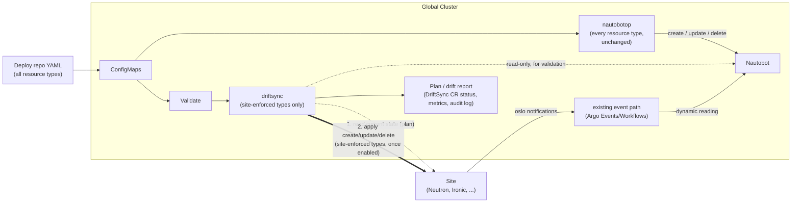

---
authors:
    - "@geetikabatra"
reviewers:
    - "@cardoe"
    - "@mfencik"
    - "@abhimanyu003"
    - "@haseebsyed12"
creation-date: 2026-07-20
last-updated: 2026-08-24
status: provisional
---

# Nautobot Resource Sync (driftsync)

## Table of Contents

- [Glossary](#glossary)
- [Summary](#summary)
- [Motivation](#motivation)
    - [Goals](#goals)
    - [Non-Goals](#non-goals)
- [Proposal](#proposal)
    - [Architecture](#architecture)
    - [Data Ownership: Static vs Dynamic](#data-ownership-static-vs-dynamic)
    - [User Stories](#user-stories)
    - [Requirements](#requirements)
    - [Implementation Details/Notes/Constraints](#implementation-detailsnotesconstraints)
- [Scope and Phased Rollout](#scope-and-phased-rollout)
- [Alternatives Considered](#alternatives-considered)
- [Additional Details](#additional-details)
    - [Test Plan](#test-plan)
    - [Subtasks](#subtasks)
    - [Graduation Criteria](#graduation-criteria)
- [References](#references)

## Glossary

- **Nautobot** - our DCIM/IPAM system. A projection, not an author: static
  data is rendered into it by nautobotop, dynamic data is recorded into it by
  the site event path. driftsync never writes here, under any circumstance —
  see below.
- **nautobotop** - the operator we already run. Reads YAML from ConfigMaps,
  writes it to Nautobot, deletes whatever's missing from the YAML. It is the
  only thing that ever writes to Nautobot, for every resource type,
  permanently — including types driftsync separately enforces at a site.
  Unchanged by this proposal.
- **driftsync** - the new, separate operator this proposal builds. Own CRD,
  own Deployment, own RBAC, own credentials — not merged into nautobotop, and
  it never writes to Nautobot. For a resource type classified
  **site-enforced**, driftsync reads the same deploy repo YAML nautobotop
  reads, reads a site's actual OpenStack state, plans the diff, and applies
  it — making the site match the file directly. It doesn't take over a
  type's Nautobot rendering; nautobotop keeps doing that in parallel,
  unaffected. First target: VNI ranges per site.
- **`DriftSync` CR** - the CR driftsync reconciles against. Unrelated to
  nautobotop's `Nautobot` CR — there's no ownership handoff between them. One
  `DriftSync` CR per site-enforced resource type per environment. Status
  carries validation results, plan output, and apply results.
- **Plan / apply** - how driftsync reconciles a site-enforced type. Plan: the
  diff between what the deploy repo says and what the site currently has.
  Apply: the create/update/delete calls that make the site match the plan.
  Every reconcile of a site-enforced type does both, in that order.
- **Site-enforced resource type** - a type driftsync has been given a
  site-side target for. Everything else is simply outside driftsync's scope
  — it stays exactly what it is today, rendered into Nautobot by nautobotop
  and nothing more.
- **Global cluster** - where Nautobot, nautobotop, and driftsync run. Sites
  can reach it.
- **Management cluster** - ArgoCD and logging. Nautobot doesn't run here.
- **Site** - a physical undercloud location with its own hardware, Kubernetes
  cluster, and OpenStack services (Neutron, Ironic).
- **Deploy repo** - `RSS-Engineering/undercloud-deploy`. Holds the
  per-environment YAML (e.g. `hardware/vlan-groups/staging/vlan-groups.yaml`)
  rendered into ConfigMaps, for every resource type. nautobotop reads all of
  it; driftsync additionally reads whichever slice covers a site-enforced
  type.
- **Static generator** - a separate tool, being built, that produces per-site
  data (OOB IP ranges, VNI ranges, BGP ASNs, switch loopback IPs) as a file
  committed to the deploy repo.
- **Static data** - authored up front in the deploy repo, by hand or by the
  generator. Git is the source of truth. For a site-enforced type, the site's
  actual config comes from the same file too — independently of, and in
  parallel with, Nautobot's copy.
- **Dynamic data** - values a site's own services produce at runtime, inside
  the deploy repo's authored ranges. Nautobot's copy is a reading — useful
  for visibility, never authoritative, never applied to anywhere.
- **Resource type** - a category synced into Nautobot: VLAN groups,
  locations, racks, device types, VLANs, etc. Every type is rendered into
  Nautobot by nautobotop. Some, separately, are also site-enforced by
  driftsync.

## Summary

The deploy repo is the source of truth. nautobotop renders it into Nautobot —
every resource type, unchanged, forever. This proposal adds a second, parallel
consumer of that same repo: **driftsync**, which for resource types explicitly
classified **site-enforced**, reads the deploy repo YAML and keeps a site's
own OpenStack config matching it directly. driftsync never writes to
Nautobot. It isn't a second way to sync Nautobot, and it doesn't take over
any type's Nautobot ownership from nautobotop — the two operators read the
same file and write to two different places, independently.

Nautobot also holds what sites actually have. Tenant VLANs, VNIs, and subnets
come into existence when a tenant calls a site's Neutron API, inside the
deploy repo's authored ranges, and reach Nautobot through the existing event
path, unchanged. That stays a recorded reading — never authoritative, never
authored from, never enforced.

This is a general mechanism for closing the gap between the deploy repo and a
site's live config — not VLAN-Group-specific. It does four things:

1. Requires every resource type driftsync is given to be classified
   **site-enforced**, with a real site-side object to push to. Everything
   else is out of driftsync's scope entirely.
2. Introduces **driftsync** as a standalone operator on the global cluster —
   own CRD, controller, RBAC — that only ever writes to a site, never to
   Nautobot.
3. Gives driftsync a **plan/apply** loop: read a site's actual state, diff it
   against the deploy repo, and apply the difference. Anything not
   site-enforced is untouched by driftsync entirely.
4. Proves the mechanism on **VNI ranges per site** first, since those map to
   a real Neutron API (network segment ranges). VLAN Groups — the resource
   type nautobotop's own known problems are easiest to point to — has no
   obvious site-side equivalent, so it stays outside driftsync's scope.

At a July 27, 2026 sync-up (@abhimanyu003, @haseebsyed12), the team agreed:

- Deploy repo YAML stays the source of truth.
- Validation is needed, and can call the Nautobot API directly.
- Ansible can't handle deletion, so this needs to be an operator.
- Reading a site back should be pull-based: global asks, site answers. This
  proposal pairs that with a push, still driven from global.
- Prove full CRUD on one resource before generalizing.

Earlier drafts described a two-way sync with writeback into Nautobot, and a
later draft had driftsync take over a type's Nautobot rendering the way
nautobotop does. Both are withdrawn. driftsync writes to exactly one place —
a site, for types explicitly enforced — and reads two: the deploy repo, and,
read-only, Nautobot, for validation. Nautobot keeps exactly one writer,
nautobotop, permanently.

This work doesn't rely on Cluster API or its IPAM claim/pool contract.

## Motivation

nautobotop has real, known gaps in how it renders resource types into
Nautobot — an unscoped delete pass, silent reference-resolution failures.
Those are out of scope here: nautobotop is unchanged by this proposal, for
every type, forever, so those gaps stay exactly as they are today. What
follows is what actually motivates driftsync: the gap between the deploy
repo and what a site itself has configured.

### Nothing confirms a site actually matches the deploy repo

Nautobot holds the authored intent and some runtime values, but nothing
checks a site's live config against the deploy repo. Drift is found by hand,
for every resource type, today.

### Detecting drift doesn't fix it

A report beats finding drift by hand, but for a static value it still ends
the same way: someone confirms the file is right and fixes the site by hand
anyway. For a type with a real site-side object, closing that gap means
driftsync applies the fix too, not just reports it.

### Ansible-driven sync does not cover deletion

The specific point from the July 27 sync-up: Ansible can create and update,
but nothing tracks what was previously applied, so removing an entry from the
YAML doesn't remove it from the target. Applies equally to a site: driftsync
needs proper delete semantics for objects that fall out of the deploy repo,
which is why this has to be a level-triggered operator, not more playbooks.

### A value applied to a site needs validating first

The same silent-failure risk that shows up anywhere a name gets resolved by
hand — a mistyped reference, an out-of-range value — applies to anything
driftsync is about to push to a site. driftsync validates before it applies,
the same discipline any write needs.

### Goals

1. Give driftsync a way to plan against a site's actual state and apply that
   plan for resource types explicitly classified site-enforced, so the
   deploy repo becomes the live control plane for the site's own config.
2. Build driftsync as a separate operator — own CRD, controller, Deployment,
   RBAC — with no path to writing Nautobot, ever, for any type.
3. Validate deploy repo YAML — structurally and referentially — for every
   type driftsync enforces, and fail loudly instead of applying partial data.
4. Prove driftsync end to end — read, validate, plan, apply — on VNI ranges
   per site first, since that's the first type with a confirmed site-side
   object to push to.
5. Leave nautobotop and Nautobot rendering untouched, for every resource
   type, whether or not driftsync separately enforces it at a site.

### Non-Goals

1. **driftsync never writes to Nautobot.** Not for any resource type, not at
   any phase, not even ones it enforces at a site. Nautobot rendering is
   permanently nautobotop's job alone. There is no migration of a type's
   Nautobot ownership anywhere in this proposal.
2. **Still no writeback into Nautobot from a site.** A site's report is never
   promoted into static data. A site's own state is read only to plan and
   detect drift, never written anywhere.
3. **No automatic conflict resolution beyond applying the file's value.**
   driftsync reports disagreement for anything not site-enforced, and
   corrects a site-enforced type to match the file. It doesn't negotiate
   between competing changes or ask before each individual correction.
4. **Not deciding the static generator's output format.** Designed
   separately; this proposal just consumes it.

## Proposal

### Architecture

Two independent operators on the global cluster, reading the same deploy
repo. nautobotop writes to Nautobot, for every type, as it always has.
driftsync writes to a site, only for types explicitly turned on for it, and
never writes to Nautobot at all.

- **Two operators, one deploy repo, two destinations.** nautobotop always
  writes to Nautobot. driftsync, for site-enforced types only, writes to a
  site. Neither ever writes to the other's destination.
- **Nautobot has exactly one writer.** nautobotop, for every type, always.
  driftsync's read access to Nautobot (for referential validation) is
  read-only, full stop.
- **Site reconciliation, global ⇄ site, read then write.** Only driftsync
  talks to a site. It reads the site's state (plan), diffs it against the
  deploy repo, and applies the difference. A site is never the origin of a
  change — the deploy repo leads. If global can't reach site APIs directly,
  this becomes a per-site agent.

Same picture regardless of which type driftsync is enforcing — VNI ranges is
just the first one wired end to end.

### Data Ownership: Static vs Dynamic

The deploy repo is the source of truth throughout. Nautobot rendering is
always nautobotop's job — that column never varies. Site Enforcement records
whether, and how, driftsync also pushes a row to a site.

| Data | Authored in | Class | To Nautobot | Site Enforcement |
|------|-------------|-------|--------------|-------------------|
| VLAN groups (name, location, range) | Deploy repo YAML | static | nautobotop | Not enforced — no obvious Neutron/Ironic object |
| Locations, location types, racks, rack groups | Deploy repo YAML | static | nautobotop | Not enforced |
| Device types | Deploy repo YAML | static | nautobotop | Not enforced |
| VLAN ID / VNI / subnet ranges a site may allocate from | Deploy repo YAML or generator | static | nautobotop | **driftsync** — VNI ranges are the first target, via Neutron's network-segment-range API; VLAN ID/subnet ranges are candidates once that proves out |
| OOB IP ranges | Static generator | static | nautobotop | Not enforced today |
| BGP ASNs | Static generator | static | nautobotop | Candidate, but configured on network hardware, not through Neutron/Ironic — needs a different push mechanism than FR9 covers |
| Switch loopback IPs | Static generator | static | nautobotop | Candidate, same caveat as BGP ASNs |
| Tenant VLAN/VNI/subnet allocations | Not authored — runtime, site's Neutron | dynamic | existing oslo/Argo path | Never enforced |
| Device/port actual state | Not authored — reported by site Ironic | dynamic | existing oslo/Argo path | Never enforced |

Rules, for every row:

- Nautobot rendering is always nautobotop's job. driftsync never creates,
  updates, or deletes anything in Nautobot, for any row, at any phase.
- For a row marked **driftsync** in Site Enforcement, driftsync may create,
  update, or delete the corresponding object at a site — scoped to what it
  created there — independently of nautobotop's Nautobot rendering of the
  same data.
- Dynamic rows are never created, updated, or deleted by either operator, in
  Nautobot or at a site.
- A dynamic value is never machine-promoted to static. Drift gets reported; a
  human edits the deploy repo.
- A site is never the source of truth for what it *should* have — only for
  what it currently has, compared against the deploy repo, never merged into
  it.

### User Stories

VNI ranges per site is the worked example for driftsync's own stories, since
it's the first confirmed target. VLAN Groups appears once, in Story 1, purely
to show what stays unaffected.

#### Story 1 - A typo in the deploy repo is caught before it reaches a site

Someone edits VNI-range YAML for a site and mistypes a value. driftsync's
validation rejects the entry before any apply, reports it on the `DriftSync`
CR status, and the site is left unchanged. Nautobot, meanwhile, goes through
nautobotop exactly as always — including its own existing silent-reference
gap for types like VLAN Groups, which stays out of scope here.

#### Story 2 - An object is removed from the deploy repo

The entry is deleted from the YAML. driftsync deletes the matching object at
the site, only because it's marked as its own. Nautobot is untouched;
nautobotop's own render of the same range is a separate, unaffected matter.

#### Story 3 - A site produces a runtime value inside an authored range

A site allocates a VLAN from an authored VNI range. It reaches Nautobot via
the event path and is recorded as a reading. Outside the authored range,
that's drift and gets reported. Never an apply — dynamic values are never
enforced.

#### Story 4 - Someone asks whether a site matches the deploy repo

driftsync pulls the site's state, compares it to the deploy repo, and reports
the differences.

#### Story 4b - A site-enforced value has drifted, and driftsync corrects it

Someone changes a value directly at a site. On the next reconcile, driftsync's
plan catches it and applies a correction back to the deploy repo's value,
visible on the `DriftSync` CR status. The deploy repo itself is untouched;
the correction only flows outward from it.

#### Story 5 - Someone needs to change a static value

They edit the deploy repo YAML, open a review, merge. nautobotop renders the
change into Nautobot on its next reconcile, as it always does. If the type is
also site-enforced with apply on, driftsync separately computes a plan
against the site and pushes the same change out — merging the file is what
changes the live site, not a separate manual step. Editing a site directly
isn't supported: the next reconcile reverts it to what the file says.

### Requirements

Requirements below describe **driftsync**.

#### Functional Requirements

- **FR1**: driftsync is its own operator: own CRD (`DriftSync`), controller
  Deployment, ServiceAccount/RBAC, and deploy repo entry
  (`global.driftsync`).
- **FR2**: Objects driftsync creates at a site are marked, so its own
  site-side delete pass only ever touches what it created there.
- **FR3**: driftsync's site-side delete pass is scoped to its own marker only
  — never an object it didn't create.
- **FR4**: Deploy repo YAML for a site-enforced type is validated before any
  apply: structurally (schema, bounds, duplicates).
- **FR5**: A validation failure fails that resource's reconcile with a named
  error on the `DriftSync` CR status. Nothing is applied to a site while a
  validation failure is outstanding.
- **FR6**: driftsync can read a site's actual state and compare it to what
  the deploy repo authored — its **plan** step.
- **FR7**: For anything not site-enforced, differences are reported only. For
  a site-enforced type, driftsync issues the create/update/delete calls the
  plan calls for — its **apply** step, always preceded by a plan in the same
  reconcile.
- **FR8**: driftsync is proven end to end — read, validate, plan, apply — on
  one resource type before a second is added. VNI ranges per site is that
  first type.
- **FR9**: Site interaction uses OpenStack APIs directly, for both plan and
  apply. driftsync's only write credentials are to a site's OpenStack APIs.
#### Non-Functional Requirements

- **NFR1**: Unit tests for the site-side delete pass against a mix of
  driftsync-marked and unmarked objects at a site.
- **NFR2**: Unit tests for schema and referential validation, including the
  unresolved-reference case.
- **NFR3**: Reconciles are idempotent — unchanged YAML produces no applies
  and no noise.
- **NFR4**: Per-site, per-resource metrics: reconcile outcome, validation
  failures, plan drift count, applies issued, apply failures, last successful
  plan/apply.
- **NFR5**: A site being unreachable is a reported condition, not a failed
  reconcile for unrelated resources, and never affects nautobotop.
- **NFR6**: driftsync is independently deployable and releasable, so a bug in
  it can't block nautobotop and vice versa.

### Implementation Details/Notes/Constraints

#### Current State

- nautobotop runs on the **global cluster** and pushes ConfigMap YAML into
  Nautobot for every resource type it supports today — location types,
  locations, rack groups, racks, device types, VLAN groups, VLANs, prefixes,
  namespaces, RIRs, roles, tenants, tenant groups, clusters, cluster types,
  cluster groups. None of this changes; it stays the only Nautobot writer,
  permanently, whether or not driftsync separately enforces a type at a site.
- Sites can reach global. Whether global can reach a site's Neutron/Ironic
  APIs — for reads, and separately writes — isn't confirmed yet.
- No site reconciliation exists today, for any type. driftsync doesn't exist
  yet.
- Ansible playbooks exist for some of this; ruled out as primary mechanism at
  the July 27 sync-up because they can't express deletion.

#### Site Ownership Marking

Every object driftsync creates at a site gets a marker (a Neutron resource
tag, or equivalent); its delete pass lists only marked objects. Consequences:

- Objects that exist at a site for another reason — created by hand, by
  another tool, before driftsync managed that type — are invisible to
  driftsync's delete pass.
- The marker also answers "did driftsync create this?" when reporting drift.
- There is no migration, backfill, or cutover step here: since driftsync
  never took over anything from nautobotop, there's nothing to hand off. A
  type simply starts being enforced, or doesn't.

#### Validation

Two layers:

1. **Schema validation** of the YAML — shape errors, catchable in deploy repo
   CI before merge, and again inside driftsync.
2. **Referential validation**, read-only, against the live Nautobot API —
   catches a well-formed file pointing at something that doesn't exist.

Failures are reported per entry, not as one opaque error.

#### Site Reconciliation: Plan and Apply

Pull for reading, push for writing: global asks, and — once enabled — global
also decides what to change. A site never initiates either direction.
driftsync-only; nautobotop never gets this, and never needs it.

Two shapes, depending on reachability:

- **driftsync → site OpenStack APIs directly.** Per-site credentials,
  queries and calls Neutron/Ironic. Needs global to reach site endpoints both
  ways.
- **Per-site agent, driven by driftsync.** Works when site APIs aren't
  directly reachable, at the cost of a component per site that now also
  accepts writes.

Site-initiated push remains a technical fallback but isn't preferred — it
inverts scheduling and needs sites to hold write credentials into global.

**Plan, then apply, always in that order.** Each reconcile reads the site,
diffs it against the deploy repo, and applies the difference. The plan is
always visible on the CR status.

**What never gets applied.** Anything not explicitly site-enforced stays
untouched at the site. Dynamic data — runtime allocations — is never applied,
under any classification. Nautobot is never a target of apply, ever.

#### Why an Operator, and Why a Separate One

An operator gives us deletion semantics Ansible lacks, plus a level-triggered
reconcile, per-site conditions, and metrics.

That doesn't argue for a *second* operator on its own — extending nautobotop
in place was considered and rejected. Its sync is stable and depended on for
every type; merging new, unproven site-reconciliation logic into the same
loop risks destabilizing that, and would force nautobotop to acquire site
credentials it has never needed and this proposal doesn't want it to have. A
separate operator keeps driftsync's entire footprint — code, credentials,
release cycle, blast radius — contained to the site-enforced types it's
actually been given, with literally no path to Nautobot as a write target.

## Scope and Phased Rollout

A general mechanism for closing the gap between the deploy repo and a site's
live config — not VLAN-Group-specific, and not a Nautobot-sync mechanism
(that stays nautobotop's job, unchanged, permanently). VLAN Groups has no
obvious site-side object to enforce, so it isn't driftsync's proving ground;
VNI ranges per site are, since they map to Neutron's network-segment-range
API.

**Phase 0 — Build the operator.** Scaffold driftsync: `DriftSync` CRD,
controller-manager, RBAC (read-only Nautobot, no site write yet), image,
`global.driftsync` entry, deployed to test. Nothing enforced yet.

**Phase 1 — VNI ranges, plan only.** Read and validate the deploy repo YAML,
read a site's Neutron network-segment-range state, compute a plan, report
drift on the `DriftSync` CR status. No apply yet — this proves the read and
diff side first. See [First Increment](#first-increment).

**Phase 2 — Add apply for VNI ranges.** Add the apply step and the site
ownership marker, and prove it against a real site.

**Phase 3 and beyond — additional site-enforceable types, one at a time.**
VLAN ID/subnet ranges are the next likely candidate — same Neutron API
family as VNI ranges. BGP ASNs and switch loopback IPs are candidates too,
but how they're actually configured at a site isn't settled — they may need
a push mechanism beyond Neutron/Ironic APIs, which FR9 doesn't cover yet.
**Which type comes after VNI ranges isn't decided here.**

#### First Increment

VNI ranges per site, end to end (Phase 1 — plan only, no apply):

1. driftsync scaffolded and deployed (Phase 0).
2. Schema validation for the VNI-range YAML, plus referential validation
   (read-only) against Nautobot where a reference needs confirming.
3. Read a site's Neutron network-segment-range state.
4. Compute and report drift on the `DriftSync` CR status and as metrics.
5. Nothing created, updated, or deleted anywhere — plan only.

## Alternatives Considered

- **Two-way sync with writeback into Nautobot** (the original design).
  Rejected: treats a site's reading as authoritative, risking sync loops.
- **driftsync also rendering into Nautobot for the types it enforces at a
  site** (an earlier version of this proposal). Rejected: it reintroduces a
  second Nautobot writer, needing its own ownership marker and a
  migration/cutover away from nautobotop, for a benefit — site enforcement —
  that doesn't require touching Nautobot at all. Scoping driftsync to sites
  only keeps Nautobot at exactly one writer, permanently, and removes an
  entire migration mechanism this proposal no longer needs.
- **Read-only drift detection only, no apply.** A real alternative: no write
  access to a site, so bug blast radius is zero. Superseded because detection
  without correction still leaves every fix as manual work.
- **Extending nautobotop in place.** Rejected: would entangle new, unproven
  site-reconciliation logic into a stable, production-depended-on reconcile
  loop, and force nautobotop to acquire site credentials it has never needed.
- **Cluster API's IPAM provider pattern.** Rejected: no machine lifecycle
  here, and it borrows a contract we don't need.
- **Ansible-driven sync.** Rejected as primary mechanism at the July 27
  sync-up: no deletion, no drift detection, no metrics.
- **Site-initiated push to global.** Kept as a fallback if driftsync can't
  reach a site directly, but not preferred — needs write credentials per
  site and inverts who controls scheduling.
- **Wrapping the OpenStack CLI.** Rejected: subprocess management and output
  parsing, where the APIs give structured responses.
- **Building validation and site reconciliation for several types at once.**
  Rejected for the first increment: the mechanism itself is unproven; proving
  it on VNI ranges first means later types migrate onto something that
  already works.

## Additional Details

### Test Plan

- Unit: site-side delete pass against a mix of driftsync-marked and unmarked
  objects at a site — only marked ones ever deleted.
- Unit: schema validation rejects missing fields, out-of-bounds values,
  malformed ranges, duplicate names.
- Unit: referential validation fails on an unresolvable reference.
- Unit: unchanged YAML produces no applies.
- Unit: plan computation matches the expected create/update/delete diff.
- Integration: a plan against a test site's Neutron network-segment-range API
  reports a deliberate mismatch with nothing modified before apply runs.
- Integration: an apply against a test site, followed by a plan confirming
  it's clean.
- Integration: an out-of-band site change is detected and, with apply on,
  corrected within a bounded number of reconciles.
- Integration: an apply failure mid-plan leaves a partial-apply condition and
  retries only the remainder next reconcile.
- Integration: confirm nautobotop's Nautobot render of VNI ranges is
  untouched by driftsync's plan and apply activity throughout.
- End-to-end: pull VNI range state from a site, report drift including a
  deliberate mismatch, assert nothing modified (Phase 1, detection only).

### Subtasks

- [ ] Scaffold driftsync: layout, `DriftSync` CRD, controller skeleton, RBAC
      (read-only Nautobot, no site write yet), image, `global.driftsync`
      entry.
- [ ] Decide the site ownership marker.
- [ ] Add schema validation for the VNI-range YAML, in CI and in driftsync.
- [ ] Add read-only referential validation against Nautobot.
- [ ] Surface validation/plan results on `DriftSync` CR status and metrics.
- [ ] Confirm global-to-site reachability, for reads and writes.
- [ ] Build the read/plan for VNI ranges against one site's Neutron
      network-segment-range API (Phase 1).
- [ ] Confirm the static generator's output format and ingestion.
- [ ] Build the plan/diff engine against mocked site state.
- [ ] Build the apply path for VNI ranges.
- [ ] After Phase 1, pick and classify the next site-enforced type.

### Graduation Criteria

#### Alpha

- driftsync scaffolded and running in test, independent of nautobotop, with
  read-only Nautobot access only.
- Site Enforcement column agreed for the ownership table.
- VNI-range validation in place, failures visible on CR status.
- Plan working for VNI ranges against a test site.

#### Beta

- Plan working for VNI ranges against a real site, with a drift report.
- Apply built and proven against a real site for VNI ranges.
- Metrics exported per site and type.
- A second site-enforceable type selected, with its Site Enforcement
  mechanism confirmed.

#### Stable

- driftsync running across multiple sites through several cycles, no
  unintended site changes, no data loss.
- At least one type applying changes to production sites reliably.
- Confirmed, across the whole rollout, that driftsync has never written to
  Nautobot.

## References

- [Nautobot Operator guide](../operator-guide/nautobotop.md)
- [nautobotop component deployment](../deploy-guide/components/nautobotop.md)
- [ADR027 - automated cab addition](https://docs.undercloud.rackspace.net/architecture-decisions/adr027-automated-cab-addition/)
- [`hardware/vlan-groups/staging/vlan-groups.yaml`](https://github.com/RSS-Engineering/undercloud-deploy/blob/main/hardware/vlan-groups/staging/vlan-groups.yaml)
- [Argo Events design guide](../design-guide/argo-events.md)
- [OpenStack/Nautobot sync](../operator-guide/openstack-nautobot-sync.md)

